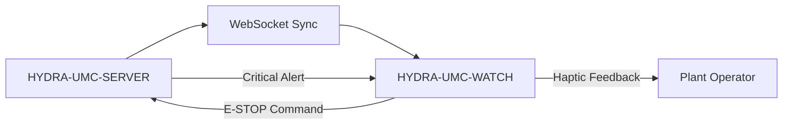

<p align="center">
  
</p>

# ⌚ HYDRA-UMC-WATCH

<p align="center">🇺🇸 <b>English</b> | <a href="README_spa.md">🇪🇸 Español</a> | <a href="README_fra.md">🇫🇷 Français</a> | <a href="README_ita.md">🇮🇹 Italiano</a> | <a href="README_deu.md">🇩🇪 Deutsch</a> | <a href="README_zho.md">🇨🇳 简体中文</a> | <a href="README_jpn.md">🇯🇵 日本語</a></p>

### 🛡️ Wearable Safety Dashboard & Haptic Emergency Alert System

<p align="left">
  
  
  
</p>

---

## 1. 🛠️ TECHNICAL OVERVIEW

**HYDRA-UMC-WATCH** is the tactical extension for the plant operator. It provides critical, glanceable information and safety controls directly on the wrist, ensuring that the operator is always in control, even when away from the main HMI.

Built as a standalone Wear OS app (Kotlin + Jetpack Compose for Wear), reusing the same Gradle/Kotlin toolchain as sibling repo HYDRA-UMC-ANDROID-CONTROL rather than introducing a new one.

### Key Features:
* 🛑 **Wireless E-STOP** — dedicated emergency button with sub-50ms latency over industrial Wi-Fi. *(planned — needs HYDRA-UMC-SERVER pairing)*
* 📳 **Haptic Alerts** — differentiated vibration patterns for various alert types (Critical, Warning, Info). *(planned)*
* ⌚ **Glanceable Status** — real-time summary of swarm activity and mission progress. *(planned)*
* 🔐 **Secure Auth** — JWT-based pairing with HYDRA-UMC-SERVER. *(planned)*
* ✅ **Standalone Wear OS toolchain** — a real Gradle/Kotlin/Compose-for-Wear app that builds a working debug APK. *(implemented — see BUILD & RUN below)*

---

## 2. 🔄 WEARABLE SYNC FLOW



---

## 3. 🧱 ARCHITECTURE & DESIGN DECISIONS

* **Why this is a standalone Wear OS app, not a feature of the phone app.** A watch runs its own independent process on its own OS - it can't just be a UI mode of HYDRA-UMC-ANDROID-CONTROL, it needs its own manifest, its own build, and its own (much more constrained) UI for glanceable status/quick E-STOP.
* **Why `minSdk 30` (Wear OS 3), lower than the phone app's own minSdk.** This targets the current Wear OS 3+ hardware generation deliberately, not old Wear OS 2 devices - unlike HYDRA-UMC-ANDROID-CONTROL, which supports older phones, a companion watch app has a narrower realistic hardware base to support.
* **Why the entry point only prints identity/version/role today.** Andamiaje (scaffolding) stage: proving `./gradlew assembleDebug` succeeds precedes the real companion-app sync logic with the phone.
* **How this fits the rest of the ecosystem.** Pairs with HYDRA-UMC-ANDROID-CONTROL and HYDRA-UMC-IOS-CONTROL as a glanceable, on-wrist companion - not a replacement for either, a quick-status/quick-E-STOP surface.

---

## 📂 DIRECTORY STRUCTURE

Standalone Wear OS app — no hardware/firmware/os of its own (it runs on off-the-shelf watch hardware), pruned from the template (see `SONNET/5.PLAN_EJECUCION_32_PROYECTOS_NUEVOS.txt` for the ecosystem-wide pruning rule).

```text
HYDRA-UMC-WATCH/
├── app/
│   ├── build.gradle.kts       # App module config, odometer-style version bump
│   ├── version.properties     # versionMajor/Minor/Patch/Code (auto-bumped every build)
│   └── src/main/
│       ├── AndroidManifest.xml
│       ├── java/com/hydraumc/watch/MainActivity.kt   # Compose-for-Wear entry point
│       └── res/                                        # Strings, theme, launcher icon
├── gradle/
│   ├── libs.versions.toml     # Dependency version catalog
│   └── wrapper/                # Gradle wrapper (pinned to 9.7.0)
├── build.gradle.kts           # Root Gradle build
├── settings.gradle.kts        # Module wiring
├── gradlew / gradlew.bat      # Gradle wrapper launcher
├── docs/                      # Documentation and safety protocols
├── build/                     # Reserved (Gradle's own app/build/ is gitignored)
├── images/                    # Media and diagrams
├── scripts/                   # Utility scripts
├── build.sh / build.bat       # Real build: gradlew assembleDebug
├── run.sh / run.bat           # Real run: gradlew installDebug + adb launch
└── src/                       # Reserved (this project's code lives under app/src/)
```

---

## 4. ⚙️ BUILD & RUN

Requires JDK 21, the Android SDK (`local.properties` → `sdk.dir`, gitignored — point it at your own SDK install), and a Wear OS device or emulator for `run`.

```bash
# Linux/macOS
chmod +x gradlew   # one-time
./build.sh
./run.sh            # needs a connected Wear OS device/emulator

# Windows
build.bat
run.bat
```

`build` compiles the debug APK to `app/build/outputs/apk/debug/app-debug.apk`. The version bump (`app/version.properties`) happens inside `app/build.gradle.kts` itself at Gradle configuration time, so it runs automatically on every real build — no separate bump step needed. `run` installs the APK via `gradlew installDebug` and launches `MainActivity` with `adb`.

---

## 🔗 Related Projects

This project is part of a larger robotics ecosystem by the same author (JuanenRac / Electro Hobby 3D), spanning firmware, control software, AI nodes, and fleet tooling. Worth knowing about, since a request might actually be about one of these rather than this repository.

### Directly Related

- **[HYDRA-UMC-ANDROID-CONTROL](https://github.com/JuanenRac/HYDRA-UMC-ANDROID-CONTROL)** — the companion app this wearable pairs with.
- **[HYDRA-UMC-IOS-CONTROL](https://github.com/JuanenRac/HYDRA-UMC-IOS-CONTROL)** — the companion app this wearable pairs with.

### Rest of the Ecosystem

**HYDRA-UMC platform** — the multi-robot micro-factory cell
- **[HYDRA-UMC](https://github.com/JuanenRac/HYDRA-UMC)** — the CM5 + STM32H745 motherboard orchestrating up to 8 robot arms.
- **[HYDRA-UMC-SERVER](https://github.com/JuanenRac/HYDRA-UMC-SERVER)** — the Express/WebSocket backend every control client talks to.
- **[HYDRA-UMC-STUDIO](https://github.com/JuanenRac/HYDRA-UMC-STUDIO)** — web-based control dashboard, multi-robot 3D visualization.
- **[HYDRA-UMC-ANDROID-CONTROL](https://github.com/JuanenRac/HYDRA-UMC-ANDROID-CONTROL)** — Android control app over Wi-Fi/Bluetooth.
- **[HYDRA-UMC-IOS-CONTROL](https://github.com/JuanenRac/HYDRA-UMC-IOS-CONTROL)** — iOS/iPadOS control app built in Flutter.
- **[HYDRA-UMC-SUITE](https://github.com/JuanenRac/HYDRA-UMC-SUITE)** — desktop swarm command center (Python/PySide6).
- **[HYDRA-UMC-EDITOR-URDF](https://github.com/JuanenRac/HYDRA-UMC-EDITOR-URDF)** — desktop URDF model editor for the robot catalog.
- **[HYDRA-UMC-DSI](https://github.com/JuanenRac/HYDRA-UMC-DSI)** — native touch UI for the onboard DSI touchscreen.

**URTC platform** — the tool head controller every HYDRA-UMC robot arm carries
- **[URTC](https://github.com/JuanenRac/URTC)** — CAN bus tool head controller, 25 tool profiles.
- **[URTC-FLASHER](https://github.com/JuanenRac/URTC-FLASHER)** — desktop CAN-OTA + SWD/JTAG flashing tool.
- **[URTC-TESTER](https://github.com/JuanenRac/URTC-TESTER)** — desktop live CAN-bus diagnostic tool.
- **[URTC-WEB-STUDIO](https://github.com/JuanenRac/URTC-WEB-STUDIO)** — browser-based alternative via Web Serial API.

**🎥 Vision AI Node (Hailo-8)**
- [HYDRA-UMC-VISION-NODE](https://github.com/JuanenRac/HYDRA-UMC-VISION-NODE)
- [HYDRA-UMC-VISION-STREAMER](https://github.com/JuanenRac/HYDRA-UMC-VISION-STREAMER)
- [HYDRA-UMC-DETECTION-HEF](https://github.com/JuanenRac/HYDRA-UMC-DETECTION-HEF)
- [HYDRA-UMC-SAFETY-ZONES](https://github.com/JuanenRac/HYDRA-UMC-SAFETY-ZONES)
- [HYDRA-UMC-VISUAL-SERVOING-API](https://github.com/JuanenRac/HYDRA-UMC-VISUAL-SERVOING-API)

**🧠 Cognitive AI Node (Hailo-10)**
- [HYDRA-UMC-COGNITIVE-NODE](https://github.com/JuanenRac/HYDRA-UMC-COGNITIVE-NODE)
- [HYDRA-UMC-VLA-ENGINE](https://github.com/JuanenRac/HYDRA-UMC-VLA-ENGINE)
- [HYDRA-UMC-VOICE-UI](https://github.com/JuanenRac/HYDRA-UMC-VOICE-UI)
- [HYDRA-UMC-SEMANTIC-PLANNER](https://github.com/JuanenRac/HYDRA-UMC-SEMANTIC-PLANNER)
- [HYDRA-UMC-DOCS-QA](https://github.com/JuanenRac/HYDRA-UMC-DOCS-QA)

**🐝 Orchestration & Swarm**
- [HYDRA-UMC-ORCHESTRATOR](https://github.com/JuanenRac/HYDRA-UMC-ORCHESTRATOR)
- [HYDRA-UMC-SWARM-SYNC](https://github.com/JuanenRac/HYDRA-UMC-SWARM-SYNC)
- [HYDRA-UMC-PATH-PLANNER-3D](https://github.com/JuanenRac/HYDRA-UMC-PATH-PLANNER-3D)
- [HYDRA-UMC-JOB-DISPATCHER](https://github.com/JuanenRac/HYDRA-UMC-JOB-DISPATCHER)
- [HYDRA-UMC-NODE-HEALING](https://github.com/JuanenRac/HYDRA-UMC-NODE-HEALING)

**🎮 Digital Twin & Simulation**
- [HYDRA-UMC-TWIN](https://github.com/JuanenRac/HYDRA-UMC-TWIN)
- [HYDRA-UMC-PHYSICS-REPLICA](https://github.com/JuanenRac/HYDRA-UMC-PHYSICS-REPLICA)
- [HYDRA-UMC-HIL-BRIDGE](https://github.com/JuanenRac/HYDRA-UMC-HIL-BRIDGE)
- [HYDRA-UMC-SYNTHETIC-DATA-GEN](https://github.com/JuanenRac/HYDRA-UMC-SYNTHETIC-DATA-GEN)

**📊 Data & Analytics**
- [HYDRA-UMC-DATALAKE](https://github.com/JuanenRac/HYDRA-UMC-DATALAKE)
- [HYDRA-UMC-TELEMETRY-COLLECTOR](https://github.com/JuanenRac/HYDRA-UMC-TELEMETRY-COLLECTOR)
- [HYDRA-UMC-ANOMALY-DETECTOR](https://github.com/JuanenRac/HYDRA-UMC-ANOMALY-DETECTOR)
- [HYDRA-UMC-PRODUCTION-REPORTS](https://github.com/JuanenRac/HYDRA-UMC-PRODUCTION-REPORTS)

**🏭 Industrial Gateway**
- [HYDRA-UMC-GATEWAY-INDUSTRIAL](https://github.com/JuanenRac/HYDRA-UMC-GATEWAY-INDUSTRIAL)
- [HYDRA-UMC-OPCUA-SERVER](https://github.com/JuanenRac/HYDRA-UMC-OPCUA-SERVER)
- [HYDRA-UMC-MQTT-BROKER](https://github.com/JuanenRac/HYDRA-UMC-MQTT-BROKER)
- [HYDRA-UMC-MTCONNECT-ADAPTER](https://github.com/JuanenRac/HYDRA-UMC-MTCONNECT-ADAPTER)

**🛠️ Complementary Tools**
- [URTC-SMART-RACK](https://github.com/JuanenRac/URTC-SMART-RACK)
- [URTC-VISION-TOOL](https://github.com/JuanenRac/URTC-VISION-TOOL)
- [HYDRA-UMC-TOOL-CLI](https://github.com/JuanenRac/HYDRA-UMC-TOOL-CLI)
- [HYDRA-UMC-DASHBOARD-AI](https://github.com/JuanenRac/HYDRA-UMC-DASHBOARD-AI)


## 👤 AUTHOR
**JuanenRac** (Electro Hobby 3D)
📧 electrohobby3d@gmail.com

## 📜 LICENSE
GPL-3.0 - See LICENSE for details.

## Related Projects

> Canonical public ecosystem relationship map.

**Direct integrations:**
[HYDRA-UMC-OS](https://github.com/JuanenRac/HYDRA-UMC-OS) · [HYDRA-UMC-SDK](https://github.com/JuanenRac/HYDRA-UMC-SDK) · [HYDRA-UMC-SERVER](https://github.com/JuanenRac/HYDRA-UMC-SERVER) · [URTC](https://github.com/JuanenRac/URTC) · [HYDRA-UMC-ORCHESTRATOR](https://github.com/JuanenRac/HYDRA-UMC-ORCHESTRATOR) · [HYDRA-UMC-JOB-DISPATCHER](https://github.com/JuanenRac/HYDRA-UMC-JOB-DISPATCHER) · [HYDRA-UMC-SWARM-SYNC](https://github.com/JuanenRac/HYDRA-UMC-SWARM-SYNC) · [HYDRA-UMC-NODE-HEALING](https://github.com/JuanenRac/HYDRA-UMC-NODE-HEALING) · [HYDRA-UMC-UPDATER](https://github.com/JuanenRac/HYDRA-UMC-UPDATER)

**Platform and contracts:**
[HYDRA-UMC-OS](https://github.com/JuanenRac/HYDRA-UMC-OS) · [HYDRA-UMC-SDK](https://github.com/JuanenRac/HYDRA-UMC-SDK)

**Rest of the ecosystem:**
All remaining public repositories are grouped by the seven ecosystem layers in the [JuanenRac ecosystem dashboard](https://juanenrac.github.io/JuanenRac/).
