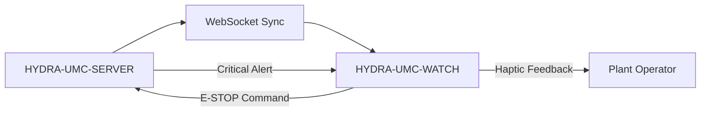

<p align="center">
  
</p>

# ⌚ HYDRA-UMC-WATCH

<p align="center">🇺🇸 <b>English</b> | <a href="README_spa.md">🇪🇸 Español</a> | <a href="README_fra.md">🇫🇷 Français</a> | <a href="README_ita.md">🇮🇹 Italiano</a> | <a href="README_deu.md">🇩🇪 Deutsch</a> | <a href="README_zho.md">🇨🇳 简体中文</a> | <a href="README_jpn.md">🇯🇵 日本語</a></p>

### 🛡️ Wearable Safety Dashboard & Haptic Emergency Alert System

<p align="left">
  
  
  
</p>

---

## 1. 🛠️ TECHNICAL OVERVIEW

**HYDRA-UMC-WATCH** is the tactical extension for the plant operator. It provides critical, glanceable information and safety controls directly on the wrist, ensuring that the operator is always in control, even when away from the main HMI.

Built as a standalone Wear OS app (Kotlin + Jetpack Compose for Wear), reusing the same Gradle/Kotlin toolchain as sibling repo HYDRA-UMC-ANDROID-CONTROL rather than introducing a new one.

### Key Features:
* ✅ **Real v0 - haptic patterns & sync protocol:** `haptics/HapticPatterns.kt` defines a real, distinct vibration waveform per alert severity (Critical/Warning/Info); `protocol/SyncMessage.kt` defines and (de)serializes the real `EStopCommand`/`Alert` message shapes for the SERVER<->WATCH sync flow below. Both are plain, testable Kotlin - no watch hardware, emulator, or open WebSocket needed to run or test either.
* 🛑 **Wireless E-STOP** — dedicated emergency button with sub-50ms latency over industrial Wi-Fi. *(the `EStopCommand` message it would send is real and tested; the WebSocket transport and physical button wiring are still planned - needs HYDRA-UMC-SERVER pairing.)*
* 📳 **Haptic Alerts** — differentiated vibration patterns for various alert types (Critical, Warning, Info). *(the patterns themselves are real - see above; wiring them into the actual `Vibrator` service call is still planned.)*
* ⌚ **Glanceable Status** — real-time summary of swarm activity and mission progress. *(planned - needs the real WebSocket connection.)*
* 🔐 **Secure Auth** — JWT-based pairing with HYDRA-UMC-SERVER. *(planned.)*
* ✅ **Standalone Wear OS toolchain** — a real Gradle/Kotlin/Compose-for-Wear app that builds a working debug APK. *(implemented — see BUILD & RUN below)*

---

## 2. 🔄 WEARABLE SYNC FLOW



---

## 3. 🧱 ARCHITECTURE & DESIGN DECISIONS

* **Why this is a standalone Wear OS app, not a feature of the phone app.** A watch runs its own independent process on its own OS - it can't just be a UI mode of HYDRA-UMC-ANDROID-CONTROL, it needs its own manifest, its own build, and its own (much more constrained) UI for glanceable status/quick E-STOP.
* **Why `minSdk 30` (Wear OS 3), lower than the phone app's own minSdk.** This targets the current Wear OS 3+ hardware generation deliberately, not old Wear OS 2 devices - unlike HYDRA-UMC-ANDROID-CONTROL, which supports older phones, a companion watch app has a narrower realistic hardware base to support.
* **Why haptic patterns and the sync protocol ship before the WebSocket connection.** Defining the vibration waveforms and the message shapes both sides need to agree on is real, plain-Kotlin work - it needs no open socket, paired server, or physical watch to write or test. Actually opening that connection is next.
* **How this fits the rest of the ecosystem.** Pairs with HYDRA-UMC-ANDROID-CONTROL and HYDRA-UMC-IOS-CONTROL as a glanceable, on-wrist companion - not a replacement for either, a quick-status/quick-E-STOP surface.

---

## 📂 DIRECTORY STRUCTURE

Standalone Wear OS app — no hardware, firmware or OS of its own (it runs on off-the-shelf watch hardware); those folders are omitted by repository structure policy.

```text
HYDRA-UMC-WATCH/
├── app/
│   ├── build.gradle.kts       # App module config (reads version.properties, never writes it)
│   ├── version.properties     # versionMajor/Minor/Patch/Code (bumped by build.sh/.bat only)
│   └── src/
│       ├── main/
│       │   ├── AndroidManifest.xml
│       │   └── java/com/hydraumc/watch/
│       │       ├── MainActivity.kt         # Compose-for-Wear entry point
│       │       ├── haptics/                # Per-severity vibration patterns
│       │       └── protocol/               # SERVER<->WATCH sync message codec
│       └── test/java/com/hydraumc/watch/   # Real JUnit tests (haptics, protocol)
├── gradle/
│   ├── libs.versions.toml     # Dependency version catalog
│   └── wrapper/                # Gradle wrapper (pinned to 9.7.0)
├── build.gradle.kts           # Root Gradle build
├── settings.gradle.kts        # Module wiring
├── gradlew / gradlew.bat      # Gradle wrapper launcher
├── docs/                      # Documentation and safety protocols
├── build/                     # Reserved (Gradle's own app/build/ is gitignored)
├── images/                    # Media and diagrams
├── scripts/                   # Utility scripts
├── bump_manifest_version.py   # Bumps major/minor/patch + the manifest, in lockstep
├── bump_version_code.py       # Bumps Android's separate versionCode counter
├── build.sh / build.bat       # Real build: bump version, run tests, assembleDebug
├── run.sh / run.bat           # Real run: gradlew installDebug + adb launch
└── src/                       # Reserved (this project's code lives under app/src/)
```

---

## 4. ⚙️ BUILD & RUN

Requires JDK 21, the Android SDK (`local.properties` → `sdk.dir`, gitignored — point it at your own SDK install), and a Wear OS device or emulator for `run`.

```bash
# Linux/macOS
chmod +x gradlew   # one-time
./build.sh
./run.sh            # needs a connected Wear OS device/emulator

# Windows
build.bat
run.bat
```

`build` bumps the version (`bump_manifest_version.py` for major/minor/patch in lockstep with `hydra-umc.project.json`, `bump_version_code.py` for Android's own `versionCode`), runs the real JUnit test suite (`haptics`, `protocol`), and compiles the debug APK to `app/build/outputs/apk/debug/app-debug.apk` - all in one Gradle invocation run with `-PhydraUmcReadOnly=true` so `app/build.gradle.kts`'s own version-reading code never *also* bumps anything (that flag is also how `build-test.sh`/`.bat` run their separate, non-mutating compile-only CI check). `run` installs the APK via `gradlew installDebug` and launches `MainActivity` with `adb`.

Real example - the two version-bump scripts run standalone too, useful to inspect what a build will do without triggering Gradle:

```bash
python3 bump_manifest_version.py   # e.g. "HYDRA-UMC version: v0.1.2 -> v0.1.3"
python3 bump_version_code.py       # e.g. "versionCode: 12 -> 13"
```

---

## ✅ Current Status & Next Steps

**Real today:** local alert playback through Android's `Vibrator` service, explicit microphone permission and system speech recognition, visible transcript feedback and local text-to-speech, plus tested typed messages for `voice_turn`, `assistant_reply`, `system_status`, `EStopCommand`, `Alert` and companion version status.

**Integration boundary:** a recognised voice turn remains on the watch until a paired, authenticated transport is connected. Voice can never actuate a robot directly; a movement-related reply must require confirmation, while the physical E-STOP stays independent.

**Still ahead:** the authenticated WebSocket/Data Layer pairing, delivery to the HYDRA-UMC-VOICE-UI gateway, live system-status cards and end-to-end validation on a real Wear OS device.

---

## 🔗 Related Projects

This project is part of a larger robotics ecosystem by the same author (JuanenRac / Electro Hobby 3D), spanning firmware, control software, AI nodes, and fleet tooling. Worth knowing about, since a request might actually be about one of these rather than this repository.

### Directly Related

- **[HYDRA-UMC-ANDROID-CONTROL](https://github.com/JuanenRac/HYDRA-UMC-ANDROID-CONTROL)** — the companion app this wearable pairs with.
- **[HYDRA-UMC-IOS-CONTROL](https://github.com/JuanenRac/HYDRA-UMC-IOS-CONTROL)** — the companion app this wearable pairs with.

### Rest of the Ecosystem

**HYDRA-UMC platform** — the multi-robot micro-factory cell
- **[HYDRA-UMC](https://github.com/JuanenRac/HYDRA-UMC)** — the CM5 + STM32H745 motherboard orchestrating up to 8 robot arms.
- **[HYDRA-UMC-SERVER](https://github.com/JuanenRac/HYDRA-UMC-SERVER)** — the Express/WebSocket backend every control client talks to.
- **[HYDRA-UMC-STUDIO](https://github.com/JuanenRac/HYDRA-UMC-STUDIO)** — web-based control dashboard, multi-robot 3D visualization.
- **[HYDRA-UMC-ANDROID-CONTROL](https://github.com/JuanenRac/HYDRA-UMC-ANDROID-CONTROL)** — Android control app over Wi-Fi/Bluetooth.
- **[HYDRA-UMC-IOS-CONTROL](https://github.com/JuanenRac/HYDRA-UMC-IOS-CONTROL)** — iOS/iPadOS control app built in Flutter.
- **[HYDRA-UMC-SUITE](https://github.com/JuanenRac/HYDRA-UMC-SUITE)** — desktop swarm command center (Python/PySide6).
- **[HYDRA-UMC-EDITOR-URDF](https://github.com/JuanenRac/HYDRA-UMC-EDITOR-URDF)** — desktop URDF model editor for the robot catalog.
- **[HYDRA-UMC-DSI](https://github.com/JuanenRac/HYDRA-UMC-DSI)** — native touch UI for the onboard DSI touchscreen.

**URTC platform** — the tool head controller every HYDRA-UMC robot arm carries
- **[URTC](https://github.com/JuanenRac/URTC)** — CAN bus tool head controller, 25 tool profiles.
- **[URTC-FLASHER](https://github.com/JuanenRac/URTC-FLASHER)** — desktop CAN-OTA + SWD/JTAG flashing tool.
- **[URTC-TESTER](https://github.com/JuanenRac/URTC-TESTER)** — desktop live CAN-bus diagnostic tool.
- **[URTC-WEB-STUDIO](https://github.com/JuanenRac/URTC-WEB-STUDIO)** — browser-based alternative via Web Serial API.

**🎥 Vision AI Node (Hailo-8)**
- [HYDRA-UMC-VISION-NODE](https://github.com/JuanenRac/HYDRA-UMC-VISION-NODE)
- [HYDRA-UMC-VISION-STREAMER](https://github.com/JuanenRac/HYDRA-UMC-VISION-STREAMER)
- [HYDRA-UMC-DETECTION-HEF](https://github.com/JuanenRac/HYDRA-UMC-DETECTION-HEF)
- [HYDRA-UMC-SAFETY-ZONES](https://github.com/JuanenRac/HYDRA-UMC-SAFETY-ZONES)
- [HYDRA-UMC-VISUAL-SERVOING-API](https://github.com/JuanenRac/HYDRA-UMC-VISUAL-SERVOING-API)

**🧠 Cognitive AI Node (Hailo-10)**
- [HYDRA-UMC-COGNITIVE-NODE](https://github.com/JuanenRac/HYDRA-UMC-COGNITIVE-NODE)
- [HYDRA-UMC-VLA-ENGINE](https://github.com/JuanenRac/HYDRA-UMC-VLA-ENGINE)
- [HYDRA-UMC-VOICE-UI](https://github.com/JuanenRac/HYDRA-UMC-VOICE-UI)
- [HYDRA-UMC-SEMANTIC-PLANNER](https://github.com/JuanenRac/HYDRA-UMC-SEMANTIC-PLANNER)
- [HYDRA-UMC-DOCS-QA](https://github.com/JuanenRac/HYDRA-UMC-DOCS-QA)

**🐝 Orchestration & Swarm**
- [HYDRA-UMC-ORCHESTRATOR](https://github.com/JuanenRac/HYDRA-UMC-ORCHESTRATOR)
- [HYDRA-UMC-SWARM-SYNC](https://github.com/JuanenRac/HYDRA-UMC-SWARM-SYNC)
- [HYDRA-UMC-PATH-PLANNER-3D](https://github.com/JuanenRac/HYDRA-UMC-PATH-PLANNER-3D)
- [HYDRA-UMC-JOB-DISPATCHER](https://github.com/JuanenRac/HYDRA-UMC-JOB-DISPATCHER)
- [HYDRA-UMC-NODE-HEALING](https://github.com/JuanenRac/HYDRA-UMC-NODE-HEALING)

**🎮 Digital Twin & Simulation**
- [HYDRA-UMC-TWIN](https://github.com/JuanenRac/HYDRA-UMC-TWIN)
- [HYDRA-UMC-PHYSICS-REPLICA](https://github.com/JuanenRac/HYDRA-UMC-PHYSICS-REPLICA)
- [HYDRA-UMC-HIL-BRIDGE](https://github.com/JuanenRac/HYDRA-UMC-HIL-BRIDGE)
- [HYDRA-UMC-SYNTHETIC-DATA-GEN](https://github.com/JuanenRac/HYDRA-UMC-SYNTHETIC-DATA-GEN)

**📊 Data & Analytics**
- [HYDRA-UMC-DATALAKE](https://github.com/JuanenRac/HYDRA-UMC-DATALAKE)
- [HYDRA-UMC-TELEMETRY-COLLECTOR](https://github.com/JuanenRac/HYDRA-UMC-TELEMETRY-COLLECTOR)
- [HYDRA-UMC-ANOMALY-DETECTOR](https://github.com/JuanenRac/HYDRA-UMC-ANOMALY-DETECTOR)
- [HYDRA-UMC-PRODUCTION-REPORTS](https://github.com/JuanenRac/HYDRA-UMC-PRODUCTION-REPORTS)

**🏭 Industrial Gateway**
- [HYDRA-UMC-GATEWAY-INDUSTRIAL](https://github.com/JuanenRac/HYDRA-UMC-GATEWAY-INDUSTRIAL)
- [HYDRA-UMC-OPCUA-SERVER](https://github.com/JuanenRac/HYDRA-UMC-OPCUA-SERVER)
- [HYDRA-UMC-MQTT-BROKER](https://github.com/JuanenRac/HYDRA-UMC-MQTT-BROKER)
- [HYDRA-UMC-MTCONNECT-ADAPTER](https://github.com/JuanenRac/HYDRA-UMC-MTCONNECT-ADAPTER)

**🛠️ Complementary Tools**
- [URTC-SMART-RACK](https://github.com/JuanenRac/URTC-SMART-RACK)
- [URTC-VISION-TOOL](https://github.com/JuanenRac/URTC-VISION-TOOL)
- [HYDRA-UMC-TOOL-CLI](https://github.com/JuanenRac/HYDRA-UMC-TOOL-CLI)
- [HYDRA-UMC-DASHBOARD-AI](https://github.com/JuanenRac/HYDRA-UMC-DASHBOARD-AI)


## 👤 AUTHOR
**JuanenRac** (Electro Hobby 3D)
📧 electrohobby3d@gmail.com

## 📜 LICENSE
GPL-3.0 - See LICENSE for details.

## 🛠️ BUILD & RUN

Use the non-versioning build check before a release build:

| Action | Windows | Linux / macOS |
|---|---|---|
| Build check (no version or CHANGELOG change) | `build-test.bat` | `./build-test.sh` |
| Run / development (when provided) | `run*.bat` or `dev*.bat` | `./run*.sh` or `./dev*.sh` |

`build-test.bat` and `build-test.sh` compile or validate the project stack without incrementing `hydra-umc.project.json` or modifying `CHANGELOG.md`. They may create normal compiler output only. Existing `build*.bat`, `build*.sh`, `run*` and `dev*` scripts retain their project-specific, versioned or runtime behavior; use them when that behavior is required.
