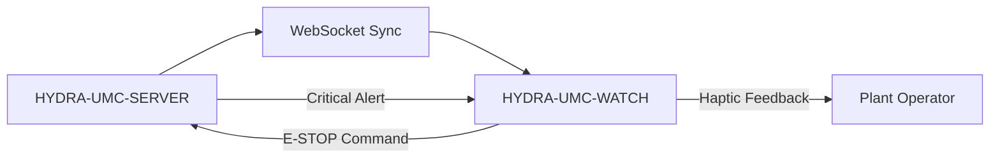

<p align="center">
  
</p>

# ⌚ HYDRA-UMC-WATCH

<p align="center">🇺🇸 <b>English</b> | <a href="README_spa.md">🇪🇸 Español</a> | <a href="README_fra.md">🇫🇷 Français</a> | <a href="README_ita.md">🇮🇹 Italiano</a> | <a href="README_deu.md">🇩🇪 Deutsch</a> | <a href="README_zho.md">🇨🇳 简体中文</a> | <a href="README_jpn.md">🇯🇵 日本語</a></p>

### 🛡️ Wearable Safety Dashboard & Haptic Emergency Alert System

<p align="left">
  
  
  
</p>

---

## 1. 🛠️ TECHNICAL OVERVIEW

**HYDRA-UMC-WATCH** is the tactical extension for the plant operator. It provides critical, glanceable information and safety controls directly on the wrist, ensuring that the operator is always in control, even when away from the main HMI.

Built as a standalone Wear OS app (Kotlin + Jetpack Compose for Wear), reusing the same Gradle/Kotlin toolchain as sibling repo HYDRA-UMC-ANDROID-CONTROL rather than introducing a new one.

### Key Features:
* ✅ **Real v0 - haptic patterns & sync protocol:** `haptics/HapticPatterns.kt` defines a real, distinct vibration waveform per alert severity (Critical/Warning/Info); `protocol/SyncMessage.kt` defines and (de)serializes the real `EStopCommand`/`Alert` message shapes for the SERVER<->WATCH sync flow below. Both are plain, testable Kotlin - no watch hardware, emulator, or open WebSocket needed to run or test either.
* 🛑 **Wireless E-STOP** — dedicated emergency button with sub-50ms latency over industrial Wi-Fi. *(the `EStopCommand` message it would send is real and tested; the WebSocket transport and physical button wiring are still planned - needs HYDRA-UMC-SERVER pairing.)*
* 📳 **Haptic Alerts** — differentiated vibration patterns for various alert types (Critical, Warning, Info), played through Android's real `Vibrator`/`VibratorManager` service. *(implemented - `haptics/HapticAlertPlayer.kt`; still unverified on a real Wear OS device, same as the rest of this app.)*
* 🎙️ **Voice** — tap-to-talk: explicit `RECORD_AUDIO` permission request, the system speech-recognition intent (`RecognizerIntent`) for transcription, the transcript relayed to HYDRA-UMC-ANDROID-CONTROL as a bounded `voice_turn` sync message, and a local `TextToSpeech` reply on the watch. *(implemented - `MainActivity.kt`; voice can never actuate a robot directly, see Architecture below and [docs/VOICE_AI_PROTOCOL.md](docs/VOICE_AI_PROTOCOL.md) for the full end-to-end message flow and safety boundary.)*
* ⌚ **Glanceable Status** — a **Refresh status** button relays a bounded status request to HYDRA-UMC-ANDROID-CONTROL over the paired Data Layer; the returned `system_status` card is shown with a "last known - may be outdated" indicator once it goes stale. *(implemented - `MainActivity.kt`/`WatchRelayTransport.requestSystemStatus()`; pull-based over the phone relay, not a direct watch-to-server push socket, and still unverified on a real Wear OS device.)*
* 🔐 **Secure Auth** — JWT-based pairing with HYDRA-UMC-SERVER. *(planned.)*
* ✅ **Standalone Wear OS toolchain** — a real Gradle/Kotlin/Compose-for-Wear app that builds a working debug APK. *(implemented — see BUILD & RUN below)*
* 🔁 **Relay Reconnection Policy** — `transport/RelayRetryPolicy.kt` is a real, pure exponential-backoff policy for a failed relay send (e.g. no paired phone yet), capped at a bounded max delay. *(implemented)*
* 🗂️ **Last-Known-State Cache** — `transport/LastKnownStateCache.kt` tracks real staleness on the last relayed status/alert, so an old one is never shown as current. *(implemented)*

---

## 2. 🔄 WEARABLE SYNC FLOW



*Target architecture once a direct Server WebSocket exists. The real, tested
path today relays through the paired phone instead: Watch -> Data Layer ->
HYDRA-UMC-ANDROID-CONTROL -> authenticated HYDRA-UMC-SERVER/Voice UI, and
back - see Architecture below and
[docs/VOICE_AI_PROTOCOL.md](docs/VOICE_AI_PROTOCOL.md) for that real
end-to-end flow. The Watch never holds a Server credential itself; a direct
Watch-to-Server WebSocket and the wireless E-STOP button remain future,
hardware-gated work.*

---

## 3. 🧱 ARCHITECTURE & DESIGN DECISIONS

* **Why this is a standalone Wear OS app, not a feature of the phone app.** A watch runs its own independent process on its own OS - it can't just be a UI mode of HYDRA-UMC-ANDROID-CONTROL, it needs its own manifest, its own build, and its own (much more constrained) UI for glanceable status/quick E-STOP.
* **Why `minSdk 30` (Wear OS 3), lower than the phone app's own minSdk.** This targets the current Wear OS 3+ hardware generation deliberately, not old Wear OS 2 devices - unlike HYDRA-UMC-ANDROID-CONTROL, which supports older phones, a companion watch app has a narrower realistic hardware base to support.
* **Why the paired relay uses Data Layer instead of a custom socket.** The official Wear OS channel enforces the same package name and signing certificate on Watch and phone, then carries only bounded protocol messages. Android Control retains the Server session; this keeps the Watch out of direct Server credential and robot-control paths.
* **Why reconnection policy and last-known-state cache are their own pure modules, not inline in `WatchRelayTransport`.** Both are real, decoupled Kotlin classes (`RelayRetryPolicy`, `LastKnownStateCache`) testable on a plain JVM without a watch, emulator, or paired phone - the same standard `HapticPatterns.kt`/`SyncMessage.kt` already set. `WatchRelayTransport` itself stays the thin, necessarily-Android piece that actually schedules a retry or records a received message, not where the underlying policy math lives.
* **Why a stale cached state is flagged, not hidden.** Withholding an old status entirely would leave the watch face blank exactly when the phone connection is flaky - the real risk moment. Showing it clearly marked "last known - may be outdated" keeps the operator informed without letting a minutes-old reading pass as a live one.
* **How this fits the rest of the ecosystem.** Pairs with HYDRA-UMC-ANDROID-CONTROL and HYDRA-UMC-IOS-CONTROL as a glanceable, on-wrist companion - not a replacement for either, a quick-status/quick-E-STOP surface.

---

## 📂 DIRECTORY STRUCTURE

Standalone Wear OS app — no hardware, firmware or OS of its own (it runs on off-the-shelf watch hardware); those folders are omitted by repository structure policy.

```text
HYDRA-UMC-WATCH/
├── app/
│   ├── build.gradle.kts       # App module config (reads version.properties, never writes it)
│   ├── version.properties     # versionMajor/Minor/Patch/Code (bumped by build.sh/.bat only)
│   └── src/
│       ├── main/
│       │   ├── AndroidManifest.xml
│       │   └── java/com/hydraumc/watch/
│       │       ├── MainActivity.kt         # Compose-for-Wear entry point
│       │       ├── haptics/                # Per-severity vibration patterns
│       │       ├── protocol/               # SERVER<->WATCH sync message codec
│       │       └── transport/              # Data Layer relay, retry policy, last-known-state cache
│       └── test/java/com/hydraumc/watch/   # Real JUnit tests (haptics, protocol, transport)
├── gradle/
│   ├── libs.versions.toml     # Dependency version catalog
│   └── wrapper/                # Gradle wrapper (pinned to 9.7.0)
├── tools/
│   ├── build_test.py          # Non-mutating CI check: contract verification + assembleDebug
│   ├── ci_validate.py         # Manifest/CHANGELOG/docs validation used by CI
│   └── verify_paired_relay_contract.py # Static Watch<->Android Control Data Layer safety-boundary check
├── build.gradle.kts           # Root Gradle build
├── settings.gradle.kts        # Module wiring
├── gradlew / gradlew.bat      # Gradle wrapper launcher
├── docs/                      # Documentation and safety protocols
├── build/                     # Reserved (Gradle's own app/build/ is gitignored)
├── images/                    # Media and diagrams
├── hydra-umc.project.json     # Ecosystem manifest (version, build/health metadata)
├── keystore.properties.example # Template for the ignored release-signing config
├── bump_manifest_version.py   # Bumps major/minor/patch + the manifest, in lockstep
├── bump_version_code.py       # Bumps Android's separate versionCode counter
├── build.sh / build.bat       # Real build: bump version, run tests, assembleDebug
├── build-test.sh / build-test.bat # Non-mutating wrapper for tools/build_test.py
├── run.sh / run.bat           # Real run: gradlew installDebug + adb launch
├── update-from-github.sh / .bat # Non-Play update channel: GitHub Release APK + `adb install -r`
└── src/                       # Reserved (this project's code lives under app/src/)
```

---

## 4. ⚙️ BUILD & RUN GUIDE

Requires JDK 21, the Android SDK (`local.properties` → `sdk.dir`, gitignored — point it at your own SDK install), and a Wear OS device or emulator for `run`.

```bash
# Linux/macOS
chmod +x gradlew   # one-time
./build.sh
./run.sh            # needs a connected Wear OS device/emulator

# Windows
build.bat
run.bat
```

`build` bumps the version (`bump_manifest_version.py` for major/minor/patch in lockstep with `hydra-umc.project.json`, `bump_version_code.py` for Android's own `versionCode`), runs the real JUnit test suite (`haptics`, `protocol`), and compiles the debug APK to `app/build/outputs/apk/debug/app-debug.apk` - all in one Gradle invocation run with `-PhydraUmcReadOnly=true` so `app/build.gradle.kts`'s own version-reading code never *also* bumps anything (that flag is also how `build-test.sh`/`.bat` run their separate, non-mutating compile-only CI check). `run` installs the APK via `gradlew installDebug` and launches `MainActivity` with `adb`.

Real example - the two version-bump scripts run standalone too, useful to inspect what a build will do without triggering Gradle:

```bash
python3 bump_manifest_version.py   # e.g. "HYDRA-UMC version: v0.1.2 -> v0.1.3"
python3 bump_version_code.py       # e.g. "versionCode: 12 -> 13"
```

---

## 5. 📲 UPDATES WITHOUT GOOGLE PLAY

This project is not distributed through Google Play. The repeatable update
path is a GitHub Release APK installed over ADB:

```bash
# from the project root, watch paired and Wireless debugging enabled
update-from-github.bat    # Windows
./update-from-github.sh   # Linux / macOS / WSL
```

The script reads `releases/latest` from GitHub, requires a stable
`vMAJOR.MINOR.PATCH` tag, checks the version already installed, asks for
explicit operator confirmation, then downloads and runs `adb install -r`. It
never touches the repository version, manifest or `CHANGELOG.md`. A manual,
best-effort install (open the downloaded APK's package installer directly on
the watch) is also documented for devices without a usable ADB path. See
[docs/GITHUB_ADB_UPDATES.md](docs/GITHUB_ADB_UPDATES.md) for the full
procedure, release-APK naming requirement, and release-signing setup.

`HYDRA-UMC-ANDROID-CONTROL` can inform the operator that a newer Watch
release exists once the paired companion-version status message is wired up
— it is informational only and can never install anything on the watch
itself. See [docs/COMPANION_VERSION_PROTOCOL.md](docs/COMPANION_VERSION_PROTOCOL.md)
for that message shape.

---

## ✅ Current Status & Next Steps

**Real today:** local alert playback through Android's `Vibrator` service, explicit microphone permission and system speech recognition, visible transcript feedback and local text-to-speech, plus tested typed messages for `voice_turn`, `assistant_reply`, `system_status`, `EStopCommand`, `Alert` and companion version status. The official Wear OS Data Layer relays bounded voice turns and status-card requests through HYDRA-UMC-ANDROID-CONTROL to the authenticated Server and Voice UI.

**Integration boundary:** the paired Android app retains the encrypted Server JWT; Server retains the Voice UI token. Data Layer requires the same package name and signing certificate on both APKs. Voice can never actuate a robot directly; a movement-related reply must require confirmation, while the physical E-STOP stays independent.

**Still ahead:** validation of pairing, radio transport, microphone/speaker and end-to-end status on a real Wear OS device; wireless E-STOP and live CM5 telemetry remain separate hardware-gated work.

---

## 🔗 Related Projects

This project is part of the HYDRA-UMC robotics ecosystem by the same author (JuanenRac / Electro Hobby 3D). Worth knowing about, since a request might actually be about one of these rather than this repository.

**Directly Related**
- **[HYDRA-UMC-ANDROID-CONTROL](https://github.com/JuanenRac/HYDRA-UMC-ANDROID-CONTROL)** — native Android control app with biometric login and a paired Wear OS companion — the companion app this wearable pairs with.
- **[HYDRA-UMC-IOS-CONTROL](https://github.com/JuanenRac/HYDRA-UMC-IOS-CONTROL)** — iOS/iPadOS control app (Flutter) with real-time WebSocket sync — the companion app this wearable pairs with.
- **[HYDRA-UMC-VOICE-UI](https://github.com/JuanenRac/HYDRA-UMC-VOICE-UI)** — real voice front-end (VAD + intent parser) with a bounded, confirmation-gated Watch relay — sends the voice_turn messages this wearable surfaces as haptic alerts.

**Also Part of the Ecosystem**

*Core Hardware & Platform*
- **[HYDRA-UMC](https://github.com/JuanenRac/HYDRA-UMC)** — the physical robot-arm motherboard: CM5 host + dual-core STM32H745, orchestrating up to 8 tool arms over CAN-OTA/SPI-OTA.
- **[HYDRA-UMC-OS](https://github.com/JuanenRac/HYDRA-UMC-OS)** — reproducible Raspberry Pi OS product layer for the CM5: read-only agent, validated config/profiles, WiFi first-contact provisioning.
- **[HYDRA-UMC-SDK](https://github.com/JuanenRac/HYDRA-UMC-SDK)** — the shared JSON-Schema contract and safety-gate boundary every bridge validates its commands against.

*Core Backend & Clients*
- **[HYDRA-UMC-SERVER](https://github.com/JuanenRac/HYDRA-UMC-SERVER)** — the real headless backend (REST/WebSocket) every control client actually talks to.
- **[HYDRA-UMC-STUDIO](https://github.com/JuanenRac/HYDRA-UMC-STUDIO)** — web control dashboard with real-time multi-robot 3D visualization.
- **[HYDRA-UMC-SUITE](https://github.com/JuanenRac/HYDRA-UMC-SUITE)** — desktop (PySide6) swarm command center for multiple servers at once, packaged as a standalone executable.
- **[HYDRA-UMC-DSI](https://github.com/JuanenRac/HYDRA-UMC-DSI)** — native touch UI for the onboard 7" DSI touchscreen, embedded on the CM5 itself.
- **[HYDRA-UMC-EDITOR-URDF](https://github.com/JuanenRac/HYDRA-UMC-EDITOR-URDF)** — desktop graphical URDF creator/editor that pushes finished models into STUDIO's own catalog.
- **[HYDRA-UMC-BRIDGE-AMR](https://github.com/JuanenRac/HYDRA-UMC-BRIDGE-AMR)** — coordination boundary for AGV/AMR fleets via a real VDA 5050 MQTT publisher.
- **[HYDRA-UMC-BRIDGE-CNC](https://github.com/JuanenRac/HYDRA-UMC-BRIDGE-CNC)** — high-level CNC-cell coordinator with real GRBL status/control-byte access.
- **[HYDRA-UMC-BRIDGE-DROIDS](https://github.com/JuanenRac/HYDRA-UMC-BRIDGE-DROIDS)** — coordination boundary for legged/humanoid droids, with a real Boston Dynamics Spot command sender.
- **[HYDRA-UMC-BRIDGE-LASER](https://github.com/JuanenRac/HYDRA-UMC-BRIDGE-LASER)** — laser-cell safety coordinator reading 3 real key/enclosure/interlock GPIO safeguards.
- **[HYDRA-UMC-BRIDGE-OPENPNP](https://github.com/JuanenRac/HYDRA-UMC-BRIDGE-OPENPNP)** — safe high-level board-flow coordinator for OpenPnP pick-and-place.
- **[HYDRA-UMC-BRIDGE-PRINTER3D](https://github.com/JuanenRac/HYDRA-UMC-BRIDGE-PRINTER3D)** — safe coordination boundary for Moonraker/Klipper 3D printers, with real gated job commands.
- **[HYDRA-UMC-BRIDGE-ROS2](https://github.com/JuanenRac/HYDRA-UMC-BRIDGE-ROS2)** — safety coordinator with a real, lazily-imported rclpy ROS 2 transport.
- **[HYDRA-UMC-BRIDGE-UAV](https://github.com/JuanenRac/HYDRA-UMC-BRIDGE-UAV)** — coordination boundary for camera-equipped UAVs, with a real MAVLink command sender.

*URTC Tool Platform*
- **[URTC](https://github.com/JuanenRac/URTC)** — firmware for the physical Universal Robot Tool Controller PCB, 25+ tool profiles over CAN bus.
- **[URTC-FLASHER](https://github.com/JuanenRac/URTC-FLASHER)** — desktop GUI flashing tool for URTC boards, CAN-OTA plus full-chip SWD/JTAG.
- **[URTC-TESTER](https://github.com/JuanenRac/URTC-TESTER)** — desktop live CAN-bus diagnostic tool for URTC boards, one panel per tool profile.
- **[URTC-WEB-STUDIO](https://github.com/JuanenRac/URTC-WEB-STUDIO)** — browser-based alternative to URTC-TESTER via the Web Serial API, no local install needed.

*Vision AI Node (Hailo-8)*
- **[HYDRA-UMC-VISION-NODE](https://github.com/JuanenRac/HYDRA-UMC-VISION-NODE)** — integration hub for the Hailo-8 vision pipeline, with a real per-stage hardware-readiness check.
- **[HYDRA-UMC-DETECTION-HEF](https://github.com/JuanenRac/HYDRA-UMC-DETECTION-HEF)** — real compiled-model registry with Hailo-architecture/checksum safe-load verification.
- **[HYDRA-UMC-VISION-STREAMER](https://github.com/JuanenRac/HYDRA-UMC-VISION-STREAMER)** — real GStreamer pipeline + MediaMTX config generator with a real HailoRT integration boundary.
- **[HYDRA-UMC-VISUAL-SERVOING-API](https://github.com/JuanenRac/HYDRA-UMC-VISUAL-SERVOING-API)** — real Position-Based Visual Servoing correction law, safety-gated on upstream zone state.
- **[HYDRA-UMC-SAFETY-ZONES](https://github.com/JuanenRac/HYDRA-UMC-SAFETY-ZONES)** — real zone-breach checking and E-STOP requesting, with calibration-freshness enforcement.

*Cognitive AI Node (Hailo-10)*
- **[HYDRA-UMC-COGNITIVE-NODE](https://github.com/JuanenRac/HYDRA-UMC-COGNITIVE-NODE)** — integration hub for the Hailo-10 cognitive pipeline (LLM/VLA/voice orchestration).
- **[HYDRA-UMC-VLA-ENGINE](https://github.com/JuanenRac/HYDRA-UMC-VLA-ENGINE)** — real action-token encoding/decoding and trajectory generation for a Vision-Language-Action model.
- **[HYDRA-UMC-SEMANTIC-PLANNER](https://github.com/JuanenRac/HYDRA-UMC-SEMANTIC-PLANNER)** — real rule-based task decomposition and semantic error recovery over MCU error codes.
- **[HYDRA-UMC-DOCS-QA](https://github.com/JuanenRac/HYDRA-UMC-DOCS-QA)** — real stdlib-only TF-IDF document search over this ecosystem's own Markdown docs.

*Orchestration & Swarm*
- **[HYDRA-UMC-ORCHESTRATOR](https://github.com/JuanenRac/HYDRA-UMC-ORCHESTRATOR)** — integration hub with a real gRPC/Protobuf health-report contract and mission state machine.
- **[HYDRA-UMC-JOB-DISPATCHER](https://github.com/JuanenRac/HYDRA-UMC-JOB-DISPATCHER)** — real priority-based job queue with deduplication, over a real HTTP API.
- **[HYDRA-UMC-NODE-HEALING](https://github.com/JuanenRac/HYDRA-UMC-NODE-HEALING)** — real gRPC-based fleet health watchdog with retry/backoff and identity-mismatch detection.
- **[HYDRA-UMC-PATH-PLANNER-3D](https://github.com/JuanenRac/HYDRA-UMC-PATH-PLANNER-3D)** — real RRT-based 3D path planner with real obstacle/workspace collision validation.
- **[HYDRA-UMC-SWARM-SYNC](https://github.com/JuanenRac/HYDRA-UMC-SWARM-SYNC)** — real CRDT LWW-Element-Map state sync, property-tested for multi-cell convergence.

*Digital Twin & Simulation*
- **[HYDRA-UMC-TWIN](https://github.com/JuanenRac/HYDRA-UMC-TWIN)** — integration hub for the digital-twin engine, with a real version-compatibility sync contract.
- **[HYDRA-UMC-HIL-BRIDGE](https://github.com/JuanenRac/HYDRA-UMC-HIL-BRIDGE)** — real hardware-in-the-loop safety interlock routing commands between simulation and real hardware.
- **[HYDRA-UMC-PHYSICS-REPLICA](https://github.com/JuanenRac/HYDRA-UMC-PHYSICS-REPLICA)** — real forward kinematics and joint-limit validation over a real URDF subset.
- **[HYDRA-UMC-SYNTHETIC-DATA-GEN](https://github.com/JuanenRac/HYDRA-UMC-SYNTHETIC-DATA-GEN)** — real procedural 2D scene generator with YOLO/COCO annotation export.

*Data & Analytics*
- **[HYDRA-UMC-DATALAKE](https://github.com/JuanenRac/HYDRA-UMC-DATALAKE)** — real sqlite3-backed time-series store with a real ingest/query HTTP API.
- **[HYDRA-UMC-ANOMALY-DETECTOR](https://github.com/JuanenRac/HYDRA-UMC-ANOMALY-DETECTOR)** — real FFT + statistical baseline anomaly detector with drift monitoring.
- **[HYDRA-UMC-PRODUCTION-REPORTS](https://github.com/JuanenRac/HYDRA-UMC-PRODUCTION-REPORTS)** — real OEE/availability calculation over DATALAKE history, with reproducible CSV export.
- **[HYDRA-UMC-TELEMETRY-COLLECTOR](https://github.com/JuanenRac/HYDRA-UMC-TELEMETRY-COLLECTOR)** — real CAN/WebSocket ingestion pipeline into DATALAKE, with sequence deduplication.

*Industrial Gateway*
- **[HYDRA-UMC-GATEWAY-INDUSTRIAL](https://github.com/JuanenRac/HYDRA-UMC-GATEWAY-INDUSTRIAL)** — integration hub relaying to industrial protocols, with a real command allowlist/backpressure layer.
- **[HYDRA-UMC-OPCUA-SERVER](https://github.com/JuanenRac/HYDRA-UMC-OPCUA-SERVER)** — real OPC-UA address space, verified with a real binary-protocol client session.
- **[HYDRA-UMC-MQTT-BROKER](https://github.com/JuanenRac/HYDRA-UMC-MQTT-BROKER)** — real MQTT broker with optional per-client authentication and topic ACLs.
- **[HYDRA-UMC-MTCONNECT-ADAPTER](https://github.com/JuanenRac/HYDRA-UMC-MTCONNECT-ADAPTER)** — real MTConnect `/probe` and `/current` XML endpoints with degraded-mode output.

*Complementary Tools & Ecosystem Operations*
- **[HYDRA-UMC-DASHBOARD-AI](https://github.com/JuanenRac/HYDRA-UMC-DASHBOARD-AI)** — Smart Summaries and Anomaly Highlighting panels over DATALAKE/ANOMALY-DETECTOR, with an honest statistical fallback.
- **[HYDRA-UMC-TOOL-CLI](https://github.com/JuanenRac/HYDRA-UMC-TOOL-CLI)** — fleet CLI with a real, stable exit-code contract, a genuine live client of HYDRA-UMC-SERVER's own API.
- **[URTC-SMART-RACK](https://github.com/JuanenRac/URTC-SMART-RACK)** — firmware for a board-mounting rack with real tool-ID decoding and Smart Idle pre-heating logic.
- **[URTC-VISION-TOOL](https://github.com/JuanenRac/URTC-VISION-TOOL)** — firmware plus a real Python vision companion for a thermal/RGB inspection tool head.
- **[HYDRA-UMC-UPDATER](https://github.com/JuanenRac/HYDRA-UMC-UPDATER)** — administrative desktop tool that discovers, clones and updates every repo in this ecosystem.
- **[HYDRA-UMC-OS-REBUILDER](https://github.com/JuanenRac/HYDRA-UMC-OS-REBUILDER)** — Windows/Linux desktop tool that builds a ready-to-flash CM5 image pre-loaded with the ecosystem's most current versions, with Raspberry-Pi-Imager-style first-boot Wi-Fi/user/SSH configuration.


---

## 📚 Documentation & Community

- **[CONTRIBUTING.md](CONTRIBUTING.md)** — tech stack and coding guidelines for a pull request.
- **[CODE_OF_CONDUCT.md](CODE_OF_CONDUCT.md)** — the standards of behavior expected in this community.
- **[SECURITY.md](SECURITY.md)** — how to report a vulnerability, and this project's own real security focus areas.
- **[SUPPORT.md](SUPPORT.md)** — where to ask questions and report bugs.
- **[LICENSE.md](LICENSE.md)** — this project's own license.

## 👤 AUTHOR
**JuanenRac** (Electro Hobby 3D)
📧 electrohobby3d@gmail.com
📺 [youtube.com/@electrohobby3d](https://youtube.com/@electrohobby3d)

## 📜 LICENSE
GPL-3.0 - See LICENSE for details.
