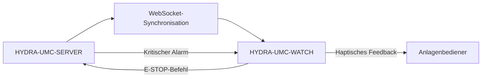

<p align="center">
  
</p>

# ⌚ HYDRA-UMC-WATCH

<p align="center"><a href="README.md">🇺🇸 English</a> | <a href="README_spa.md">🇪🇸 Español</a> | <a href="README_fra.md">🇫🇷 Français</a> | <a href="README_ita.md">🇮🇹 Italiano</a> | 🇩🇪 <b>Deutsch</b> | <a href="README_zho.md">🇨🇳 简体中文</a> | <a href="README_jpn.md">🇯🇵 日本語</a></p>

### 🛡️ Tragbares Sicherheits-Dashboard & Haptisches Notfall-Alarmsystem

<p align="left">
  
  
  
</p>

---

## 1. 🛠️ TECHNISCHER ÜBERBLICK

**HYDRA-UMC-WATCH** ist die taktische Erweiterung für den Anlagenbediener. Sie liefert kritische, auf einen Blick erfassbare Informationen und Sicherheitskontrollen direkt am Handgelenk und stellt sicher, dass der Bediener stets die Kontrolle behält, selbst fernab der Haupt-HMI.

Gebaut als eigenständige Wear-OS-App (Kotlin + Jetpack Compose für Wear), die dieselbe Gradle/Kotlin-Toolchain wie das Schwester-Repository HYDRA-UMC-ANDROID-CONTROL wiederverwendet, statt eine neue einzuführen.

### Hauptmerkmale:
* ✅ **Echtes v0 - haptische Muster & Sync-Protokoll:** `haptics/HapticPatterns.kt` definiert ein echtes, eigenständiges Vibrationsmuster pro Alarmschweregrad (Kritisch/Warnung/Info); `protocol/SyncMessage.kt` definiert und (de)serialisiert die echten `EStopCommand`/`Alert`-Nachrichtenformen für den SERVER<->WATCH-Sync-Ablauf unten. Beides ist reines, testbares Kotlin - keine Uhr-Hardware, kein Emulator, kein offener WebSocket nötig, um es auszuführen oder zu testen.
* 🛑 **Kabelloser E-STOP** — dedizierter Notfallknopf mit unter 50ms Latenz über industrielles WLAN. *(die `EStopCommand`-Nachricht, die er senden würde, ist echt und getestet; der WebSocket-Transport und die physische Knopf-Verdrahtung bleiben geplant — benötigt Kopplung mit HYDRA-UMC-SERVER.)*
* 📳 **Haptische Alarme** — unterschiedliche Vibrationsmuster für verschiedene Alarmtypen (Kritisch, Warnung, Info), abgespielt über Androids echten `Vibrator`/`VibratorManager`-Dienst. *(implementiert - `haptics/HapticAlertPlayer.kt`; noch unverifiziert auf einem echten Wear-OS-Gerät, wie der Rest dieser App.)*
* 🎙️ **Sprache** — Tap-to-Talk: explizite `RECORD_AUDIO`-Berechtigungsanfrage, das System-Spracherkennungs-Intent (`RecognizerIntent`) für die Transkription, die Transkription wird als begrenzte `voice_turn`-Sync-Nachricht an HYDRA-UMC-ANDROID-CONTROL weitergeleitet, und eine lokale `TextToSpeech`-Antwort auf der Uhr. *(implementiert - `MainActivity.kt`; Sprache kann niemals direkt einen Roboter ansteuern, siehe Architektur unten und [docs/VOICE_AI_PROTOCOL.md](docs/VOICE_AI_PROTOCOL.md) für den vollständigen Ende-zu-Ende-Nachrichtenfluss und die Sicherheitsgrenze.)*
* ⌚ **Statusübersicht auf einen Blick** — ein **Status aktualisieren**-Knopf leitet eine begrenzte Statusanfrage über den gekoppelten Data Layer an HYDRA-UMC-ANDROID-CONTROL weiter; die zurückgegebene `system_status`-Karte wird mit einem "zuletzt bekannt - könnte veraltet sein"-Hinweis angezeigt, sobald sie veraltet. *(implementiert - `MainActivity.kt`/`WatchRelayTransport.requestSystemStatus()`; abrufbasiert über das Telefon-Relay, kein direkter Uhr-zu-Server-Push-Socket, und noch unverifiziert auf einem echten Wear-OS-Gerät.)*
* 🔐 **Sichere Authentifizierung** — JWT-basierte Kopplung mit HYDRA-UMC-SERVER. *(geplant.)*
* ✅ **Eigenständige Wear-OS-Toolchain** — eine echte Gradle/Kotlin/Compose-for-Wear-App, die eine funktionierende Debug-APK baut. *(implementiert — siehe BUILD & AUSFÜHRUNG unten)*
* 🔁 **Relay-Wiederverbindungsrichtlinie** — `transport/RelayRetryPolicy.kt` ist eine echte, reine Exponential-Backoff-Richtlinie für einen fehlgeschlagenen Relay-Sendevorgang (z. B. noch kein gekoppeltes Telefon), begrenzt auf eine maximale Verzögerung. *(implementiert)*
* 🗂️ **Cache des zuletzt bekannten Zustands** — `transport/LastKnownStateCache.kt` verfolgt die echte Veralterung des zuletzt weitergeleiteten Status/Alarms, sodass ein alter niemals als aktuell angezeigt wird. *(implementiert)*

---

## 2. 🔄 WEARABLE-SYNC-ABLAUF



*Zielarchitektur, sobald ein direkter Server-WebSocket existiert. Der echte,
getestete Weg heute läuft über das gekoppelte Telefon: Watch -> Data Layer
-> HYDRA-UMC-ANDROID-CONTROL -> authentifizierter HYDRA-UMC-SERVER/Voice UI,
und zurück - siehe Architektur unten und
[docs/VOICE_AI_PROTOCOL.md](docs/VOICE_AI_PROTOCOL.md) für diesen echten
Ende-zu-Ende-Fluss. Die Uhr besitzt selbst niemals eine Server-Anmeldeinfo;
ein direkter Watch-zu-Server-WebSocket und der kabellose E-STOP-Knopf
bleiben zukünftige, hardware-abhängige Arbeit.*

---

## 3. 🧱 ARCHITEKTUR & DESIGNENTSCHEIDUNGEN

* **Warum es eine eigenständige Wear-OS-App ist, kein Feature der Telefon-App.** Eine Uhr läuft als eigener unabhängiger Prozess auf ihrem eigenen Betriebssystem - sie kann nicht einfach ein UI-Modus von HYDRA-UMC-ANDROID-CONTROL sein, sie braucht ihr eigenes Manifest, ihren eigenen Build und ihre eigene (viel eingeschränktere) UI für Status auf einen Blick/schnellen E-STOP.
* **Warum `minSdk 30` (Wear OS 3), niedriger als der eigene minSdk der Telefon-App.** Dies zielt bewusst auf die aktuelle Wear-OS-3+-Hardware-Generation, nicht auf alte Wear-OS-2-Geräte - anders als HYDRA-UMC-ANDROID-CONTROL, das ältere Telefone unterstützt, hat eine Begleituhr-App eine deutlich engere realistische Hardware-Basis zu unterstützen.
* **Warum haptische Muster und das Sync-Protokoll vor der WebSocket-Verbindung kommen.** Die Vibrationswellenformen und die Nachrichtenformen zu definieren, auf die sich beide Seiten einigen müssen, ist echte, reine Kotlin-Arbeit - dafür braucht es weder einen offenen Socket noch einen gekoppelten Server noch eine physische Uhr zum Schreiben oder Testen. Diese Verbindung tatsächlich zu öffnen, ist der nächste Schritt.
* **Warum Wiederverbindungsrichtlinie und Cache des zuletzt bekannten Zustands eigene reine Module sind, nicht inline in `WatchRelayTransport`.** Beide sind echte, entkoppelte Kotlin-Klassen (`RelayRetryPolicy`, `LastKnownStateCache`), testbar auf einer einfachen JVM ohne Uhr, Emulator oder gekoppeltes Telefon - derselbe Standard, den `HapticPatterns.kt`/`SyncMessage.kt` bereits gesetzt haben. `WatchRelayTransport` selbst bleibt das schlanke, notwendigerweise Android-spezifische Stück, das tatsächlich einen erneuten Versuch plant oder eine empfangene Nachricht aufzeichnet, nicht der Ort, an dem die zugrunde liegende Richtlinienlogik lebt.
* **Warum ein veralteter zwischengespeicherter Zustand markiert, nicht verborgen wird.** Einen alten Status vollständig zurückzuhalten würde das Ziffernblatt der Uhr genau dann leer lassen, wenn die Telefonverbindung instabil ist - der eigentliche Risikomoment. Ihn klar markiert als "zuletzt bekannt - könnte veraltet sein" anzuzeigen, hält den Bediener informiert, ohne eine minutenalte Ablesung als aktuell durchgehen zu lassen.
* **Wie sich das ins restliche Ökosystem einfügt.** Bildet ein Paar mit HYDRA-UMC-ANDROID-CONTROL und HYDRA-UMC-IOS-CONTROL als Begleiter am Handgelenk, auf einen Blick - kein Ersatz für eines von beiden, sondern eine Oberfläche für schnellen Status/schnellen E-STOP.

---

## 📂 VERZEICHNISSTRUKTUR

Eigenständige Wear-OS-App — ohne eigene Hardware, Firmware oder Betriebssystem (läuft auf handelsüblicher Uhren-Hardware); diese Ordner werden gemäß der Repository-Strukturpolitik ausgelassen.

```text
HYDRA-UMC-WATCH/
├── app/
│   ├── build.gradle.kts       # App-Modul-Konfiguration (liest version.properties, schreibt es nie)
│   ├── version.properties     # versionMajor/Minor/Patch/Code (nur von build.sh/.bat erhöht)
│   └── src/
│       ├── main/
│       │   ├── AndroidManifest.xml
│       │   └── java/com/hydraumc/watch/
│       │       ├── MainActivity.kt         # Compose-for-Wear-Einstiegspunkt
│       │       ├── haptics/                # Vibrationsmuster pro Schweregrad
│       │       ├── protocol/               # SERVER<->WATCH-Sync-Nachrichten-Codec
│       │       └── transport/              # Data-Layer-Relay, Retry-Richtlinie, Cache des zuletzt bekannten Zustands
│       └── test/java/com/hydraumc/watch/   # Echte JUnit-Tests (haptics, protocol, transport)
├── gradle/
│   ├── libs.versions.toml     # Abhängigkeits-Versionskatalog
│   └── wrapper/                # Gradle-Wrapper (fixiert auf 9.7.0)
├── tools/
│   ├── build_test.py          # Nicht-mutierende CI-Prüfung: Vertragsprüfung + assembleDebug
│   ├── ci_validate.py         # Manifest-/CHANGELOG-/Docs-Validierung, von CI verwendet
│   └── verify_paired_relay_contract.py # Statische Prüfung der Data-Layer-Sicherheitsgrenze Watch<->Android Control
├── build.gradle.kts           # Gradle-Root-Build
├── settings.gradle.kts        # Modul-Verdrahtung
├── gradlew / gradlew.bat      # Gradle-Wrapper-Launcher
├── docs/                      # Dokumentation und Sicherheitsprotokolle
├── build/                     # Reserviert (Gradles eigenes app/build/ ist von git ignoriert)
├── images/                    # Medien und Diagramme
├── hydra-umc.project.json     # Ökosystem-Manifest (Version, Build-/Health-Metadaten)
├── keystore.properties.example # Vorlage für die von git ignorierte Release-Signierkonfiguration
├── bump_manifest_version.py   # Erhöht major/minor/patch + das Manifest, gemeinsam
├── bump_version_code.py       # Erhöht den eigenen versionCode-Zähler von Android
├── build.sh / build.bat       # Echter Build: erhöht Version, führt Tests aus, assembleDebug
├── build-test.sh / build-test.bat # Nicht-mutierender Wrapper für tools/build_test.py
├── run.sh / run.bat           # Echte Ausführung: gradlew installDebug + adb-Start
├── update-from-github.sh / .bat # Nicht-Play-Update-Kanal: GitHub-Release-APK + `adb install -r`
└── src/                       # Reserviert (der Code dieses Projekts liegt unter app/src/)
```

---

## 4. ⚙️ BUILD & AUSFÜHRUNG

Erfordert JDK 21, das Android SDK (`local.properties` → `sdk.dir`, von git ignoriert — auf die eigene SDK-Installation verweisen) und ein Wear-OS-Gerät oder einen Emulator für `run`.

```bash
# Linux/macOS
chmod +x gradlew   # einmalig
./build.sh
./run.sh            # benötigt ein verbundenes Wear-OS-Gerät/Emulator

# Windows
build.bat
run.bat
```

`build` erhöht die Version (`bump_manifest_version.py` für major/minor/patch im Gleichschritt mit `hydra-umc.project.json`, `bump_version_code.py` für Androids eigenen `versionCode`), führt die echte JUnit-Test-Suite aus (`haptics`, `protocol`) und kompiliert die Debug-APK nach `app/build/outputs/apk/debug/app-debug.apk` - alles in einem einzigen Gradle-Aufruf mit `-PhydraUmcReadOnly=true`, damit der versionslesende Code in `app/build.gradle.kts` sie niemals *auch* erhöht (dasselbe Flag verwenden `build-test.sh`/`.bat` für ihre separate, nicht mutierende, reine Compile-CI-Prüfung). `run` installiert die APK über `gradlew installDebug` und startet `MainActivity` mit `adb`.

Echtes Beispiel - die beiden Versions-Erhöhungsskripte laufen auch eigenständig, nützlich um zu prüfen, was ein Build tun würde, ohne Gradle auszulösen:

```bash
python3 bump_manifest_version.py   # z.B. "HYDRA-UMC version: v0.1.2 -> v0.1.3"
python3 bump_version_code.py       # z.B. "versionCode: 12 -> 13"
```

---

## 5. 📲 UPDATES OHNE GOOGLE PLAY

Dieses Projekt wird nicht über Google Play verteilt. Der wiederholbare
Update-Weg ist eine GitHub-Release-APK, installiert über ADB:

```bash
# vom Projektstamm aus, Uhr gekoppelt und Wireless Debugging aktiviert
update-from-github.bat    # Windows
./update-from-github.sh   # Linux / macOS / WSL
```

Das Skript liest `releases/latest` von GitHub, verlangt ein stabiles
`vMAJOR.MINOR.PATCH`-Tag, prüft die bereits installierte Version, fragt
nach expliziter Bestätigung des Bedieners und lädt dann herunter und ruft
`adb install -r` auf. Es berührt niemals die Repository-Version, das
Manifest oder `CHANGELOG.md`. Eine manuelle Best-Effort-Installation (die
heruntergeladene APK direkt auf der Uhr mit dem Paketinstaller öffnen) ist
ebenfalls für Geräte ohne nutzbaren ADB-Weg dokumentiert. Siehe
[docs/GITHUB_ADB_UPDATES.md](docs/GITHUB_ADB_UPDATES.md) für das
vollständige Verfahren, die geforderte Release-APK-Benennung und die
Release-Signierkonfiguration.

`HYDRA-UMC-ANDROID-CONTROL` kann den Bediener informieren, dass eine neue
Watch-Version existiert, sobald die Companion-Versionsstatus-Nachricht
verdrahtet ist — das ist rein informativ und kann niemals selbst etwas auf
der Uhr installieren. Siehe
[docs/COMPANION_VERSION_PROTOCOL.md](docs/COMPANION_VERSION_PROTOCOL.md)
für diese Nachrichtenform.

---

## ✅ Aktueller Status & Nächste Schritte

**Heute real:** lokale Alarmwiedergabe über den Android-Dienst `Vibrator`, explizite Mikrofonberechtigung und System-Spracherkennung, sichtbares Transkript und lokale Sprachausgabe sowie getestete typisierte Nachrichten für `voice_turn`, `assistant_reply`, `system_status`, `EStopCommand`, `Alert` und den Versionsstatus des Begleitgeräts. Der offizielle Wear-OS-Data-Layer-Transport leitet begrenzte Sprachanfragen und Statuskarten über HYDRA-UMC-ANDROID-CONTROL an den authentifizierten Server und Voice UI weiter.

**Integrationsgrenze:** die gekoppelte Android-App bewahrt das verschlüsselte Server-JWT auf; Server bewahrt das Voice-UI-Token auf. Data Layer verlangt denselben Paketnamen und dasselbe Signaturzertifikat in beiden APKs. Sprache kann nie einen Roboter direkt betätigen; eine bewegungsbezogene Antwort muss eine Bestätigung verlangen, während der physische E-STOP unabhängig bleibt.

**Noch offen:** Validierung von Kopplung, Funktransport, Mikrofon/Lautsprecher und Ende-zu-Ende-Status auf einem echten Wear-OS-Gerät; drahtloser E-STOP und CM5-Livetelemetrie bleiben getrennte hardwareabhängige Arbeit.

---

## 🔗 Verwandte Projekte

Dieses Projekt ist Teil des HYDRA-UMC-Robotik-Ökosystems desselben Autors (JuanenRac / Electro Hobby 3D). Gut zu wissen, da eine Anfrage eigentlich eines dieser Projekte betreffen könnte statt dieses Repositorys.

**Direkt verwandt**
- **[HYDRA-UMC-ANDROID-CONTROL](https://github.com/JuanenRac/HYDRA-UMC-ANDROID-CONTROL)** — native Android-Steuerungs-App mit biometrischem Login und einer gekoppelten Wear-OS-Begleit-App — die Begleit-App, mit der sich dieses Wearable koppelt.
- **[HYDRA-UMC-IOS-CONTROL](https://github.com/JuanenRac/HYDRA-UMC-IOS-CONTROL)** — iOS/iPadOS-Steuerungs-App (Flutter) mit Echtzeit-WebSocket-Synchronisierung — die Begleit-App, mit der sich dieses Wearable koppelt.
- **[HYDRA-UMC-VOICE-UI](https://github.com/JuanenRac/HYDRA-UMC-VOICE-UI)** — echtes Sprach-Frontend (VAD + Intent-Parser) mit einem begrenzten, bestätigungsgesicherten Watch-Relay — sendet die voice_turn-Nachrichten, die dieses Wearable als haptische Alarme darstellt.

**Ebenfalls Teil des Ökosystems**

*Kern-Hardware & Plattform*
- **[HYDRA-UMC](https://github.com/JuanenRac/HYDRA-UMC)** — das physische Motherboard des Roboterarms: CM5-Host + Dual-Core-STM32H745, koordiniert bis zu 8 Werkzeugarme über CAN-OTA/SPI-OTA.
- **[HYDRA-UMC-OS](https://github.com/JuanenRac/HYDRA-UMC-OS)** — reproduzierbare Raspberry-Pi-OS-Produktschicht für den CM5: schreibgeschützter Agent, validierte Konfiguration/Profile, WiFi-Ersteinrichtung.
- **[HYDRA-UMC-SDK](https://github.com/JuanenRac/HYDRA-UMC-SDK)** — der gemeinsame JSON-Schema-Vertrag und die Sicherheitsschranke, gegen die jede Bridge ihre Befehle validiert.

*Kern-Backend & Clients*
- **[HYDRA-UMC-SERVER](https://github.com/JuanenRac/HYDRA-UMC-SERVER)** — das reale Headless-Backend (REST/WebSocket), mit dem jeder Steuerungsclient tatsächlich spricht.
- **[HYDRA-UMC-STUDIO](https://github.com/JuanenRac/HYDRA-UMC-STUDIO)** — Web-Steuerungs-Dashboard mit Echtzeit-3D-Visualisierung mehrerer Roboter.
- **[HYDRA-UMC-SUITE](https://github.com/JuanenRac/HYDRA-UMC-SUITE)** — Desktop-Schwarmleitstand (PySide6) für mehrere Server gleichzeitig, verpackt als eigenständige ausführbare Datei.
- **[HYDRA-UMC-DSI](https://github.com/JuanenRac/HYDRA-UMC-DSI)** — native Touch-UI für das eingebaute 7"-DSI-Touchscreen, direkt auf dem CM5 eingebettet.
- **[HYDRA-UMC-EDITOR-URDF](https://github.com/JuanenRac/HYDRA-UMC-EDITOR-URDF)** — grafischer Desktop-URDF-Ersteller/-Editor, der fertige Modelle in STUDIOs eigenen Katalog überträgt.
- **[HYDRA-UMC-BRIDGE-AMR](https://github.com/JuanenRac/HYDRA-UMC-BRIDGE-AMR)** — Koordinationsschranke für AGV-/AMR-Flotten über einen echten VDA-5050-MQTT-Publisher.
- **[HYDRA-UMC-BRIDGE-CNC](https://github.com/JuanenRac/HYDRA-UMC-BRIDGE-CNC)** — High-Level-Koordinator für CNC-Zellen mit echtem GRBL-Status-/Steuerbyte-Zugriff.
- **[HYDRA-UMC-BRIDGE-DROIDS](https://github.com/JuanenRac/HYDRA-UMC-BRIDGE-DROIDS)** — Koordinationsschranke für laufende/humanoide Droiden, mit einem echten Boston-Dynamics-Spot-Befehlssender.
- **[HYDRA-UMC-BRIDGE-LASER](https://github.com/JuanenRac/HYDRA-UMC-BRIDGE-LASER)** — Sicherheitskoordinator für Laserzellen, liest 3 echte Schlüssel-/Gehäuse-/Verriegelungs-GPIO-Sicherungen.
- **[HYDRA-UMC-BRIDGE-OPENPNP](https://github.com/JuanenRac/HYDRA-UMC-BRIDGE-OPENPNP)** — sicherer High-Level-Koordinator für den Leiterplattenfluss von OpenPnP Pick-and-Place.
- **[HYDRA-UMC-BRIDGE-PRINTER3D](https://github.com/JuanenRac/HYDRA-UMC-BRIDGE-PRINTER3D)** — sichere Koordinationsschranke für Moonraker/Klipper-3D-Drucker, mit echten gesicherten Job-Befehlen.
- **[HYDRA-UMC-BRIDGE-ROS2](https://github.com/JuanenRac/HYDRA-UMC-BRIDGE-ROS2)** — Sicherheitskoordinator mit einem echten, träge importierten rclpy-ROS-2-Transport.
- **[HYDRA-UMC-BRIDGE-UAV](https://github.com/JuanenRac/HYDRA-UMC-BRIDGE-UAV)** — Koordinationsschranke für kameraausgestattete UAVs, mit einem echten MAVLink-Befehlssender.

*URTC-Werkzeugplattform*
- **[URTC](https://github.com/JuanenRac/URTC)** — Firmware für die physische Universal-Robot-Tool-Controller-Platine, 25+ Werkzeugprofile über CAN-Bus.
- **[URTC-FLASHER](https://github.com/JuanenRac/URTC-FLASHER)** — Desktop-GUI-Flash-Tool für URTC-Platinen, CAN-OTA plus Full-Chip-SWD/JTAG.
- **[URTC-TESTER](https://github.com/JuanenRac/URTC-TESTER)** — Desktop-Live-CAN-Bus-Diagnosetool für URTC-Platinen, ein Panel pro Werkzeugprofil.
- **[URTC-WEB-STUDIO](https://github.com/JuanenRac/URTC-WEB-STUDIO)** — browserbasierte Alternative zu URTC-TESTER über die Web-Serial-API, ohne lokale Installation.

*Vision-KI-Knoten (Hailo-8)*
- **[HYDRA-UMC-VISION-NODE](https://github.com/JuanenRac/HYDRA-UMC-VISION-NODE)** — Integrationsknoten für die Hailo-8-Vision-Pipeline, mit einer echten stufenweisen Hardware-Bereitschaftsprüfung.
- **[HYDRA-UMC-DETECTION-HEF](https://github.com/JuanenRac/HYDRA-UMC-DETECTION-HEF)** — echte Registry für kompilierte Modelle mit Hailo-Architektur-/Prüfsummen-Safe-Load-Verifizierung.
- **[HYDRA-UMC-VISION-STREAMER](https://github.com/JuanenRac/HYDRA-UMC-VISION-STREAMER)** — echter GStreamer-Pipeline- + MediaMTX-Konfigurationsgenerator mit einer echten HailoRT-Integrationsschranke.
- **[HYDRA-UMC-VISUAL-SERVOING-API](https://github.com/JuanenRac/HYDRA-UMC-VISUAL-SERVOING-API)** — echtes Position-Based-Visual-Servoing-Korrekturgesetz, sicherheitsgesteuert nach vorgelagertem Zonenstatus.
- **[HYDRA-UMC-SAFETY-ZONES](https://github.com/JuanenRac/HYDRA-UMC-SAFETY-ZONES)** — echte Zonenverletzungsprüfung und E-STOP-Anforderung, mit erzwungener Kalibrierungsaktualität.

*Kognitiver KI-Knoten (Hailo-10)*
- **[HYDRA-UMC-COGNITIVE-NODE](https://github.com/JuanenRac/HYDRA-UMC-COGNITIVE-NODE)** — Integrationsknoten für die Hailo-10-Cognitive-Pipeline (LLM-/VLA-/Sprach-Orchestrierung).
- **[HYDRA-UMC-VLA-ENGINE](https://github.com/JuanenRac/HYDRA-UMC-VLA-ENGINE)** — echte Aktions-Token-Kodierung/-Dekodierung und Trajektoriengenerierung für ein Vision-Language-Action-Modell.
- **[HYDRA-UMC-SEMANTIC-PLANNER](https://github.com/JuanenRac/HYDRA-UMC-SEMANTIC-PLANNER)** — echte regelbasierte Aufgabenzerlegung und semantische Fehlerbehebung über MCU-Fehlercodes.
- **[HYDRA-UMC-DOCS-QA](https://github.com/JuanenRac/HYDRA-UMC-DOCS-QA)** — echte, nur auf der Standardbibliothek basierende TF-IDF-Dokumentensuche über die eigenen Markdown-Dokumente dieses Ökosystems.

*Orchestrierung & Schwarm*
- **[HYDRA-UMC-ORCHESTRATOR](https://github.com/JuanenRac/HYDRA-UMC-ORCHESTRATOR)** — Integrationsknoten mit einem echten gRPC/Protobuf-Health-Report-Vertrag und einer Missions-Zustandsmaschine.
- **[HYDRA-UMC-JOB-DISPATCHER](https://github.com/JuanenRac/HYDRA-UMC-JOB-DISPATCHER)** — echte prioritätsbasierte Job-Queue mit Deduplizierung, über eine echte HTTP-API.
- **[HYDRA-UMC-NODE-HEALING](https://github.com/JuanenRac/HYDRA-UMC-NODE-HEALING)** — echter gRPC-basierter Flotten-Health-Watchdog mit Retry/Backoff und Identitäts-Mismatch-Erkennung.
- **[HYDRA-UMC-PATH-PLANNER-3D](https://github.com/JuanenRac/HYDRA-UMC-PATH-PLANNER-3D)** — echter RRT-basierter 3D-Pfadplaner mit echter Hindernis-/Arbeitsraum-Kollisionsvalidierung.
- **[HYDRA-UMC-SWARM-SYNC](https://github.com/JuanenRac/HYDRA-UMC-SWARM-SYNC)** — echte CRDT-LWW-Element-Map-Zustandssynchronisation, eigenschaftsgetestet auf Multi-Zellen-Konvergenz.

*Digitaler Zwilling & Simulation*
- **[HYDRA-UMC-TWIN](https://github.com/JuanenRac/HYDRA-UMC-TWIN)** — Integrationsknoten für die Digital-Twin-Engine, mit einem echten Versionskompatibilitäts-Sync-Vertrag.
- **[HYDRA-UMC-HIL-BRIDGE](https://github.com/JuanenRac/HYDRA-UMC-HIL-BRIDGE)** — echte Hardware-in-the-Loop-Sicherheitsverriegelung, die Befehle zwischen Simulation und echter Hardware routet.
- **[HYDRA-UMC-PHYSICS-REPLICA](https://github.com/JuanenRac/HYDRA-UMC-PHYSICS-REPLICA)** — echte Vorwärtskinematik und Gelenkgrenzenvalidierung über eine echte URDF-Teilmenge.
- **[HYDRA-UMC-SYNTHETIC-DATA-GEN](https://github.com/JuanenRac/HYDRA-UMC-SYNTHETIC-DATA-GEN)** — echter prozeduraler 2D-Szenengenerator mit YOLO/COCO-Annotationsexport.

*Daten & Analytik*
- **[HYDRA-UMC-DATALAKE](https://github.com/JuanenRac/HYDRA-UMC-DATALAKE)** — echter sqlite3-gestützter Zeitreihenspeicher mit einer echten Ingest-/Abfrage-HTTP-API.
- **[HYDRA-UMC-ANOMALY-DETECTOR](https://github.com/JuanenRac/HYDRA-UMC-ANOMALY-DETECTOR)** — echter FFT- + statistischer Basislinien-Anomaliedetektor mit Drift-Überwachung.
- **[HYDRA-UMC-PRODUCTION-REPORTS](https://github.com/JuanenRac/HYDRA-UMC-PRODUCTION-REPORTS)** — echte OEE-/Verfügbarkeitsberechnung über den DATALAKE-Verlauf, mit reproduzierbarem CSV-Export.
- **[HYDRA-UMC-TELEMETRY-COLLECTOR](https://github.com/JuanenRac/HYDRA-UMC-TELEMETRY-COLLECTOR)** — echte CAN/WebSocket-Ingestion-Pipeline in DATALAKE, mit Sequenz-Deduplizierung.

*Industrie-Gateway*
- **[HYDRA-UMC-GATEWAY-INDUSTRIAL](https://github.com/JuanenRac/HYDRA-UMC-GATEWAY-INDUSTRIAL)** — Integrationsknoten, der zu Industrieprotokollen weiterleitet, mit einer echten Befehls-Allowlist-/Backpressure-Schicht.
- **[HYDRA-UMC-OPCUA-SERVER](https://github.com/JuanenRac/HYDRA-UMC-OPCUA-SERVER)** — echter OPC-UA-Adressraum, verifiziert mit einer echten Binärprotokoll-Client-Session.
- **[HYDRA-UMC-MQTT-BROKER](https://github.com/JuanenRac/HYDRA-UMC-MQTT-BROKER)** — echter MQTT-Broker mit optionaler Pro-Client-Authentifizierung und Topic-ACLs.
- **[HYDRA-UMC-MTCONNECT-ADAPTER](https://github.com/JuanenRac/HYDRA-UMC-MTCONNECT-ADAPTER)** — echte MTConnect-`/probe`- und `/current`-XML-Endpunkte mit Degraded-Mode-Ausgabe.

*Ergänzende Tools & Ökosystembetrieb*
- **[HYDRA-UMC-DASHBOARD-AI](https://github.com/JuanenRac/HYDRA-UMC-DASHBOARD-AI)** — Smart-Summaries- und Anomaly-Highlighting-Panels über DATALAKE/ANOMALY-DETECTOR, mit einem ehrlichen statistischen Fallback.
- **[HYDRA-UMC-TOOL-CLI](https://github.com/JuanenRac/HYDRA-UMC-TOOL-CLI)** — Flotten-CLI mit einem echten, stabilen Exit-Code-Vertrag, ein echter Live-Client der eigenen API von HYDRA-UMC-SERVER.
- **[URTC-SMART-RACK](https://github.com/JuanenRac/URTC-SMART-RACK)** — Firmware für ein Platinenmontagegestell mit echter Werkzeug-ID-Dekodierung und Smart-Idle-Vorheizlogik.
- **[URTC-VISION-TOOL](https://github.com/JuanenRac/URTC-VISION-TOOL)** — Firmware plus ein echter Python-Vision-Begleiter für einen Thermal-/RGB-Inspektionswerkzeugkopf.
- **[HYDRA-UMC-UPDATER](https://github.com/JuanenRac/HYDRA-UMC-UPDATER)** — administratives Desktop-Tool, das jedes Repository in diesem Ökosystem entdeckt, klont und aktualisiert.


---

## 📚 Dokumentation & Community

- **[CONTRIBUTING.md](CONTRIBUTING.md)** — Technologie-Stack und Coding-Richtlinien für einen Pull Request.
- **[CODE_OF_CONDUCT.md](CODE_OF_CONDUCT.md)** — die in dieser Community erwarteten Verhaltensstandards.
- **[SECURITY.md](SECURITY.md)** — wie man eine Schwachstelle meldet, und die echten Sicherheitsschwerpunkte dieses Projekts.
- **[SUPPORT.md](SUPPORT.md)** — wo man Fragen stellt und Fehler meldet.
- **[LICENSE.md](LICENSE.md)** — die eigene Lizenz dieses Projekts.

## 👤 AUTOR
**JuanenRac** (Electro Hobby 3D)
📧 electrohobby3d@gmail.com
📺 [youtube.com/@electrohobby3d](https://youtube.com/@electrohobby3d)

## 📜 LIZENZ
GPL-3.0 - Siehe LICENSE für Details.
