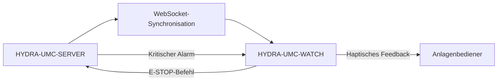

<p align="center">
  
</p>

# ⌚ HYDRA-UMC-WATCH

<p align="center"><a href="README.md">🇺🇸 English</a> | <a href="README_spa.md">🇪🇸 Español</a> | <a href="README_fra.md">🇫🇷 Français</a> | <a href="README_ita.md">🇮🇹 Italiano</a> | 🇩🇪 <b>Deutsch</b> | <a href="README_zho.md">🇨🇳 简体中文</a> | <a href="README_jpn.md">🇯🇵 日本語</a></p>

### 🛡️ Tragbares Sicherheits-Dashboard & Haptisches Notfall-Alarmsystem

<p align="left">
  
  
  
</p>

---

## 1. 🛠️ TECHNISCHER ÜBERBLICK

**HYDRA-UMC-WATCH** ist die taktische Erweiterung für den Anlagenbediener. Sie liefert kritische, auf einen Blick erfassbare Informationen und Sicherheitskontrollen direkt am Handgelenk und stellt sicher, dass der Bediener stets die Kontrolle behält, selbst fernab der Haupt-HMI.

Gebaut als eigenständige Wear-OS-App (Kotlin + Jetpack Compose für Wear), die dieselbe Gradle/Kotlin-Toolchain wie das Schwester-Repository HYDRA-UMC-ANDROID-CONTROL wiederverwendet, statt eine neue einzuführen.

### Hauptmerkmale:
* 🛑 **Kabelloser E-STOP** — dedizierter Notfallknopf mit unter 50ms Latenz über industrielles WLAN. *(geplant — benötigt Kopplung mit HYDRA-UMC-SERVER)*
* 📳 **Haptische Alarme** — unterschiedliche Vibrationsmuster für verschiedene Alarmtypen (Kritisch, Warnung, Info). *(geplant)*
* ⌚ **Statusübersicht auf einen Blick** — Echtzeit-Zusammenfassung der Flottenaktivität und des Missionsfortschritts. *(geplant)*
* 🔐 **Sichere Authentifizierung** — JWT-basierte Kopplung mit HYDRA-UMC-SERVER. *(geplant)*
* ✅ **Eigenständige Wear-OS-Toolchain** — eine echte Gradle/Kotlin/Compose-for-Wear-App, die eine funktionierende Debug-APK baut. *(implementiert — siehe BUILD & AUSFÜHRUNG unten)*

---

## 2. 🔄 WEARABLE-SYNC-ABLAUF



---

## 3. 🧱 ARCHITEKTUR & DESIGNENTSCHEIDUNGEN

* **Warum es eine eigenständige Wear-OS-App ist, kein Feature der Telefon-App.** Eine Uhr läuft als eigener unabhängiger Prozess auf ihrem eigenen Betriebssystem - sie kann nicht einfach ein UI-Modus von HYDRA-UMC-ANDROID-CONTROL sein, sie braucht ihr eigenes Manifest, ihren eigenen Build und ihre eigene (viel eingeschränktere) UI für Status auf einen Blick/schnellen E-STOP.
* **Warum `minSdk 30` (Wear OS 3), niedriger als der eigene minSdk der Telefon-App.** Dies zielt bewusst auf die aktuelle Wear-OS-3+-Hardware-Generation, nicht auf alte Wear-OS-2-Geräte - anders als HYDRA-UMC-ANDROID-CONTROL, das ältere Telefone unterstützt, hat eine Begleituhr-App eine deutlich engere realistische Hardware-Basis zu unterstützen.
* **Warum der Einstiegspunkt heute nur Identität/Version/Rolle ausgibt.** Andamiaje-Stadium: der Nachweis, dass `./gradlew assembleDebug` gelingt, geht der echten Sync-Logik mit der Begleit-Telefon-App voraus.
* **Wie sich das ins restliche Ökosystem einfügt.** Bildet ein Paar mit HYDRA-UMC-ANDROID-CONTROL und HYDRA-UMC-IOS-CONTROL als Begleiter am Handgelenk, auf einen Blick - kein Ersatz für eines von beiden, sondern eine Oberfläche für schnellen Status/schnellen E-STOP.

---

## 📂 VERZEICHNISSTRUKTUR

Eigenständige Wear-OS-App — ohne eigene Hardware/Firmware/OS (läuft auf handelsüblicher Uhren-Hardware), aus der Vorlage entfernt (siehe `SONNET/5.PLAN_EJECUCION_32_PROYECTOS_NUEVOS.txt` für die ökosystemweite Bereinigungsregel).

```text
HYDRA-UMC-WATCH/
├── app/
│   ├── build.gradle.kts       # App-Modul-Konfiguration, Versionserhöhung nach Kilometerzähler-Prinzip
│   ├── version.properties     # versionMajor/Minor/Patch/Code (bei jedem Build erhöht)
│   └── src/main/
│       ├── AndroidManifest.xml
│       ├── java/com/hydraumc/watch/MainActivity.kt   # Compose-for-Wear-Einstiegspunkt
│       └── res/                                        # Strings, Theme, Launcher-Icon
├── gradle/
│   ├── libs.versions.toml     # Abhängigkeits-Versionskatalog
│   └── wrapper/                # Gradle-Wrapper (fixiert auf 9.7.0)
├── build.gradle.kts           # Gradle-Root-Build
├── settings.gradle.kts        # Modul-Verdrahtung
├── gradlew / gradlew.bat      # Gradle-Wrapper-Launcher
├── docs/                      # Dokumentation und Sicherheitsprotokolle
├── build/                     # Reserviert (Gradles eigenes app/build/ ist von git ignoriert)
├── images/                    # Medien und Diagramme
├── scripts/                   # Hilfsskripte
├── build.sh / build.bat       # Echter Build: gradlew assembleDebug
├── run.sh / run.bat           # Echte Ausführung: gradlew installDebug + adb-Start
└── src/                       # Reserviert (der Code dieses Projekts liegt unter app/src/)
```

---

## 4. ⚙️ BUILD & AUSFÜHRUNG

Erfordert JDK 21, das Android SDK (`local.properties` → `sdk.dir`, von git ignoriert — auf die eigene SDK-Installation verweisen) und ein Wear-OS-Gerät oder einen Emulator für `run`.

```bash
# Linux/macOS
chmod +x gradlew   # einmalig
./build.sh
./run.sh            # benötigt ein verbundenes Wear-OS-Gerät/Emulator

# Windows
build.bat
run.bat
```

`build` kompiliert die Debug-APK nach `app/build/outputs/apk/debug/app-debug.apk`. Die Versionserhöhung (`app/version.properties`) erfolgt innerhalb von `app/build.gradle.kts` selbst zur Gradle-Konfigurationszeit und läuft daher automatisch bei jedem echten Build - kein separater Erhöhungsschritt nötig. `run` installiert die APK über `gradlew installDebug` und startet `MainActivity` mit `adb`.

---

## 🔗 Verwandte Projekte

Dieses Projekt ist Teil eines größeren Robotik-Ökosystems desselben Autors (JuanenRac / Electro Hobby 3D), das Firmware, Steuerungssoftware, KI-Knoten und Flotten-Tools umfasst. Gut zu wissen, denn eine Anfrage könnte tatsächlich eines dieser Projekte betreffen statt dieses Repository.

### Direkte Beziehung

- **[HYDRA-UMC-ANDROID-CONTROL](https://github.com/JuanenRac/HYDRA-UMC-ANDROID-CONTROL)** — die App, mit der dieses Wearable gekoppelt wird.
- **[HYDRA-UMC-IOS-CONTROL](https://github.com/JuanenRac/HYDRA-UMC-IOS-CONTROL)** — die App, mit der dieses Wearable gekoppelt wird.

### Restliches Ökosystem

**HYDRA-UMC-Plattform** — die Multi-Roboter-Mikrofabrikzelle
- **[HYDRA-UMC](https://github.com/JuanenRac/HYDRA-UMC)** — das CM5 + STM32H745-Motherboard, das bis zu 8 Roboterarme orchestriert.
- **[HYDRA-UMC-SERVER](https://github.com/JuanenRac/HYDRA-UMC-SERVER)** — das Express/WebSocket-Backend, mit dem jeder Steuerungsclient spricht.
- **[HYDRA-UMC-STUDIO](https://github.com/JuanenRac/HYDRA-UMC-STUDIO)** — webbasiertes Steuerungs-Dashboard, Multi-Roboter-3D-Visualisierung.
- **[HYDRA-UMC-ANDROID-CONTROL](https://github.com/JuanenRac/HYDRA-UMC-ANDROID-CONTROL)** — Android-Steuerungs-App über Wi-Fi/Bluetooth.
- **[HYDRA-UMC-IOS-CONTROL](https://github.com/JuanenRac/HYDRA-UMC-IOS-CONTROL)** — iOS/iPadOS-Steuerungs-App, gebaut in Flutter.
- **[HYDRA-UMC-SUITE](https://github.com/JuanenRac/HYDRA-UMC-SUITE)** — Desktop-Schwarm-Kommandozentrale (Python/PySide6).
- **[HYDRA-UMC-EDITOR-URDF](https://github.com/JuanenRac/HYDRA-UMC-EDITOR-URDF)** — Desktop-URDF-Modelleditor für den Roboterkatalog.
- **[HYDRA-UMC-DSI](https://github.com/JuanenRac/HYDRA-UMC-DSI)** — native Touch-UI für den eingebauten DSI-Touchscreen.

**URTC-Plattform** — der Werkzeugkopf-Controller, den jeder HYDRA-UMC-Roboterarm trägt
- **[URTC](https://github.com/JuanenRac/URTC)** — CAN-Bus-Werkzeugkopf-Controller, 25 Werkzeugprofile.
- **[URTC-FLASHER](https://github.com/JuanenRac/URTC-FLASHER)** — Desktop-Tool für CAN-OTA + SWD/JTAG-Flashing.
- **[URTC-TESTER](https://github.com/JuanenRac/URTC-TESTER)** — Desktop-Tool für Live-CAN-Bus-Diagnose.
- **[URTC-WEB-STUDIO](https://github.com/JuanenRac/URTC-WEB-STUDIO)** — browserbasierte Alternative über die Web-Serial-API.

**🎥 Vision AI Node (Hailo-8)**
- [HYDRA-UMC-VISION-NODE](https://github.com/JuanenRac/HYDRA-UMC-VISION-NODE)
- [HYDRA-UMC-VISION-STREAMER](https://github.com/JuanenRac/HYDRA-UMC-VISION-STREAMER)
- [HYDRA-UMC-DETECTION-HEF](https://github.com/JuanenRac/HYDRA-UMC-DETECTION-HEF)
- [HYDRA-UMC-SAFETY-ZONES](https://github.com/JuanenRac/HYDRA-UMC-SAFETY-ZONES)
- [HYDRA-UMC-VISUAL-SERVOING-API](https://github.com/JuanenRac/HYDRA-UMC-VISUAL-SERVOING-API)

**🧠 Cognitive AI Node (Hailo-10)**
- [HYDRA-UMC-COGNITIVE-NODE](https://github.com/JuanenRac/HYDRA-UMC-COGNITIVE-NODE)
- [HYDRA-UMC-VLA-ENGINE](https://github.com/JuanenRac/HYDRA-UMC-VLA-ENGINE)
- [HYDRA-UMC-VOICE-UI](https://github.com/JuanenRac/HYDRA-UMC-VOICE-UI)
- [HYDRA-UMC-SEMANTIC-PLANNER](https://github.com/JuanenRac/HYDRA-UMC-SEMANTIC-PLANNER)
- [HYDRA-UMC-DOCS-QA](https://github.com/JuanenRac/HYDRA-UMC-DOCS-QA)

**🐝 Orchestration & Swarm**
- [HYDRA-UMC-ORCHESTRATOR](https://github.com/JuanenRac/HYDRA-UMC-ORCHESTRATOR)
- [HYDRA-UMC-SWARM-SYNC](https://github.com/JuanenRac/HYDRA-UMC-SWARM-SYNC)
- [HYDRA-UMC-PATH-PLANNER-3D](https://github.com/JuanenRac/HYDRA-UMC-PATH-PLANNER-3D)
- [HYDRA-UMC-JOB-DISPATCHER](https://github.com/JuanenRac/HYDRA-UMC-JOB-DISPATCHER)
- [HYDRA-UMC-NODE-HEALING](https://github.com/JuanenRac/HYDRA-UMC-NODE-HEALING)

**🎮 Digital Twin & Simulation**
- [HYDRA-UMC-TWIN](https://github.com/JuanenRac/HYDRA-UMC-TWIN)
- [HYDRA-UMC-PHYSICS-REPLICA](https://github.com/JuanenRac/HYDRA-UMC-PHYSICS-REPLICA)
- [HYDRA-UMC-HIL-BRIDGE](https://github.com/JuanenRac/HYDRA-UMC-HIL-BRIDGE)
- [HYDRA-UMC-SYNTHETIC-DATA-GEN](https://github.com/JuanenRac/HYDRA-UMC-SYNTHETIC-DATA-GEN)

**📊 Data & Analytics**
- [HYDRA-UMC-DATALAKE](https://github.com/JuanenRac/HYDRA-UMC-DATALAKE)
- [HYDRA-UMC-TELEMETRY-COLLECTOR](https://github.com/JuanenRac/HYDRA-UMC-TELEMETRY-COLLECTOR)
- [HYDRA-UMC-ANOMALY-DETECTOR](https://github.com/JuanenRac/HYDRA-UMC-ANOMALY-DETECTOR)
- [HYDRA-UMC-PRODUCTION-REPORTS](https://github.com/JuanenRac/HYDRA-UMC-PRODUCTION-REPORTS)

**🏭 Industrial Gateway**
- [HYDRA-UMC-GATEWAY-INDUSTRIAL](https://github.com/JuanenRac/HYDRA-UMC-GATEWAY-INDUSTRIAL)
- [HYDRA-UMC-OPCUA-SERVER](https://github.com/JuanenRac/HYDRA-UMC-OPCUA-SERVER)
- [HYDRA-UMC-MQTT-BROKER](https://github.com/JuanenRac/HYDRA-UMC-MQTT-BROKER)
- [HYDRA-UMC-MTCONNECT-ADAPTER](https://github.com/JuanenRac/HYDRA-UMC-MTCONNECT-ADAPTER)

**🛠️ Complementary Tools**
- [URTC-SMART-RACK](https://github.com/JuanenRac/URTC-SMART-RACK)
- [URTC-VISION-TOOL](https://github.com/JuanenRac/URTC-VISION-TOOL)
- [HYDRA-UMC-TOOL-CLI](https://github.com/JuanenRac/HYDRA-UMC-TOOL-CLI)
- [HYDRA-UMC-DASHBOARD-AI](https://github.com/JuanenRac/HYDRA-UMC-DASHBOARD-AI)


## 👤 AUTOR
**JuanenRac** (Electro Hobby 3D)
📧 electrohobby3d@gmail.com

## 📜 LIZENZ
GPL-3.0 - Siehe LICENSE für Details.
