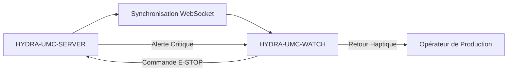

<p align="center">
  
</p>

# ⌚ HYDRA-UMC-WATCH

<p align="center"><a href="README.md">🇺🇸 English</a> | <a href="README_spa.md">🇪🇸 Español</a> | 🇫🇷 <b>Français</b> | <a href="README_ita.md">🇮🇹 Italiano</a> | <a href="README_deu.md">🇩🇪 Deutsch</a> | <a href="README_zho.md">🇨🇳 简体中文</a> | <a href="README_jpn.md">🇯🇵 日本語</a></p>

### 🛡️ Tableau de Bord de Sécurité Portable et Système d'Alerte Haptique d'Urgence

<p align="left">
  
  
  
</p>

---

## 1. 🛠️ APERÇU TECHNIQUE

**HYDRA-UMC-WATCH** est l'extension tactique de l'opérateur de production. Elle fournit des informations critiques d'un coup d'œil et des contrôles de sécurité directement au poignet, garantissant que l'opérateur garde toujours le contrôle, même loin de l'IHM principale.

Construit comme une application Wear OS autonome (Kotlin + Jetpack Compose pour Wear), réutilisant la même chaîne d'outils Gradle/Kotlin que le dépôt frère HYDRA-UMC-ANDROID-CONTROL plutôt que d'en introduire une nouvelle.

### Fonctionnalités Clés :
* ✅ **Réel v0 - motifs haptiques et protocole de synchronisation :** `haptics/HapticPatterns.kt` définit un motif de vibration réel et distinct par sévérité d'alerte (Critique/Avertissement/Info) ; `protocol/SyncMessage.kt` définit et (dé)sérialise les formes réelles des messages `EStopCommand`/`Alert` du flux de synchronisation SERVER<->WATCH ci-dessous. Les deux sont du Kotlin pur, testable - aucun matériel de montre, émulateur, ou WebSocket ouvert nécessaire pour les exécuter ou les tester.
* 🛑 **E-STOP Sans Fil** — bouton d'urgence dédié avec une latence inférieure à 50 ms sur Wi-Fi industriel. *(le message `EStopCommand` qu'il enverrait est réel et testé ; le transport WebSocket et le câblage du bouton physique restent prévus — nécessite l'appairage avec HYDRA-UMC-SERVER.)*
* 📳 **Alertes Haptiques** — motifs de vibration différenciés selon le type d'alerte (Critique, Avertissement, Info). *(les motifs eux-mêmes sont réels - voir ci-dessus ; les relier à l'appel réel du service `Vibrator` reste prévu.)*
* ⌚ **Statut en un Coup d'Œil** — résumé en temps réel de l'activité de la flotte et de l'avancement des missions. *(prévu - nécessite la vraie connexion WebSocket.)*
* 🔐 **Authentification Sécurisée** — appairage basé sur JWT avec HYDRA-UMC-SERVER. *(prévu.)*
* ✅ **Chaîne d'outils Wear OS autonome** — une véritable application Gradle/Kotlin/Compose pour Wear qui compile un APK de débogage fonctionnel. *(implémenté — voir COMPILATION ET EXÉCUTION ci-dessous)*
* 🔁 **Politique de Reconnexion du Relais** — `transport/RelayRetryPolicy.kt` est une politique réelle et pure de backoff exponentiel pour un envoi de relais échoué (par ex. pas encore de téléphone appairé), plafonnée à un délai maximal borné. *(implémenté)*
* 🗂️ **Cache du Dernier État Connu** — `transport/LastKnownStateCache.kt` suit l'obsolescence réelle du dernier statut/alerte relayé, afin qu'un ancien ne soit jamais affiché comme actuel. *(implémenté)*

---

## 2. 🔄 FLUX DE SYNCHRONISATION DU WEARABLE



---

## 3. 🧱 ARCHITECTURE & DÉCISIONS DE CONCEPTION

* **Pourquoi c'est une application Wear OS autonome, pas une fonctionnalité de l'application téléphone.** Une montre exécute son propre processus indépendant sur son propre système d'exploitation - elle ne peut pas être simplement un mode d'interface de HYDRA-UMC-ANDROID-CONTROL, elle a besoin de son propre manifeste, sa propre compilation, et sa propre interface (bien plus contrainte) pour un statut en un coup d'œil/un E-STOP rapide.
* **Pourquoi `minSdk 30` (Wear OS 3), inférieur au propre minSdk de l'application téléphone.** Cela cible délibérément la génération matérielle Wear OS 3+ actuelle, pas les anciens appareils Wear OS 2 - contrairement à HYDRA-UMC-ANDROID-CONTROL, qui supporte les téléphones plus anciens, une application montre compagnon a une base matérielle réaliste à supporter bien plus étroite.
* **Pourquoi les motifs haptiques et le protocole de synchronisation arrivent avant la connexion WebSocket.** Définir les formes d'onde de vibration et les formes des messages que les deux côtés doivent s'accorder est du vrai travail Kotlin pur - inutile d'avoir un socket ouvert, un serveur appairé ou une montre physique pour l'écrire ou le tester. Ouvrir réellement cette connexion est la prochaine étape.
* **Pourquoi la politique de reconnexion et le cache du dernier état connu sont leurs propres modules purs, et non du code intégré dans `WatchRelayTransport`.** Les deux sont des classes Kotlin réelles et découplées (`RelayRetryPolicy`, `LastKnownStateCache`) testables sur une simple JVM sans montre, émulateur, ni téléphone appairé - la même norme déjà établie par `HapticPatterns.kt`/`SyncMessage.kt`. `WatchRelayTransport` lui-même reste l'élément mince, nécessairement Android, qui planifie réellement une nouvelle tentative ou enregistre un message reçu, et non l'endroit où vit la logique mathématique de la politique sous-jacente.
* **Pourquoi un état mis en cache périmé est signalé, et non masqué.** Masquer entièrement un ancien statut laisserait l'écran de la montre vide exactement quand la connexion au téléphone est instable - le véritable moment à risque. L'afficher clairement marqué "dernier connu - peut être obsolète" tient l'opérateur informé sans laisser passer une lecture vieille de plusieurs minutes pour une lecture en direct.
* **Comment cela s'intègre dans le reste de l'écosystème.** Fait paire avec HYDRA-UMC-ANDROID-CONTROL et HYDRA-UMC-IOS-CONTROL comme compagnon au poignet, en un coup d'œil - pas un remplacement de l'un ou l'autre, une surface de statut rapide/E-STOP rapide.

---

## 📂 STRUCTURE DES DOSSIERS

Application Wear OS autonome — sans matériel, micrologiciel ou système d'exploitation propres (elle tourne sur du matériel de montre du commerce) ; ces dossiers sont omis conformément à la politique de structure du dépôt.

```text
HYDRA-UMC-WATCH/
├── app/
│   ├── build.gradle.kts       # Config du module app (lit version.properties, ne l'écrit jamais)
│   ├── version.properties     # versionMajor/Minor/Patch/Code (incrémenté uniquement par build.sh/.bat)
│   └── src/
│       ├── main/
│       │   ├── AndroidManifest.xml
│       │   └── java/com/hydraumc/watch/
│       │       ├── MainActivity.kt         # Point d'entrée Compose pour Wear
│       │       ├── haptics/                # Motifs de vibration par sévérité
│       │       ├── protocol/               # Codec des messages de synchronisation SERVER<->WATCH
│       │       └── transport/              # Relais Data Layer, politique de nouvelle tentative, cache du dernier état connu
│       └── test/java/com/hydraumc/watch/   # Tests JUnit réels (haptics, protocol, transport)
├── gradle/
│   ├── libs.versions.toml     # Catalogue des versions de dépendances
│   └── wrapper/                # Gradle wrapper (épinglé à 9.7.0)
├── build.gradle.kts           # Build racine Gradle
├── settings.gradle.kts        # Câblage des modules
├── gradlew / gradlew.bat      # Lanceur du Gradle wrapper
├── docs/                      # Documentation et protocoles de sécurité
├── build/                     # Réservé (app/build/ de Gradle lui-même est ignoré par git)
├── images/                    # Médias et diagrammes
├── scripts/                   # Scripts utilitaires
├── bump_manifest_version.py   # Incrémente major/minor/patch + le manifeste, ensemble
├── bump_version_code.py       # Incrémente le compteur versionCode propre à Android
├── build.sh / build.bat       # Build réel : incrémente la version, lance les tests, assembleDebug
├── run.sh / run.bat           # Exécution réelle : gradlew installDebug + lancement adb
└── src/                       # Réservé (le code de ce projet vit dans app/src/)
```

---

## 4. ⚙️ COMPILATION ET EXÉCUTION

Nécessite JDK 21, le SDK Android (`local.properties` → `sdk.dir`, ignoré par git — pointez-le vers votre propre installation du SDK) et un appareil ou émulateur Wear OS pour `run`.

```bash
# Linux/macOS
chmod +x gradlew   # une seule fois
./build.sh
./run.sh            # nécessite un appareil/émulateur Wear OS connecté

# Windows
build.bat
run.bat
```

`build` incrémente la version (`bump_manifest_version.py` pour major/minor/patch en accord avec `hydra-umc.project.json`, `bump_version_code.py` pour le `versionCode` propre à Android), lance la vraie suite de tests JUnit (`haptics`, `protocol`), et compile l'APK de débogage vers `app/build/outputs/apk/debug/app-debug.apk` - le tout en une seule invocation Gradle exécutée avec `-PhydraUmcReadOnly=true` pour que le code de `app/build.gradle.kts` qui lit la version ne l'incrémente jamais *aussi* (le même indicateur utilisé par `build-test.sh`/`.bat` pour leur vérification CI séparée, compilation seule, sans mutation). `run` installe l'APK via `gradlew installDebug` et lance `MainActivity` avec `adb`.

Exemple réel - les deux scripts d'incrémentation de version fonctionnent aussi de manière autonome, utile pour inspecter ce qu'un build fera sans déclencher Gradle :

```bash
python3 bump_manifest_version.py   # ex. "HYDRA-UMC version: v0.1.2 -> v0.1.3"
python3 bump_version_code.py       # ex. "versionCode: 12 -> 13"
```

---

## ✅ État Actuel et Prochaines Étapes

**Réel aujourd'hui :** lecture locale des alertes par le service Android `Vibrator`, permission explicite du microphone et reconnaissance vocale système, transcription visible et synthèse vocale locale, ainsi que des messages typés et testés pour `voice_turn`, `assistant_reply`, `system_status`, `EStopCommand`, `Alert` et l'état de version du compagnon. Le transport officiel Wear OS Data Layer relaie les demandes vocales limitées et les cartes d'état via HYDRA-UMC-ANDROID-CONTROL vers Server authentifié et Voice UI.

**Limite d'intégration :** l'application Android appairée conserve le JWT chiffré de Server ; Server conserve le jeton Voice UI. Data Layer exige le même nom de paquet et le même certificat de signature pour les deux APK. La voix ne peut jamais actionner directement un robot ; une réponse liée au mouvement doit demander une confirmation et l'E-STOP physique reste indépendant.

**À venir :** validation de l'appairage, du transport radio, du microphone/haut-parleur et de l'état de bout en bout sur un appareil Wear OS réel ; l'E-STOP sans fil et la télémétrie CM5 en direct restent des travaux distincts soumis au matériel.

---

## 🔗 Projets Liés

Ce projet fait partie d'un écosystème robotique plus large du même auteur (JuanenRac / Electro Hobby 3D), couvrant firmware, logiciel de contrôle, nœuds IA et outillage de flotte. Bon à savoir, car une demande pourrait en réalité concerner l'un de ces projets plutôt que ce dépôt.

### Relation Directe

- **[HYDRA-UMC-ANDROID-CONTROL](https://github.com/JuanenRac/HYDRA-UMC-ANDROID-CONTROL)** — l'application avec laquelle cet objet connecté est appairé.
- **[HYDRA-UMC-IOS-CONTROL](https://github.com/JuanenRac/HYDRA-UMC-IOS-CONTROL)** — l'application avec laquelle cet objet connecté est appairé.

### Reste de l'Écosystème

**Plateforme HYDRA-UMC** — la cellule de micro-usine multi-robot
- **[HYDRA-UMC](https://github.com/JuanenRac/HYDRA-UMC)** — la carte mère CM5 + STM32H745 orchestrant jusqu'à 8 bras robotiques.
- **[HYDRA-UMC-SERVER](https://github.com/JuanenRac/HYDRA-UMC-SERVER)** — le backend Express/WebSocket auquel parle chaque client de contrôle.
- **[HYDRA-UMC-STUDIO](https://github.com/JuanenRac/HYDRA-UMC-STUDIO)** — tableau de bord de contrôle web, visualisation 3D multi-robot.
- **[HYDRA-UMC-ANDROID-CONTROL](https://github.com/JuanenRac/HYDRA-UMC-ANDROID-CONTROL)** — application de contrôle Android via Wi-Fi/Bluetooth.
- **[HYDRA-UMC-IOS-CONTROL](https://github.com/JuanenRac/HYDRA-UMC-IOS-CONTROL)** — application de contrôle iOS/iPadOS construite en Flutter.
- **[HYDRA-UMC-SUITE](https://github.com/JuanenRac/HYDRA-UMC-SUITE)** — centre de commande d'essaim de bureau (Python/PySide6).
- **[HYDRA-UMC-EDITOR-URDF](https://github.com/JuanenRac/HYDRA-UMC-EDITOR-URDF)** — éditeur de modèles URDF de bureau pour le catalogue de robots.
- **[HYDRA-UMC-DSI](https://github.com/JuanenRac/HYDRA-UMC-DSI)** — interface tactile native pour l'écran DSI embarqué.

**Plateforme URTC** — le contrôleur de tête d'outil que porte chaque bras HYDRA-UMC
- **[URTC](https://github.com/JuanenRac/URTC)** — contrôleur de tête d'outil sur bus CAN, 25 profils d'outil.
- **[URTC-FLASHER](https://github.com/JuanenRac/URTC-FLASHER)** — outil de bureau de flashage CAN-OTA + SWD/JTAG.
- **[URTC-TESTER](https://github.com/JuanenRac/URTC-TESTER)** — outil de bureau de diagnostic CAN en direct.
- **[URTC-WEB-STUDIO](https://github.com/JuanenRac/URTC-WEB-STUDIO)** — alternative basée navigateur via l'API Web Serial.

**🎥 Vision AI Node (Hailo-8)**
- [HYDRA-UMC-VISION-NODE](https://github.com/JuanenRac/HYDRA-UMC-VISION-NODE)
- [HYDRA-UMC-VISION-STREAMER](https://github.com/JuanenRac/HYDRA-UMC-VISION-STREAMER)
- [HYDRA-UMC-DETECTION-HEF](https://github.com/JuanenRac/HYDRA-UMC-DETECTION-HEF)
- [HYDRA-UMC-SAFETY-ZONES](https://github.com/JuanenRac/HYDRA-UMC-SAFETY-ZONES)
- [HYDRA-UMC-VISUAL-SERVOING-API](https://github.com/JuanenRac/HYDRA-UMC-VISUAL-SERVOING-API)

**🧠 Cognitive AI Node (Hailo-10)**
- [HYDRA-UMC-COGNITIVE-NODE](https://github.com/JuanenRac/HYDRA-UMC-COGNITIVE-NODE)
- [HYDRA-UMC-VLA-ENGINE](https://github.com/JuanenRac/HYDRA-UMC-VLA-ENGINE)
- [HYDRA-UMC-VOICE-UI](https://github.com/JuanenRac/HYDRA-UMC-VOICE-UI)
- [HYDRA-UMC-SEMANTIC-PLANNER](https://github.com/JuanenRac/HYDRA-UMC-SEMANTIC-PLANNER)
- [HYDRA-UMC-DOCS-QA](https://github.com/JuanenRac/HYDRA-UMC-DOCS-QA)

**🐝 Orchestration & Swarm**
- [HYDRA-UMC-ORCHESTRATOR](https://github.com/JuanenRac/HYDRA-UMC-ORCHESTRATOR)
- [HYDRA-UMC-SWARM-SYNC](https://github.com/JuanenRac/HYDRA-UMC-SWARM-SYNC)
- [HYDRA-UMC-PATH-PLANNER-3D](https://github.com/JuanenRac/HYDRA-UMC-PATH-PLANNER-3D)
- [HYDRA-UMC-JOB-DISPATCHER](https://github.com/JuanenRac/HYDRA-UMC-JOB-DISPATCHER)
- [HYDRA-UMC-NODE-HEALING](https://github.com/JuanenRac/HYDRA-UMC-NODE-HEALING)

**🎮 Digital Twin & Simulation**
- [HYDRA-UMC-TWIN](https://github.com/JuanenRac/HYDRA-UMC-TWIN)
- [HYDRA-UMC-PHYSICS-REPLICA](https://github.com/JuanenRac/HYDRA-UMC-PHYSICS-REPLICA)
- [HYDRA-UMC-HIL-BRIDGE](https://github.com/JuanenRac/HYDRA-UMC-HIL-BRIDGE)
- [HYDRA-UMC-SYNTHETIC-DATA-GEN](https://github.com/JuanenRac/HYDRA-UMC-SYNTHETIC-DATA-GEN)

**📊 Data & Analytics**
- [HYDRA-UMC-DATALAKE](https://github.com/JuanenRac/HYDRA-UMC-DATALAKE)
- [HYDRA-UMC-TELEMETRY-COLLECTOR](https://github.com/JuanenRac/HYDRA-UMC-TELEMETRY-COLLECTOR)
- [HYDRA-UMC-ANOMALY-DETECTOR](https://github.com/JuanenRac/HYDRA-UMC-ANOMALY-DETECTOR)
- [HYDRA-UMC-PRODUCTION-REPORTS](https://github.com/JuanenRac/HYDRA-UMC-PRODUCTION-REPORTS)

**🏭 Industrial Gateway**
- [HYDRA-UMC-GATEWAY-INDUSTRIAL](https://github.com/JuanenRac/HYDRA-UMC-GATEWAY-INDUSTRIAL)
- [HYDRA-UMC-OPCUA-SERVER](https://github.com/JuanenRac/HYDRA-UMC-OPCUA-SERVER)
- [HYDRA-UMC-MQTT-BROKER](https://github.com/JuanenRac/HYDRA-UMC-MQTT-BROKER)
- [HYDRA-UMC-MTCONNECT-ADAPTER](https://github.com/JuanenRac/HYDRA-UMC-MTCONNECT-ADAPTER)

**🛠️ Complementary Tools**
- [URTC-SMART-RACK](https://github.com/JuanenRac/URTC-SMART-RACK)
- [URTC-VISION-TOOL](https://github.com/JuanenRac/URTC-VISION-TOOL)
- [HYDRA-UMC-TOOL-CLI](https://github.com/JuanenRac/HYDRA-UMC-TOOL-CLI)
- [HYDRA-UMC-DASHBOARD-AI](https://github.com/JuanenRac/HYDRA-UMC-DASHBOARD-AI)


## 👤 AUTEUR
**JuanenRac** (Electro Hobby 3D)
📧 electrohobby3d@gmail.com

## 📜 LICENCE
GPL-3.0 - Voir LICENSE pour plus de détails.
