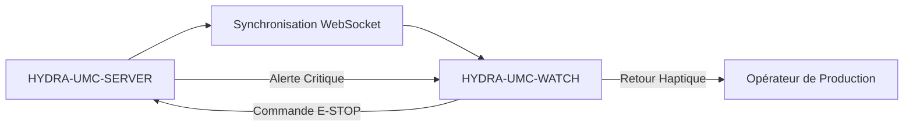

<p align="center">
  
</p>

# ⌚ HYDRA-UMC-WATCH

<p align="center"><a href="README.md">🇺🇸 English</a> | <a href="README_spa.md">🇪🇸 Español</a> | 🇫🇷 <b>Français</b> | <a href="README_ita.md">🇮🇹 Italiano</a> | <a href="README_deu.md">🇩🇪 Deutsch</a> | <a href="README_zho.md">🇨🇳 简体中文</a> | <a href="README_jpn.md">🇯🇵 日本語</a></p>

### 🛡️ Tableau de Bord de Sécurité Portable et Système d'Alerte Haptique d'Urgence

<p align="left">
  
  
  
</p>

---

## 1. 🛠️ APERÇU TECHNIQUE

**HYDRA-UMC-WATCH** est l'extension tactique de l'opérateur de production. Elle fournit des informations critiques d'un coup d'œil et des contrôles de sécurité directement au poignet, garantissant que l'opérateur garde toujours le contrôle, même loin de l'IHM principale.

Construit comme une application Wear OS autonome (Kotlin + Jetpack Compose pour Wear), réutilisant la même chaîne d'outils Gradle/Kotlin que le dépôt frère HYDRA-UMC-ANDROID-CONTROL plutôt que d'en introduire une nouvelle.

### Fonctionnalités Clés :
* ✅ **Réel v0 - motifs haptiques et protocole de synchronisation :** `haptics/HapticPatterns.kt` définit un motif de vibration réel et distinct par sévérité d'alerte (Critique/Avertissement/Info) ; `protocol/SyncMessage.kt` définit et (dé)sérialise les formes réelles des messages `EStopCommand`/`Alert` du flux de synchronisation SERVER<->WATCH ci-dessous. Les deux sont du Kotlin pur, testable - aucun matériel de montre, émulateur, ou WebSocket ouvert nécessaire pour les exécuter ou les tester.
* 🛑 **E-STOP Sans Fil** — bouton d'urgence dédié avec une latence inférieure à 50 ms sur Wi-Fi industriel. *(le message `EStopCommand` qu'il enverrait est réel et testé ; le transport WebSocket et le câblage du bouton physique restent prévus — nécessite l'appairage avec HYDRA-UMC-SERVER.)*
* 📳 **Alertes Haptiques** — motifs de vibration différenciés selon le type d'alerte (Critique, Avertissement, Info), joués via le vrai service Android `Vibrator`/`VibratorManager`. *(implémenté - `haptics/HapticAlertPlayer.kt` ; encore non vérifié sur un vrai appareil Wear OS, comme le reste de cette app.)*
* 🎙️ **Voix** — appuyer pour parler : demande explicite de la permission `RECORD_AUDIO`, l'intent de reconnaissance vocale système (`RecognizerIntent`) pour la transcription, la transcription relayée à HYDRA-UMC-ANDROID-CONTROL sous forme de message de sync `voice_turn` borné, et une réponse locale par `TextToSpeech` sur la montre. *(implémenté - `MainActivity.kt` ; la voix ne peut jamais actionner un robot directement, voir Architecture ci-dessous et [docs/VOICE_AI_PROTOCOL.md](docs/VOICE_AI_PROTOCOL.md) pour le flux de bout en bout et la limite de sécurité.)*
* ⌚ **Statut en un Coup d'Œil** — un bouton **Actualiser le statut** relaie une requête de statut bornée à HYDRA-UMC-ANDROID-CONTROL via le Data Layer appairé ; la carte `system_status` reçue est affichée avec un indicateur « dernier connu - peut être obsolète » dès qu'elle devient périmée. *(implémenté - `MainActivity.kt`/`WatchRelayTransport.requestSystemStatus()` ; à la demande via le relais téléphone, pas un socket direct montre-serveur, et encore non vérifié sur un vrai appareil Wear OS.)*
* 🔐 **Authentification Sécurisée** — appairage basé sur JWT avec HYDRA-UMC-SERVER. *(prévu.)*
* ✅ **Chaîne d'outils Wear OS autonome** — une véritable application Gradle/Kotlin/Compose pour Wear qui compile un APK de débogage fonctionnel. *(implémenté — voir COMPILATION ET EXÉCUTION ci-dessous)*
* 🔁 **Politique de Reconnexion du Relais** — `transport/RelayRetryPolicy.kt` est une politique réelle et pure de backoff exponentiel pour un envoi de relais échoué (par ex. pas encore de téléphone appairé), plafonnée à un délai maximal borné. *(implémenté)*
* 🗂️ **Cache du Dernier État Connu** — `transport/LastKnownStateCache.kt` suit l'obsolescence réelle du dernier statut/alerte relayé, afin qu'un ancien ne soit jamais affiché comme actuel. *(implémenté)*

---

## 2. 🔄 FLUX DE SYNCHRONISATION DU WEARABLE



*Architecture cible une fois qu'un WebSocket direct avec le Server existera.
Le chemin réel et testé aujourd'hui passe par le téléphone appairé : Watch
-> Data Layer -> HYDRA-UMC-ANDROID-CONTROL -> HYDRA-UMC-SERVER/Voice UI
authentifié, et retour - voir Architecture ci-dessous et
[docs/VOICE_AI_PROTOCOL.md](docs/VOICE_AI_PROTOCOL.md) pour ce flux réel de
bout en bout. La montre ne détient jamais elle-même d'identifiant Server ;
un WebSocket direct Watch-Server et le bouton E-STOP sans fil restent un
travail futur conditionné au matériel.*

---

## 3. 🧱 ARCHITECTURE & DÉCISIONS DE CONCEPTION

* **Pourquoi c'est une application Wear OS autonome, pas une fonctionnalité de l'application téléphone.** Une montre exécute son propre processus indépendant sur son propre système d'exploitation - elle ne peut pas être simplement un mode d'interface de HYDRA-UMC-ANDROID-CONTROL, elle a besoin de son propre manifeste, sa propre compilation, et sa propre interface (bien plus contrainte) pour un statut en un coup d'œil/un E-STOP rapide.
* **Pourquoi `minSdk 30` (Wear OS 3), inférieur au propre minSdk de l'application téléphone.** Cela cible délibérément la génération matérielle Wear OS 3+ actuelle, pas les anciens appareils Wear OS 2 - contrairement à HYDRA-UMC-ANDROID-CONTROL, qui supporte les téléphones plus anciens, une application montre compagnon a une base matérielle réaliste à supporter bien plus étroite.
* **Pourquoi les motifs haptiques et le protocole de synchronisation arrivent avant la connexion WebSocket.** Définir les formes d'onde de vibration et les formes des messages que les deux côtés doivent s'accorder est du vrai travail Kotlin pur - inutile d'avoir un socket ouvert, un serveur appairé ou une montre physique pour l'écrire ou le tester. Ouvrir réellement cette connexion est la prochaine étape.
* **Pourquoi la politique de reconnexion et le cache du dernier état connu sont leurs propres modules purs, et non du code intégré dans `WatchRelayTransport`.** Les deux sont des classes Kotlin réelles et découplées (`RelayRetryPolicy`, `LastKnownStateCache`) testables sur une simple JVM sans montre, émulateur, ni téléphone appairé - la même norme déjà établie par `HapticPatterns.kt`/`SyncMessage.kt`. `WatchRelayTransport` lui-même reste l'élément mince, nécessairement Android, qui planifie réellement une nouvelle tentative ou enregistre un message reçu, et non l'endroit où vit la logique mathématique de la politique sous-jacente.
* **Pourquoi un état mis en cache périmé est signalé, et non masqué.** Masquer entièrement un ancien statut laisserait l'écran de la montre vide exactement quand la connexion au téléphone est instable - le véritable moment à risque. L'afficher clairement marqué "dernier connu - peut être obsolète" tient l'opérateur informé sans laisser passer une lecture vieille de plusieurs minutes pour une lecture en direct.
* **Comment cela s'intègre dans le reste de l'écosystème.** Fait paire avec HYDRA-UMC-ANDROID-CONTROL et HYDRA-UMC-IOS-CONTROL comme compagnon au poignet, en un coup d'œil - pas un remplacement de l'un ou l'autre, une surface de statut rapide/E-STOP rapide.

---

## 📂 STRUCTURE DES DOSSIERS

Application Wear OS autonome — sans matériel, micrologiciel ou système d'exploitation propres (elle tourne sur du matériel de montre du commerce) ; ces dossiers sont omis conformément à la politique de structure du dépôt.

```text
HYDRA-UMC-WATCH/
├── app/
│   ├── build.gradle.kts       # Config du module app (lit version.properties, ne l'écrit jamais)
│   ├── version.properties     # versionMajor/Minor/Patch/Code (incrémenté uniquement par build.sh/.bat)
│   └── src/
│       ├── main/
│       │   ├── AndroidManifest.xml
│       │   └── java/com/hydraumc/watch/
│       │       ├── MainActivity.kt         # Point d'entrée Compose pour Wear
│       │       ├── haptics/                # Motifs de vibration par sévérité
│       │       ├── protocol/               # Codec des messages de synchronisation SERVER<->WATCH
│       │       └── transport/              # Relais Data Layer, politique de nouvelle tentative, cache du dernier état connu
│       └── test/java/com/hydraumc/watch/   # Tests JUnit réels (haptics, protocol, transport)
├── gradle/
│   ├── libs.versions.toml     # Catalogue des versions de dépendances
│   └── wrapper/                # Gradle wrapper (épinglé à 9.7.0)
├── tools/
│   ├── build_test.py          # Vérification CI sans mutation : vérification du contrat + assembleDebug
│   ├── ci_validate.py         # Validation manifeste/CHANGELOG/docs utilisée par CI
│   └── verify_paired_relay_contract.py # Vérification statique de la limite de sécurité Data Layer Watch<->Android Control
├── build.gradle.kts           # Build racine Gradle
├── settings.gradle.kts        # Câblage des modules
├── gradlew / gradlew.bat      # Lanceur du Gradle wrapper
├── docs/                      # Documentation et protocoles de sécurité
├── build/                     # Réservé (app/build/ de Gradle lui-même est ignoré par git)
├── images/                    # Médias et diagrammes
├── hydra-umc.project.json     # Manifeste de l'écosystème (version, métadonnées build/santé)
├── keystore.properties.example # Modèle pour la config de signature de release ignorée par git
├── bump_manifest_version.py   # Incrémente major/minor/patch + le manifeste, ensemble
├── bump_version_code.py       # Incrémente le compteur versionCode propre à Android
├── build.sh / build.bat       # Build réel : incrémente la version, lance les tests, assembleDebug
├── build-test.sh / build-test.bat # Enveloppe sans mutation pour tools/build_test.py
├── run.sh / run.bat           # Exécution réelle : gradlew installDebug + lancement adb
├── update-from-github.sh / .bat # Canal de mise à jour hors Play : APK GitHub Release + `adb install -r`
└── src/                       # Réservé (le code de ce projet vit dans app/src/)
```

---

## 4. ⚙️ COMPILATION ET EXÉCUTION

Nécessite JDK 21, le SDK Android (`local.properties` → `sdk.dir`, ignoré par git — pointez-le vers votre propre installation du SDK) et un appareil ou émulateur Wear OS pour `run`.

```bash
# Linux/macOS
chmod +x gradlew   # une seule fois
./build.sh
./run.sh            # nécessite un appareil/émulateur Wear OS connecté

# Windows
build.bat
run.bat
```

`build` incrémente la version (`bump_manifest_version.py` pour major/minor/patch en accord avec `hydra-umc.project.json`, `bump_version_code.py` pour le `versionCode` propre à Android), lance la vraie suite de tests JUnit (`haptics`, `protocol`), et compile l'APK de débogage vers `app/build/outputs/apk/debug/app-debug.apk` - le tout en une seule invocation Gradle exécutée avec `-PhydraUmcReadOnly=true` pour que le code de `app/build.gradle.kts` qui lit la version ne l'incrémente jamais *aussi* (le même indicateur utilisé par `build-test.sh`/`.bat` pour leur vérification CI séparée, compilation seule, sans mutation). `run` installe l'APK via `gradlew installDebug` et lance `MainActivity` avec `adb`.

Exemple réel - les deux scripts d'incrémentation de version fonctionnent aussi de manière autonome, utile pour inspecter ce qu'un build fera sans déclencher Gradle :

```bash
python3 bump_manifest_version.py   # ex. "HYDRA-UMC version: v0.1.2 -> v0.1.3"
python3 bump_version_code.py       # ex. "versionCode: 12 -> 13"
```

---

## 5. 📲 MISES À JOUR SANS GOOGLE PLAY

Ce projet n'est pas distribué via Google Play. Le chemin de mise à jour
répétable est un APK GitHub Release installé via ADB :

```bash
# depuis la racine du projet, montre appairée et débogage sans fil activé
update-from-github.bat    # Windows
./update-from-github.sh   # Linux / macOS / WSL
```

Le script lit `releases/latest` sur GitHub, exige un tag stable
`vMAJOR.MINOR.PATCH`, vérifie la version déjà installée, demande une
confirmation explicite de l'opérateur, puis télécharge et invoque
`adb install -r`. Il ne touche jamais la version du dépôt, le manifeste ou
`CHANGELOG.md`. Une installation manuelle, au mieux (ouvrir l'APK téléchargé
avec l'installeur de paquets directement sur la montre) est également
documentée pour les appareils sans chemin ADB utilisable. Voir
[docs/GITHUB_ADB_UPDATES.md](docs/GITHUB_ADB_UPDATES.md) pour la procédure
complète, le nom exigé de l'APK de release, et la configuration de
signature de release.

`HYDRA-UMC-ANDROID-CONTROL` peut informer l'opérateur qu'une nouvelle
version de la montre existe une fois le message de statut de version du
compagnon câblé — c'est purement informatif et cela ne peut jamais
installer quoi que ce soit sur la montre elle-même. Voir
[docs/COMPANION_VERSION_PROTOCOL.md](docs/COMPANION_VERSION_PROTOCOL.md)
pour cette forme de message.

---

## ✅ État Actuel et Prochaines Étapes

**Réel aujourd'hui :** lecture locale des alertes par le service Android `Vibrator`, permission explicite du microphone et reconnaissance vocale système, transcription visible et synthèse vocale locale, ainsi que des messages typés et testés pour `voice_turn`, `assistant_reply`, `system_status`, `EStopCommand`, `Alert` et l'état de version du compagnon. Le transport officiel Wear OS Data Layer relaie les demandes vocales limitées et les cartes d'état via HYDRA-UMC-ANDROID-CONTROL vers Server authentifié et Voice UI.

**Limite d'intégration :** l'application Android appairée conserve le JWT chiffré de Server ; Server conserve le jeton Voice UI. Data Layer exige le même nom de paquet et le même certificat de signature pour les deux APK. La voix ne peut jamais actionner directement un robot ; une réponse liée au mouvement doit demander une confirmation et l'E-STOP physique reste indépendant.

**À venir :** validation de l'appairage, du transport radio, du microphone/haut-parleur et de l'état de bout en bout sur un appareil Wear OS réel ; l'E-STOP sans fil et la télémétrie CM5 en direct restent des travaux distincts soumis au matériel.

---

## 🔗 Projets Liés

Ce projet fait partie de l'écosystème robotique HYDRA-UMC du même auteur (JuanenRac / Electro Hobby 3D). Bon à savoir, car une demande pourrait en réalité concerner l'un de ceux-ci plutôt que ce dépôt.

**Directement Liés**
- **[HYDRA-UMC-ANDROID-CONTROL](https://github.com/JuanenRac/HYDRA-UMC-ANDROID-CONTROL)** — application de contrôle Android native avec connexion biométrique et un compagnon Wear OS jumelé — l'application compagnon avec laquelle se jumelle ce dispositif portable.
- **[HYDRA-UMC-IOS-CONTROL](https://github.com/JuanenRac/HYDRA-UMC-IOS-CONTROL)** — application de contrôle iOS/iPadOS (Flutter) avec synchronisation WebSocket en temps réel — l'application compagnon avec laquelle se jumelle ce dispositif portable.
- **[HYDRA-UMC-VOICE-UI](https://github.com/JuanenRac/HYDRA-UMC-VOICE-UI)** — vrai front-end vocal (VAD + analyseur d'intention) avec un relais Watch borné et soumis à confirmation — envoie les messages voice_turn que ce dispositif portable affiche sous forme d'alertes haptiques.

**Fait Également Partie de l'Écosystème**

*Matériel & Plateforme de Base*
- **[HYDRA-UMC](https://github.com/JuanenRac/HYDRA-UMC)** — la carte mère physique du bras robotique : hôte CM5 + coprocesseur STM32H745 double cœur, coordonnant jusqu'à 8 bras-outils via CAN-OTA/SPI-OTA.
- **[HYDRA-UMC-OS](https://github.com/JuanenRac/HYDRA-UMC-OS)** — couche produit reproductible sur Raspberry Pi OS pour le CM5 : agent en lecture seule, config/profils validés, provisionnement WiFi de premier contact.
- **[HYDRA-UMC-SDK](https://github.com/JuanenRac/HYDRA-UMC-SDK)** — le contrat JSON-Schema partagé et la barrière de sécurité contre laquelle chaque bridge valide ses commandes.

*Backend Central & Clients*
- **[HYDRA-UMC-SERVER](https://github.com/JuanenRac/HYDRA-UMC-SERVER)** — le vrai backend headless (REST/WebSocket) auquel parle réellement chaque client de contrôle.
- **[HYDRA-UMC-STUDIO](https://github.com/JuanenRac/HYDRA-UMC-STUDIO)** — tableau de bord de contrôle web avec visualisation 3D multi-robot en temps réel.
- **[HYDRA-UMC-SUITE](https://github.com/JuanenRac/HYDRA-UMC-SUITE)** — centre de commande d'essaim de bureau (PySide6) pour plusieurs serveurs à la fois, empaqueté en exécutable autonome.
- **[HYDRA-UMC-DSI](https://github.com/JuanenRac/HYDRA-UMC-DSI)** — interface tactile native pour l'écran tactile DSI 7" embarqué, intégrée directement sur le CM5.
- **[HYDRA-UMC-EDITOR-URDF](https://github.com/JuanenRac/HYDRA-UMC-EDITOR-URDF)** — créateur/éditeur graphique de bureau pour URDF qui envoie les modèles terminés vers le propre catalogue de STUDIO.
- **[HYDRA-UMC-BRIDGE-AMR](https://github.com/JuanenRac/HYDRA-UMC-BRIDGE-AMR)** — frontière de coordination pour les flottes AGV/AMR via un éditeur MQTT VDA 5050 réel.
- **[HYDRA-UMC-BRIDGE-CNC](https://github.com/JuanenRac/HYDRA-UMC-BRIDGE-CNC)** — coordinateur haut niveau pour cellules CNC avec accès réel au statut/octets de contrôle GRBL.
- **[HYDRA-UMC-BRIDGE-DROIDS](https://github.com/JuanenRac/HYDRA-UMC-BRIDGE-DROIDS)** — frontière de coordination pour droïdes à pattes/humanoïdes, avec un véritable émetteur de commandes Boston Dynamics Spot.
- **[HYDRA-UMC-BRIDGE-LASER](https://github.com/JuanenRac/HYDRA-UMC-BRIDGE-LASER)** — coordinateur de sécurité pour cellules laser lisant 3 vraies sécurités GPIO de clé/enceinte/verrouillage.
- **[HYDRA-UMC-BRIDGE-OPENPNP](https://github.com/JuanenRac/HYDRA-UMC-BRIDGE-OPENPNP)** — coordinateur haut niveau sûr pour le flux de cartes du pick-and-place OpenPnP.
- **[HYDRA-UMC-BRIDGE-PRINTER3D](https://github.com/JuanenRac/HYDRA-UMC-BRIDGE-PRINTER3D)** — frontière de coordination sûre pour imprimantes 3D Moonraker/Klipper, avec de vraies commandes de tâche contrôlées.
- **[HYDRA-UMC-BRIDGE-ROS2](https://github.com/JuanenRac/HYDRA-UMC-BRIDGE-ROS2)** — coordinateur de sécurité avec un vrai transport ROS 2 rclpy à importation paresseuse.
- **[HYDRA-UMC-BRIDGE-UAV](https://github.com/JuanenRac/HYDRA-UMC-BRIDGE-UAV)** — frontière de coordination pour UAV équipés de caméra, avec un véritable émetteur de commandes MAVLink.

*Plateforme d'Outils URTC*
- **[URTC](https://github.com/JuanenRac/URTC)** — firmware pour la carte physique Universal Robot Tool Controller, plus de 25 profils d'outil sur bus CAN.
- **[URTC-FLASHER](https://github.com/JuanenRac/URTC-FLASHER)** — outil de bureau à interface graphique pour flasher les cartes URTC, CAN-OTA plus SWD/JTAG puce complète.
- **[URTC-TESTER](https://github.com/JuanenRac/URTC-TESTER)** — outil de bureau de diagnostic CAN-bus en direct pour cartes URTC, un panneau par profil d'outil.
- **[URTC-WEB-STUDIO](https://github.com/JuanenRac/URTC-WEB-STUDIO)** — alternative basée navigateur à URTC-TESTER via la Web Serial API, sans installation locale.

*Nœud IA de Vision (Hailo-8)*
- **[HYDRA-UMC-VISION-NODE](https://github.com/JuanenRac/HYDRA-UMC-VISION-NODE)** — hub d'intégration pour le pipeline de vision Hailo-8, avec une vraie vérification de disponibilité matérielle par étape.
- **[HYDRA-UMC-DETECTION-HEF](https://github.com/JuanenRac/HYDRA-UMC-DETECTION-HEF)** — registre réel de modèles compilés avec vérification de chargement sécurisé par architecture Hailo/checksum.
- **[HYDRA-UMC-VISION-STREAMER](https://github.com/JuanenRac/HYDRA-UMC-VISION-STREAMER)** — générateur réel de pipeline GStreamer + config MediaMTX, avec une vraie frontière d'intégration HailoRT.
- **[HYDRA-UMC-VISUAL-SERVOING-API](https://github.com/JuanenRac/HYDRA-UMC-VISUAL-SERVOING-API)** — vraie loi de correction Position-Based Visual Servoing, verrouillée sur l'état de zone en amont.
- **[HYDRA-UMC-SAFETY-ZONES](https://github.com/JuanenRac/HYDRA-UMC-SAFETY-ZONES)** — vraie vérification de violation de zone et demande d'E-STOP, avec application de la fraîcheur de calibration.

*Nœud IA Cognitif (Hailo-10)*
- **[HYDRA-UMC-COGNITIVE-NODE](https://github.com/JuanenRac/HYDRA-UMC-COGNITIVE-NODE)** — hub d'intégration pour le pipeline cognitif Hailo-10 (orchestration LLM/VLA/voix).
- **[HYDRA-UMC-VLA-ENGINE](https://github.com/JuanenRac/HYDRA-UMC-VLA-ENGINE)** — vrai encodage/décodage de jetons d'action et génération de trajectoire pour un modèle Vision-Language-Action.
- **[HYDRA-UMC-SEMANTIC-PLANNER](https://github.com/JuanenRac/HYDRA-UMC-SEMANTIC-PLANNER)** — vraie décomposition de tâches basée sur des règles et récupération sémantique d'erreurs sur les codes d'erreur MCU.
- **[HYDRA-UMC-DOCS-QA](https://github.com/JuanenRac/HYDRA-UMC-DOCS-QA)** — vraie recherche documentaire TF-IDF (bibliothèque standard uniquement) sur les propres documents Markdown de cet écosystème.

*Orchestration & Essaim*
- **[HYDRA-UMC-ORCHESTRATOR](https://github.com/JuanenRac/HYDRA-UMC-ORCHESTRATOR)** — hub d'intégration avec un vrai contrat de rapport de santé gRPC/Protobuf et une machine à états de mission.
- **[HYDRA-UMC-JOB-DISPATCHER](https://github.com/JuanenRac/HYDRA-UMC-JOB-DISPATCHER)** — vraie file de tâches basée sur la priorité avec déduplication, via une vraie API HTTP.
- **[HYDRA-UMC-NODE-HEALING](https://github.com/JuanenRac/HYDRA-UMC-NODE-HEALING)** — vrai chien de garde de santé de flotte basé sur gRPC, avec retry/backoff et détection d'incohérence d'identité.
- **[HYDRA-UMC-PATH-PLANNER-3D](https://github.com/JuanenRac/HYDRA-UMC-PATH-PLANNER-3D)** — vrai planificateur de trajectoire 3D basé sur RRT, avec vraie validation des collisions obstacle/espace de travail.
- **[HYDRA-UMC-SWARM-SYNC](https://github.com/JuanenRac/HYDRA-UMC-SWARM-SYNC)** — vraie synchronisation d'état CRDT LWW-Element-Map, testée par propriétés pour la convergence multi-cellule.

*Jumeau Numérique & Simulation*
- **[HYDRA-UMC-TWIN](https://github.com/JuanenRac/HYDRA-UMC-TWIN)** — hub d'intégration pour le moteur de jumeau numérique, avec un vrai contrat de synchronisation par compatibilité de version.
- **[HYDRA-UMC-HIL-BRIDGE](https://github.com/JuanenRac/HYDRA-UMC-HIL-BRIDGE)** — vrai verrouillage de sécurité hardware-in-the-loop routant les commandes entre simulation et matériel réel.
- **[HYDRA-UMC-PHYSICS-REPLICA](https://github.com/JuanenRac/HYDRA-UMC-PHYSICS-REPLICA)** — vraie cinématique directe et validation des limites articulaires sur un vrai sous-ensemble URDF.
- **[HYDRA-UMC-SYNTHETIC-DATA-GEN](https://github.com/JuanenRac/HYDRA-UMC-SYNTHETIC-DATA-GEN)** — vrai générateur procédural de scènes 2D avec export d'annotations YOLO/COCO.

*Données & Analytique*
- **[HYDRA-UMC-DATALAKE](https://github.com/JuanenRac/HYDRA-UMC-DATALAKE)** — vrai magasin de séries temporelles basé sur sqlite3, avec une vraie API HTTP d'ingestion/requête.
- **[HYDRA-UMC-ANOMALY-DETECTOR](https://github.com/JuanenRac/HYDRA-UMC-ANOMALY-DETECTOR)** — vrai détecteur d'anomalies FFT + ligne de base statistique, avec surveillance de dérive.
- **[HYDRA-UMC-PRODUCTION-REPORTS](https://github.com/JuanenRac/HYDRA-UMC-PRODUCTION-REPORTS)** — vrai calcul OEE/disponibilité sur l'historique de DATALAKE, avec export CSV reproductible.
- **[HYDRA-UMC-TELEMETRY-COLLECTOR](https://github.com/JuanenRac/HYDRA-UMC-TELEMETRY-COLLECTOR)** — vrai pipeline d'ingestion CAN/WebSocket vers DATALAKE, avec déduplication par séquence.

*Passerelle Industrielle*
- **[HYDRA-UMC-GATEWAY-INDUSTRIAL](https://github.com/JuanenRac/HYDRA-UMC-GATEWAY-INDUSTRIAL)** — hub d'intégration relayant vers les protocoles industriels, avec une vraie couche de liste blanche de commandes/contre-pression.
- **[HYDRA-UMC-OPCUA-SERVER](https://github.com/JuanenRac/HYDRA-UMC-OPCUA-SERVER)** — vrai espace d'adressage OPC-UA, vérifié avec une vraie session client du protocole binaire.
- **[HYDRA-UMC-MQTT-BROKER](https://github.com/JuanenRac/HYDRA-UMC-MQTT-BROKER)** — vrai broker MQTT avec authentification par client optionnelle et ACL de sujets.
- **[HYDRA-UMC-MTCONNECT-ADAPTER](https://github.com/JuanenRac/HYDRA-UMC-MTCONNECT-ADAPTER)** — vrais points de terminaison XML MTConnect `/probe` et `/current`, avec sortie en mode dégradé.

*Outils Complémentaires & Opérations de l'Écosystème*
- **[HYDRA-UMC-DASHBOARD-AI](https://github.com/JuanenRac/HYDRA-UMC-DASHBOARD-AI)** — panneaux Smart Summaries et Anomaly Highlighting sur DATALAKE/ANOMALY-DETECTOR, avec un repli statistique honnête.
- **[HYDRA-UMC-TOOL-CLI](https://github.com/JuanenRac/HYDRA-UMC-TOOL-CLI)** — CLI de flotte avec un vrai contrat de codes de sortie stable, un vrai client en direct de la propre API de HYDRA-UMC-SERVER.
- **[URTC-SMART-RACK](https://github.com/JuanenRac/URTC-SMART-RACK)** — firmware pour un rack de montage de cartes avec décodage réel d'ID d'outil et logique de préchauffage Smart Idle.
- **[URTC-VISION-TOOL](https://github.com/JuanenRac/URTC-VISION-TOOL)** — firmware plus un vrai compagnon de vision Python pour une tête d'outil d'inspection thermique/RGB.
- **[HYDRA-UMC-UPDATER](https://github.com/JuanenRac/HYDRA-UMC-UPDATER)** — outil administratif de bureau qui découvre, clone et met à jour chaque dépôt de cet écosystème.
- **[HYDRA-UMC-OS-REBUILDER](https://github.com/JuanenRac/HYDRA-UMC-OS-REBUILDER)** — outil de bureau Windows/Linux qui construit une image de la CM5 prête à graver, préchargée avec les versions les plus actuelles de l'écosystème, avec une configuration de premier démarrage Wi-Fi/utilisateur/SSH façon Raspberry Pi Imager.


---

## 📚 Documentation & Communauté

- **[CONTRIBUTING.md](CONTRIBUTING.md)** — pile technologique et lignes directrices de codage pour une pull request.
- **[CODE_OF_CONDUCT.md](CODE_OF_CONDUCT.md)** — les normes de comportement attendues dans cette communauté.
- **[SECURITY.md](SECURITY.md)** — comment signaler une vulnérabilité, et les véritables axes de sécurité de ce projet.
- **[SUPPORT.md](SUPPORT.md)** — où poser des questions et signaler des bugs.
- **[LICENSE.md](LICENSE.md)** — la licence propre de ce projet.

## 👤 AUTEUR
**JuanenRac** (Electro Hobby 3D)
📧 electrohobby3d@gmail.com
📺 [youtube.com/@electrohobby3d](https://youtube.com/@electrohobby3d)

## 📜 LICENCE
GPL-3.0 - Voir LICENSE pour plus de détails.
