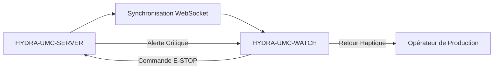

<p align="center">
  
</p>

# ⌚ HYDRA-UMC-WATCH

<p align="center"><a href="README.md">🇺🇸 English</a> | <a href="README_spa.md">🇪🇸 Español</a> | 🇫🇷 <b>Français</b> | <a href="README_ita.md">🇮🇹 Italiano</a> | <a href="README_deu.md">🇩🇪 Deutsch</a> | <a href="README_zho.md">🇨🇳 简体中文</a> | <a href="README_jpn.md">🇯🇵 日本語</a></p>

### 🛡️ Tableau de Bord de Sécurité Portable et Système d'Alerte Haptique d'Urgence

<p align="left">
  
  
  
</p>

---

## 1. 🛠️ APERÇU TECHNIQUE

**HYDRA-UMC-WATCH** est l'extension tactique de l'opérateur de production. Elle fournit des informations critiques d'un coup d'œil et des contrôles de sécurité directement au poignet, garantissant que l'opérateur garde toujours le contrôle, même loin de l'IHM principale.

Construit comme une application Wear OS autonome (Kotlin + Jetpack Compose pour Wear), réutilisant la même chaîne d'outils Gradle/Kotlin que le dépôt frère HYDRA-UMC-ANDROID-CONTROL plutôt que d'en introduire une nouvelle.

### Fonctionnalités Clés :
* 🛑 **E-STOP Sans Fil** — bouton d'urgence dédié avec une latence inférieure à 50 ms sur Wi-Fi industriel. *(prévu — nécessite l'appairage avec HYDRA-UMC-SERVER)*
* 📳 **Alertes Haptiques** — motifs de vibration différenciés selon le type d'alerte (Critique, Avertissement, Info). *(prévu)*
* ⌚ **Statut en un Coup d'Œil** — résumé en temps réel de l'activité de la flotte et de l'avancement des missions. *(prévu)*
* 🔐 **Authentification Sécurisée** — appairage basé sur JWT avec HYDRA-UMC-SERVER. *(prévu)*
* ✅ **Chaîne d'outils Wear OS autonome** — une véritable application Gradle/Kotlin/Compose pour Wear qui compile un APK de débogage fonctionnel. *(implémenté — voir COMPILATION ET EXÉCUTION ci-dessous)*

---

## 2. 🔄 FLUX DE SYNCHRONISATION DU WEARABLE



---

## 3. 🧱 ARCHITECTURE & DÉCISIONS DE CONCEPTION

* **Pourquoi c'est une application Wear OS autonome, pas une fonctionnalité de l'application téléphone.** Une montre exécute son propre processus indépendant sur son propre système d'exploitation - elle ne peut pas être simplement un mode d'interface de HYDRA-UMC-ANDROID-CONTROL, elle a besoin de son propre manifeste, sa propre compilation, et sa propre interface (bien plus contrainte) pour un statut en un coup d'œil/un E-STOP rapide.
* **Pourquoi `minSdk 30` (Wear OS 3), inférieur au propre minSdk de l'application téléphone.** Cela cible délibérément la génération matérielle Wear OS 3+ actuelle, pas les anciens appareils Wear OS 2 - contrairement à HYDRA-UMC-ANDROID-CONTROL, qui supporte les téléphones plus anciens, une application montre compagnon a une base matérielle réaliste à supporter bien plus étroite.
* **Pourquoi le point d'entrée ne fait qu'imprimer identité/version/rôle aujourd'hui.** Étape d'andamiaje : prouver que `./gradlew assembleDebug` réussit précède la vraie logique de synchronisation avec l'application téléphone compagnon.
* **Comment cela s'intègre dans le reste de l'écosystème.** Fait paire avec HYDRA-UMC-ANDROID-CONTROL et HYDRA-UMC-IOS-CONTROL comme compagnon au poignet, en un coup d'œil - pas un remplacement de l'un ou l'autre, une surface de statut rapide/E-STOP rapide.

---

## 📂 STRUCTURE DES DOSSIERS

Application Wear OS autonome — sans hardware/firmware/os propres (elle tourne sur du matériel de montre du commerce), élagués du modèle (voir `SONNET/5.PLAN_EJECUCION_32_PROYECTOS_NUEVOS.txt` pour la règle d'élagage de tout l'écosystème).

```text
HYDRA-UMC-WATCH/
├── app/
│   ├── build.gradle.kts       # Config du module app, incrémentation de version façon compteur kilométrique
│   ├── version.properties     # versionMajor/Minor/Patch/Code (incrémenté à chaque build)
│   └── src/main/
│       ├── AndroidManifest.xml
│       ├── java/com/hydraumc/watch/MainActivity.kt   # Point d'entrée Compose pour Wear
│       └── res/                                        # Chaînes, thème, icône de lancement
├── gradle/
│   ├── libs.versions.toml     # Catalogue des versions de dépendances
│   └── wrapper/                # Gradle wrapper (épinglé à 9.7.0)
├── build.gradle.kts           # Build racine Gradle
├── settings.gradle.kts        # Câblage des modules
├── gradlew / gradlew.bat      # Lanceur du Gradle wrapper
├── docs/                      # Documentation et protocoles de sécurité
├── build/                     # Réservé (app/build/ de Gradle lui-même est ignoré par git)
├── images/                    # Médias et diagrammes
├── scripts/                   # Scripts utilitaires
├── build.sh / build.bat       # Build réel : gradlew assembleDebug
├── run.sh / run.bat           # Exécution réelle : gradlew installDebug + lancement adb
└── src/                       # Réservé (le code de ce projet vit dans app/src/)
```

---

## 4. ⚙️ COMPILATION ET EXÉCUTION

Nécessite JDK 21, le SDK Android (`local.properties` → `sdk.dir`, ignoré par git — pointez-le vers votre propre installation du SDK) et un appareil ou émulateur Wear OS pour `run`.

```bash
# Linux/macOS
chmod +x gradlew   # une seule fois
./build.sh
./run.sh            # nécessite un appareil/émulateur Wear OS connecté

# Windows
build.bat
run.bat
```

`build` compile l'APK de débogage vers `app/build/outputs/apk/debug/app-debug.apk`. L'incrémentation de version (`app/version.properties`) se produit à l'intérieur même de `app/build.gradle.kts` au moment de la configuration Gradle, elle s'exécute donc automatiquement à chaque build réel - pas d'étape d'incrémentation séparée. `run` installe l'APK via `gradlew installDebug` et lance `MainActivity` avec `adb`.

---

## 🔗 Projets Liés

Ce projet fait partie d'un écosystème robotique plus large du même auteur (JuanenRac / Electro Hobby 3D), couvrant firmware, logiciel de contrôle, nœuds IA et outillage de flotte. Bon à savoir, car une demande pourrait en réalité concerner l'un de ces projets plutôt que ce dépôt.

### Relation Directe

- **[HYDRA-UMC-ANDROID-CONTROL](https://github.com/JuanenRac/HYDRA-UMC-ANDROID-CONTROL)** — l'application avec laquelle cet objet connecté est appairé.
- **[HYDRA-UMC-IOS-CONTROL](https://github.com/JuanenRac/HYDRA-UMC-IOS-CONTROL)** — l'application avec laquelle cet objet connecté est appairé.

### Reste de l'Écosystème

**Plateforme HYDRA-UMC** — la cellule de micro-usine multi-robot
- **[HYDRA-UMC](https://github.com/JuanenRac/HYDRA-UMC)** — la carte mère CM5 + STM32H745 orchestrant jusqu'à 8 bras robotiques.
- **[HYDRA-UMC-SERVER](https://github.com/JuanenRac/HYDRA-UMC-SERVER)** — le backend Express/WebSocket auquel parle chaque client de contrôle.
- **[HYDRA-UMC-STUDIO](https://github.com/JuanenRac/HYDRA-UMC-STUDIO)** — tableau de bord de contrôle web, visualisation 3D multi-robot.
- **[HYDRA-UMC-ANDROID-CONTROL](https://github.com/JuanenRac/HYDRA-UMC-ANDROID-CONTROL)** — application de contrôle Android via Wi-Fi/Bluetooth.
- **[HYDRA-UMC-IOS-CONTROL](https://github.com/JuanenRac/HYDRA-UMC-IOS-CONTROL)** — application de contrôle iOS/iPadOS construite en Flutter.
- **[HYDRA-UMC-SUITE](https://github.com/JuanenRac/HYDRA-UMC-SUITE)** — centre de commande d'essaim de bureau (Python/PySide6).
- **[HYDRA-UMC-EDITOR-URDF](https://github.com/JuanenRac/HYDRA-UMC-EDITOR-URDF)** — éditeur de modèles URDF de bureau pour le catalogue de robots.
- **[HYDRA-UMC-DSI](https://github.com/JuanenRac/HYDRA-UMC-DSI)** — interface tactile native pour l'écran DSI embarqué.

**Plateforme URTC** — le contrôleur de tête d'outil que porte chaque bras HYDRA-UMC
- **[URTC](https://github.com/JuanenRac/URTC)** — contrôleur de tête d'outil sur bus CAN, 25 profils d'outil.
- **[URTC-FLASHER](https://github.com/JuanenRac/URTC-FLASHER)** — outil de bureau de flashage CAN-OTA + SWD/JTAG.
- **[URTC-TESTER](https://github.com/JuanenRac/URTC-TESTER)** — outil de bureau de diagnostic CAN en direct.
- **[URTC-WEB-STUDIO](https://github.com/JuanenRac/URTC-WEB-STUDIO)** — alternative basée navigateur via l'API Web Serial.

**🎥 Vision AI Node (Hailo-8)**
- [HYDRA-UMC-VISION-NODE](https://github.com/JuanenRac/HYDRA-UMC-VISION-NODE)
- [HYDRA-UMC-VISION-STREAMER](https://github.com/JuanenRac/HYDRA-UMC-VISION-STREAMER)
- [HYDRA-UMC-DETECTION-HEF](https://github.com/JuanenRac/HYDRA-UMC-DETECTION-HEF)
- [HYDRA-UMC-SAFETY-ZONES](https://github.com/JuanenRac/HYDRA-UMC-SAFETY-ZONES)
- [HYDRA-UMC-VISUAL-SERVOING-API](https://github.com/JuanenRac/HYDRA-UMC-VISUAL-SERVOING-API)

**🧠 Cognitive AI Node (Hailo-10)**
- [HYDRA-UMC-COGNITIVE-NODE](https://github.com/JuanenRac/HYDRA-UMC-COGNITIVE-NODE)
- [HYDRA-UMC-VLA-ENGINE](https://github.com/JuanenRac/HYDRA-UMC-VLA-ENGINE)
- [HYDRA-UMC-VOICE-UI](https://github.com/JuanenRac/HYDRA-UMC-VOICE-UI)
- [HYDRA-UMC-SEMANTIC-PLANNER](https://github.com/JuanenRac/HYDRA-UMC-SEMANTIC-PLANNER)
- [HYDRA-UMC-DOCS-QA](https://github.com/JuanenRac/HYDRA-UMC-DOCS-QA)

**🐝 Orchestration & Swarm**
- [HYDRA-UMC-ORCHESTRATOR](https://github.com/JuanenRac/HYDRA-UMC-ORCHESTRATOR)
- [HYDRA-UMC-SWARM-SYNC](https://github.com/JuanenRac/HYDRA-UMC-SWARM-SYNC)
- [HYDRA-UMC-PATH-PLANNER-3D](https://github.com/JuanenRac/HYDRA-UMC-PATH-PLANNER-3D)
- [HYDRA-UMC-JOB-DISPATCHER](https://github.com/JuanenRac/HYDRA-UMC-JOB-DISPATCHER)
- [HYDRA-UMC-NODE-HEALING](https://github.com/JuanenRac/HYDRA-UMC-NODE-HEALING)

**🎮 Digital Twin & Simulation**
- [HYDRA-UMC-TWIN](https://github.com/JuanenRac/HYDRA-UMC-TWIN)
- [HYDRA-UMC-PHYSICS-REPLICA](https://github.com/JuanenRac/HYDRA-UMC-PHYSICS-REPLICA)
- [HYDRA-UMC-HIL-BRIDGE](https://github.com/JuanenRac/HYDRA-UMC-HIL-BRIDGE)
- [HYDRA-UMC-SYNTHETIC-DATA-GEN](https://github.com/JuanenRac/HYDRA-UMC-SYNTHETIC-DATA-GEN)

**📊 Data & Analytics**
- [HYDRA-UMC-DATALAKE](https://github.com/JuanenRac/HYDRA-UMC-DATALAKE)
- [HYDRA-UMC-TELEMETRY-COLLECTOR](https://github.com/JuanenRac/HYDRA-UMC-TELEMETRY-COLLECTOR)
- [HYDRA-UMC-ANOMALY-DETECTOR](https://github.com/JuanenRac/HYDRA-UMC-ANOMALY-DETECTOR)
- [HYDRA-UMC-PRODUCTION-REPORTS](https://github.com/JuanenRac/HYDRA-UMC-PRODUCTION-REPORTS)

**🏭 Industrial Gateway**
- [HYDRA-UMC-GATEWAY-INDUSTRIAL](https://github.com/JuanenRac/HYDRA-UMC-GATEWAY-INDUSTRIAL)
- [HYDRA-UMC-OPCUA-SERVER](https://github.com/JuanenRac/HYDRA-UMC-OPCUA-SERVER)
- [HYDRA-UMC-MQTT-BROKER](https://github.com/JuanenRac/HYDRA-UMC-MQTT-BROKER)
- [HYDRA-UMC-MTCONNECT-ADAPTER](https://github.com/JuanenRac/HYDRA-UMC-MTCONNECT-ADAPTER)

**🛠️ Complementary Tools**
- [URTC-SMART-RACK](https://github.com/JuanenRac/URTC-SMART-RACK)
- [URTC-VISION-TOOL](https://github.com/JuanenRac/URTC-VISION-TOOL)
- [HYDRA-UMC-TOOL-CLI](https://github.com/JuanenRac/HYDRA-UMC-TOOL-CLI)
- [HYDRA-UMC-DASHBOARD-AI](https://github.com/JuanenRac/HYDRA-UMC-DASHBOARD-AI)


## 👤 AUTEUR
**JuanenRac** (Electro Hobby 3D)
📧 electrohobby3d@gmail.com

## 📜 LICENCE
GPL-3.0 - Voir LICENSE pour plus de détails.

## Projets associés

> Canonical public ecosystem relationship map.

**Direct integrations:**
[HYDRA-UMC-OS](https://github.com/JuanenRac/HYDRA-UMC-OS) · [HYDRA-UMC-SDK](https://github.com/JuanenRac/HYDRA-UMC-SDK) · [HYDRA-UMC-SERVER](https://github.com/JuanenRac/HYDRA-UMC-SERVER) · [URTC](https://github.com/JuanenRac/URTC) · [HYDRA-UMC-ORCHESTRATOR](https://github.com/JuanenRac/HYDRA-UMC-ORCHESTRATOR) · [HYDRA-UMC-JOB-DISPATCHER](https://github.com/JuanenRac/HYDRA-UMC-JOB-DISPATCHER) · [HYDRA-UMC-SWARM-SYNC](https://github.com/JuanenRac/HYDRA-UMC-SWARM-SYNC) · [HYDRA-UMC-NODE-HEALING](https://github.com/JuanenRac/HYDRA-UMC-NODE-HEALING) · [HYDRA-UMC-UPDATER](https://github.com/JuanenRac/HYDRA-UMC-UPDATER)

**Platform and contracts:**
[HYDRA-UMC-OS](https://github.com/JuanenRac/HYDRA-UMC-OS) · [HYDRA-UMC-SDK](https://github.com/JuanenRac/HYDRA-UMC-SDK)

**Rest of the ecosystem:**
All remaining public repositories are grouped by the seven ecosystem layers in the [JuanenRac ecosystem dashboard](https://juanenrac.github.io/JuanenRac/).
