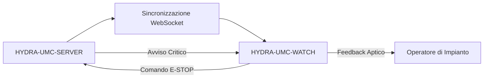

<p align="center">
  
</p>

# ⌚ HYDRA-UMC-WATCH

<p align="center"><a href="README.md">🇺🇸 English</a> | <a href="README_spa.md">🇪🇸 Español</a> | <a href="README_fra.md">🇫🇷 Français</a> | 🇮🇹 <b>Italiano</b> | <a href="README_deu.md">🇩🇪 Deutsch</a> | <a href="README_zho.md">🇨🇳 简体中文</a> | <a href="README_jpn.md">🇯🇵 日本語</a></p>

### 🛡️ Dashboard di Sicurezza Indossabile e Sistema di Allarme Aptico d'Emergenza

<p align="left">
  
  
  
</p>

---

## 1. 🛠️ PANORAMICA TECNICA

**HYDRA-UMC-WATCH** è l'estensione tattica per l'operatore di impianto. Fornisce informazioni critiche a colpo d'occhio e controlli di sicurezza direttamente al polso, garantendo che l'operatore mantenga sempre il controllo, anche lontano dall'HMI principale.

Costruita come app Wear OS autonoma (Kotlin + Jetpack Compose per Wear), riutilizzando la stessa toolchain Gradle/Kotlin del repository gemello HYDRA-UMC-ANDROID-CONTROL invece di introdurne una nuova.

### Caratteristiche Principali:
* ✅ **Reale v0 - pattern aptici e protocollo di sincronizzazione:** `haptics/HapticPatterns.kt` definisce un pattern di vibrazione reale e distinto per severità di avviso (Critico/Avviso/Info); `protocol/SyncMessage.kt` definisce e (de)serializza le forme reali dei messaggi `EStopCommand`/`Alert` del flusso di sincronizzazione SERVER<->WATCH sotto. Entrambi sono Kotlin puro, testabile - non serve hardware da orologio, emulatore, né un WebSocket aperto per eseguirli o testarli.
* 🛑 **E-STOP Wireless** — pulsante di emergenza dedicato con latenza inferiore a 50ms su Wi-Fi industriale. *(il messaggio `EStopCommand` che invierebbe è reale e testato; il trasporto WebSocket e il collegamento del pulsante fisico restano pianificati — richiede l'accoppiamento con HYDRA-UMC-SERVER.)*
* 📳 **Avvisi Aptici** — pattern di vibrazione differenziati per i vari tipi di avviso (Critico, Avviso, Info), riprodotti tramite il vero servizio Android `Vibrator`/`VibratorManager`. *(implementato - `haptics/HapticAlertPlayer.kt`; ancora non verificato su un vero dispositivo Wear OS, come il resto di questa app.)*
* 🎙️ **Voce** — tocca per parlare: richiesta esplicita del permesso `RECORD_AUDIO`, l'intent di riconoscimento vocale di sistema (`RecognizerIntent`) per la trascrizione, la trascrizione inoltrata a HYDRA-UMC-ANDROID-CONTROL come messaggio di sync `voice_turn` limitato, e una risposta locale tramite `TextToSpeech` sull'orologio. *(implementato - `MainActivity.kt`; la voce non può mai azionare direttamente un robot, vedi Architettura sotto e [docs/VOICE_AI_PROTOCOL.md](docs/VOICE_AI_PROTOCOL.md) per il flusso completo end-to-end e il limite di sicurezza.)*
* ⌚ **Stato a Colpo d'Occhio** — un pulsante **Aggiorna stato** inoltra una richiesta di stato limitata a HYDRA-UMC-ANDROID-CONTROL tramite il Data Layer accoppiato; la card `system_status` ricevuta viene mostrata con un indicatore "ultimo noto - potrebbe essere obsoleto" non appena diventa obsoleta. *(implementato - `MainActivity.kt`/`WatchRelayTransport.requestSystemStatus()`; su richiesta tramite il relay del telefono, non un socket diretto orologio-server, e ancora non verificato su un vero dispositivo Wear OS.)*
* 🔐 **Autenticazione Sicura** — accoppiamento basato su JWT con HYDRA-UMC-SERVER. *(pianificato.)*
* ✅ **Toolchain Wear OS autonoma** — una vera app Gradle/Kotlin/Compose per Wear che compila un APK di debug funzionante. *(implementato — vedi COMPILAZIONE ED ESECUZIONE sotto)*
* 🔁 **Politica di Riconnessione del Relay** — `transport/RelayRetryPolicy.kt` è una politica reale e pura di backoff esponenziale per un invio relay fallito (ad es. nessun telefono ancora accoppiato), limitata a un ritardo massimo definito. *(implementato)*
* 🗂️ **Cache dell'Ultimo Stato Noto** — `transport/LastKnownStateCache.kt` tiene traccia dell'obsolescenza reale dell'ultimo stato/avviso inoltrato, così uno vecchio non viene mai mostrato come attuale. *(implementato)*

---

## 2. 🔄 FLUSSO DI SINCRONIZZAZIONE DEL WEARABLE



*Architettura obiettivo una volta che esisterà un WebSocket diretto con il
Server. Il percorso reale e testato oggi passa dal telefono accoppiato:
Watch -> Data Layer -> HYDRA-UMC-ANDROID-CONTROL -> HYDRA-UMC-SERVER/Voice
UI autenticato, e ritorno - vedi Architettura sotto e
[docs/VOICE_AI_PROTOCOL.md](docs/VOICE_AI_PROTOCOL.md) per quel flusso
reale end-to-end. L'orologio non detiene mai da sé una credenziale del
Server; un WebSocket diretto Watch-Server e il pulsante E-STOP wireless
restano lavoro futuro condizionato all'hardware.*

---

## 3. 🧱 ARCHITETTURA E DECISIONI DI PROGETTAZIONE

* **Perché è un'app Wear OS autonoma, non una funzionalità dell'app telefono.** Un orologio esegue il proprio processo indipendente sul proprio sistema operativo - non può essere semplicemente una modalità UI di HYDRA-UMC-ANDROID-CONTROL, ha bisogno del proprio manifest, della propria build, e della propria UI (molto più limitata) per stato a colpo d'occhio/E-STOP rapido.
* **Perché `minSdk 30` (Wear OS 3), inferiore al minSdk proprio dell'app telefono.** Questo mira deliberatamente all'attuale generazione hardware Wear OS 3+, non ai vecchi dispositivi Wear OS 2 - a differenza di HYDRA-UMC-ANDROID-CONTROL, che supporta telefoni più vecchi, un'app orologio companion ha una base hardware realistica da supportare molto più ristretta.
* **Perché i pattern aptici e il protocollo di sincronizzazione arrivano prima della connessione WebSocket.** Definire le forme d'onda di vibrazione e le forme dei messaggi su cui entrambe le parti devono concordare è vero lavoro in Kotlin puro - non serve un socket aperto, un server accoppiato o un orologio fisico per scriverlo o testarlo. Aprire davvero quella connessione è il prossimo passo.
* **Perché la politica di riconnessione e la cache dell'ultimo stato noto sono moduli puri a sé stanti, non codice inline in `WatchRelayTransport`.** Entrambe sono classi Kotlin reali e disaccoppiate (`RelayRetryPolicy`, `LastKnownStateCache`) testabili su una semplice JVM senza orologio, emulatore o telefono accoppiato - lo stesso standard già stabilito da `HapticPatterns.kt`/`SyncMessage.kt`. `WatchRelayTransport` stesso resta il pezzo sottile, necessariamente Android, che effettivamente pianifica un nuovo tentativo o registra un messaggio ricevuto, non il luogo dove risiede la logica matematica della policy sottostante.
* **Perché uno stato in cache obsoleto viene segnalato, non nascosto.** Nascondere del tutto uno stato vecchio lascerebbe il quadrante dell'orologio vuoto proprio quando la connessione al telefono è instabile - il vero momento di rischio. Mostrarlo chiaramente contrassegnato come "ultimo noto - potrebbe essere obsoleto" mantiene l'operatore informato senza far passare una lettura vecchia di minuti come se fosse in tempo reale.
* **Come si inserisce nel resto dell'ecosistema.** Si accoppia con HYDRA-UMC-ANDROID-CONTROL e HYDRA-UMC-IOS-CONTROL come companion al polso, a colpo d'occhio - non un sostituto di nessuno dei due, una superficie di stato rapido/E-STOP rapido.

---

## 📂 STRUTTURA DELLE DIRECTORY

App Wear OS autonoma — senza hardware, firmware o sistema operativo propri (gira su hardware da orologio disponibile in commercio); tali cartelle sono omesse secondo la politica della struttura del repository.

```text
HYDRA-UMC-WATCH/
├── app/
│   ├── build.gradle.kts       # Config del modulo app (legge version.properties, non lo scrive mai)
│   ├── version.properties     # versionMajor/Minor/Patch/Code (incrementato solo da build.sh/.bat)
│   └── src/
│       ├── main/
│       │   ├── AndroidManifest.xml
│       │   └── java/com/hydraumc/watch/
│       │       ├── MainActivity.kt         # Punto di ingresso Compose per Wear
│       │       ├── haptics/                # Pattern di vibrazione per severità
│       │       ├── protocol/               # Codec dei messaggi di sincronizzazione SERVER<->WATCH
│       │       └── transport/              # Relay Data Layer, policy di retry, cache dell'ultimo stato noto
│       └── test/java/com/hydraumc/watch/   # Test JUnit reali (haptics, protocol, transport)
├── gradle/
│   ├── libs.versions.toml     # Catalogo delle versioni delle dipendenze
│   └── wrapper/                # Gradle wrapper (fissato a 9.7.0)
├── tools/
│   ├── build_test.py          # Verifica CI senza mutazioni: verifica del contratto + assembleDebug
│   ├── ci_validate.py         # Validazione manifest/CHANGELOG/docs usata dalla CI
│   └── verify_paired_relay_contract.py # Verifica statica del limite di sicurezza Data Layer Watch<->Android Control
├── build.gradle.kts           # Build radice di Gradle
├── settings.gradle.kts        # Cablaggio dei moduli
├── gradlew / gradlew.bat      # Launcher del Gradle wrapper
├── docs/                      # Documentazione e protocolli di sicurezza
├── build/                     # Riservato (l'app/build/ di Gradle stesso è ignorato da git)
├── images/                    # Media e diagrammi
├── hydra-umc.project.json     # Manifest dell'ecosistema (versione, metadati build/salute)
├── keystore.properties.example # Modello per la config di firma release ignorata da git
├── bump_manifest_version.py   # Incrementa major/minor/patch + il manifest, insieme
├── bump_version_code.py       # Incrementa il contatore versionCode proprio di Android
├── build.sh / build.bat       # Build reale: incrementa la versione, esegue i test, assembleDebug
├── build-test.sh / build-test.bat # Wrapper senza mutazioni per tools/build_test.py
├── run.sh / run.bat           # Esecuzione reale: gradlew installDebug + avvio adb
├── update-from-github.sh / .bat # Canale di aggiornamento senza Play: APK GitHub Release + `adb install -r`
└── src/                       # Riservato (il codice di questo progetto vive in app/src/)
```

---

## 4. ⚙️ COMPILAZIONE ED ESECUZIONE

Richiede JDK 21, l'Android SDK (`local.properties` → `sdk.dir`, ignorato da git — puntalo alla tua installazione locale dell'SDK) e un dispositivo o emulatore Wear OS per `run`.

```bash
# Linux/macOS
chmod +x gradlew   # una tantum
./build.sh
./run.sh            # richiede un dispositivo/emulatore Wear OS connesso

# Windows
build.bat
run.bat
```

`build` incrementa la versione (`bump_manifest_version.py` per major/minor/patch in sincronia con `hydra-umc.project.json`, `bump_version_code.py` per il `versionCode` proprio di Android), esegue la vera suite di test JUnit (`haptics`, `protocol`), e compila l'APK di debug in `app/build/outputs/apk/debug/app-debug.apk` - tutto in un'unica invocazione Gradle eseguita con `-PhydraUmcReadOnly=true` così che il codice di `app/build.gradle.kts` che legge la versione non la incrementi mai *anche* lui (la stessa bandiera usata da `build-test.sh`/`.bat` per la loro verifica CI separata, solo-compilazione, senza mutazioni). `run` installa l'APK tramite `gradlew installDebug` e avvia `MainActivity` con `adb`.

Esempio reale - i due script di incremento versione funzionano anche in modo autonomo, utile per ispezionare cosa farà una build senza attivare Gradle:

```bash
python3 bump_manifest_version.py   # es. "HYDRA-UMC version: v0.1.2 -> v0.1.3"
python3 bump_version_code.py       # es. "versionCode: 12 -> 13"
```

---

## 5. 📲 AGGIORNAMENTI SENZA GOOGLE PLAY

Questo progetto non è distribuito tramite Google Play. Il percorso di
aggiornamento ripetibile è un APK di GitHub Release installato via ADB:

```bash
# dalla radice del progetto, con l'orologio accoppiato e Wireless debugging attivo
update-from-github.bat    # Windows
./update-from-github.sh   # Linux / macOS / WSL
```

Lo script legge `releases/latest` da GitHub, richiede un tag stabile
`vMAJOR.MINOR.PATCH`, controlla la versione già installata, chiede una
conferma esplicita dell'operatore, quindi scarica ed esegue
`adb install -r`. Non tocca mai la versione del repository, il manifest o
`CHANGELOG.md`. È documentata anche un'installazione manuale, a
miglior sforzo (aprire l'APK scaricato con l'installatore di pacchetti
direttamente sull'orologio) per i dispositivi senza un percorso ADB
utilizzabile. Vedi [docs/GITHUB_ADB_UPDATES.md](docs/GITHUB_ADB_UPDATES.md)
per la procedura completa, il nome richiesto per l'APK di release, e la
configurazione della firma di release.

`HYDRA-UMC-ANDROID-CONTROL` può informare l'operatore che esiste una nuova
release dell'orologio una volta collegato il messaggio di stato versione
companion — è puramente informativo e non può mai installare nulla
sull'orologio stesso. Vedi
[docs/COMPANION_VERSION_PROTOCOL.md](docs/COMPANION_VERSION_PROTOCOL.md)
per quella forma di messaggio.

---

## ✅ Stato Attuale e Prossimi Passi

**Reale oggi:** riproduzione locale degli avvisi tramite il servizio Android `Vibrator`, autorizzazione esplicita del microfono e riconoscimento vocale di sistema, trascrizione visibile e sintesi vocale locale; inoltre messaggi tipizzati e testati per `voice_turn`, `assistant_reply`, `system_status`, `EStopCommand`, `Alert` e stato versione del companion. Il trasporto ufficiale Wear OS Data Layer inoltra turni vocali limitati e richieste di stato tramite HYDRA-UMC-ANDROID-CONTROL al Server autenticato e a Voice UI.

**Limite d'integrazione:** l'app Android associata conserva il JWT cifrato del Server; Server conserva il token Voice UI. Data Layer richiede lo stesso nome pacchetto e certificato di firma nelle due APK. La voce non può mai azionare direttamente un robot; una risposta relativa al movimento deve richiedere conferma e l'E-STOP fisico rimane indipendente.

**Da completare:** convalida di associazione, trasporto radio, microfono/altoparlante e stato end-to-end su un dispositivo Wear OS reale; E-STOP wireless e telemetria CM5 in tempo reale restano lavori separati vincolati all'hardware.

---

## 🔗 Progetti Correlati

Questo progetto fa parte dell'ecosistema robotico HYDRA-UMC dello stesso autore (JuanenRac / Electro Hobby 3D). Vale la pena conoscerlo, poiché una richiesta potrebbe in realtà riguardare uno di questi invece di questo repository.

**Direttamente Correlati**
- **[HYDRA-UMC-ANDROID-CONTROL](https://github.com/JuanenRac/HYDRA-UMC-ANDROID-CONTROL)** — app di controllo nativa per Android con login biometrico e un companion Wear OS abbinato — l'app companion con cui si abbina questo dispositivo indossabile.
- **[HYDRA-UMC-IOS-CONTROL](https://github.com/JuanenRac/HYDRA-UMC-IOS-CONTROL)** — app di controllo per iOS/iPadOS (Flutter) con sincronizzazione WebSocket in tempo reale — l'app companion con cui si abbina questo dispositivo indossabile.
- **[HYDRA-UMC-VOICE-UI](https://github.com/JuanenRac/HYDRA-UMC-VOICE-UI)** — vero front-end vocale (VAD + parser di intenti) con un relay verso Watch limitato e soggetto a conferma — invia i messaggi voice_turn che questo dispositivo indossabile mostra come avvisi aptici.

**Fa Anche Parte dell'Ecosistema**

*Hardware e Piattaforma di Base*
- **[HYDRA-UMC](https://github.com/JuanenRac/HYDRA-UMC)** — la scheda madre fisica del braccio robotico: host CM5 + coprocessore STM32H745 dual-core, che coordina fino a 8 bracci utensile via CAN-OTA/SPI-OTA.
- **[HYDRA-UMC-OS](https://github.com/JuanenRac/HYDRA-UMC-OS)** — livello prodotto riproducibile su Raspberry Pi OS per il CM5: agente in sola lettura, config/profili validati, provisioning WiFi al primo contatto.
- **[HYDRA-UMC-SDK](https://github.com/JuanenRac/HYDRA-UMC-SDK)** — il contratto JSON-Schema condiviso e la barriera di sicurezza contro cui ogni bridge valida i propri comandi.

*Backend Centrale e Client*
- **[HYDRA-UMC-SERVER](https://github.com/JuanenRac/HYDRA-UMC-SERVER)** — il vero backend headless (REST/WebSocket) con cui parla davvero ogni client di controllo.
- **[HYDRA-UMC-STUDIO](https://github.com/JuanenRac/HYDRA-UMC-STUDIO)** — dashboard di controllo web con visualizzazione 3D multi-robot in tempo reale.
- **[HYDRA-UMC-SUITE](https://github.com/JuanenRac/HYDRA-UMC-SUITE)** — centro di comando sciame desktop (PySide6) per più server contemporaneamente, pacchettizzato come eseguibile standalone.
- **[HYDRA-UMC-DSI](https://github.com/JuanenRac/HYDRA-UMC-DSI)** — interfaccia touch nativa per il touchscreen DSI da 7" a bordo, incorporata direttamente nel CM5.
- **[HYDRA-UMC-EDITOR-URDF](https://github.com/JuanenRac/HYDRA-UMC-EDITOR-URDF)** — creatore/editor grafico desktop di URDF che invia i modelli finiti al catalogo di STUDIO.
- **[HYDRA-UMC-BRIDGE-AMR](https://github.com/JuanenRac/HYDRA-UMC-BRIDGE-AMR)** — barriera di coordinamento per flotte AGV/AMR tramite un publisher MQTT VDA 5050 reale.
- **[HYDRA-UMC-BRIDGE-CNC](https://github.com/JuanenRac/HYDRA-UMC-BRIDGE-CNC)** — coordinatore ad alto livello per celle CNC con accesso reale a stato/byte di controllo GRBL.
- **[HYDRA-UMC-BRIDGE-DROIDS](https://github.com/JuanenRac/HYDRA-UMC-BRIDGE-DROIDS)** — barriera di coordinamento per droidi con zampe/umanoidi, con un vero mittente di comandi per Boston Dynamics Spot.
- **[HYDRA-UMC-BRIDGE-LASER](https://github.com/JuanenRac/HYDRA-UMC-BRIDGE-LASER)** — coordinatore di sicurezza per celle laser che legge 3 salvaguardie GPIO reali di chiave/involucro/interblocco.
- **[HYDRA-UMC-BRIDGE-OPENPNP](https://github.com/JuanenRac/HYDRA-UMC-BRIDGE-OPENPNP)** — coordinatore ad alto livello sicuro per il flusso schede del pick-and-place OpenPnP.
- **[HYDRA-UMC-BRIDGE-PRINTER3D](https://github.com/JuanenRac/HYDRA-UMC-BRIDGE-PRINTER3D)** — barriera di coordinamento sicura per stampanti 3D Moonraker/Klipper, con comandi di lavoro reali e controllati.
- **[HYDRA-UMC-BRIDGE-ROS2](https://github.com/JuanenRac/HYDRA-UMC-BRIDGE-ROS2)** — coordinatore di sicurezza con un vero trasporto ROS 2 rclpy, importato in modo lazy.
- **[HYDRA-UMC-BRIDGE-UAV](https://github.com/JuanenRac/HYDRA-UMC-BRIDGE-UAV)** — barriera di coordinamento per UAV dotati di fotocamera, con un vero mittente di comandi MAVLink.

*Piattaforma Strumenti URTC*
- **[URTC](https://github.com/JuanenRac/URTC)** — firmware per la scheda fisica dell'Universal Robot Tool Controller, oltre 25 profili utensile su bus CAN.
- **[URTC-FLASHER](https://github.com/JuanenRac/URTC-FLASHER)** — strumento desktop con GUI per il flashing delle schede URTC, CAN-OTA più SWD/JTAG a chip intero.
- **[URTC-TESTER](https://github.com/JuanenRac/URTC-TESTER)** — strumento desktop di diagnostica CAN-bus dal vivo per schede URTC, un pannello per profilo utensile.
- **[URTC-WEB-STUDIO](https://github.com/JuanenRac/URTC-WEB-STUDIO)** — alternativa basata su browser a URTC-TESTER tramite la Web Serial API, senza installazione locale.

*Nodo IA Visione (Hailo-8)*
- **[HYDRA-UMC-VISION-NODE](https://github.com/JuanenRac/HYDRA-UMC-VISION-NODE)** — hub di integrazione per la pipeline di visione Hailo-8, con un vero controllo di prontezza hardware per fase.
- **[HYDRA-UMC-DETECTION-HEF](https://github.com/JuanenRac/HYDRA-UMC-DETECTION-HEF)** — registro reale di modelli compilati con verifica di caricamento sicuro per architettura Hailo/checksum.
- **[HYDRA-UMC-VISION-STREAMER](https://github.com/JuanenRac/HYDRA-UMC-VISION-STREAMER)** — generatore reale di pipeline GStreamer + config MediaMTX, con una vera barriera di integrazione HailoRT.
- **[HYDRA-UMC-VISUAL-SERVOING-API](https://github.com/JuanenRac/HYDRA-UMC-VISUAL-SERVOING-API)** — vera legge di correzione Position-Based Visual Servoing, con cancello di sicurezza sullo stato di zona a monte.
- **[HYDRA-UMC-SAFETY-ZONES](https://github.com/JuanenRac/HYDRA-UMC-SAFETY-ZONES)** — vero controllo di violazione zona e richiesta E-STOP, con imposizione della freschezza di calibrazione.

*Nodo IA Cognitivo (Hailo-10)*
- **[HYDRA-UMC-COGNITIVE-NODE](https://github.com/JuanenRac/HYDRA-UMC-COGNITIVE-NODE)** — hub di integrazione per la pipeline cognitiva Hailo-10 (orchestrazione LLM/VLA/voce).
- **[HYDRA-UMC-VLA-ENGINE](https://github.com/JuanenRac/HYDRA-UMC-VLA-ENGINE)** — vera codifica/decodifica di token d'azione e generazione di traiettoria per un modello Vision-Language-Action.
- **[HYDRA-UMC-SEMANTIC-PLANNER](https://github.com/JuanenRac/HYDRA-UMC-SEMANTIC-PLANNER)** — vera scomposizione dei task basata su regole e recupero semantico degli errori sui codici errore MCU.
- **[HYDRA-UMC-DOCS-QA](https://github.com/JuanenRac/HYDRA-UMC-DOCS-QA)** — vera ricerca documentale TF-IDF (solo libreria standard) sui documenti Markdown di questo ecosistema.

*Orchestrazione e Sciame*
- **[HYDRA-UMC-ORCHESTRATOR](https://github.com/JuanenRac/HYDRA-UMC-ORCHESTRATOR)** — hub di integrazione con un vero contratto di health-report gRPC/Protobuf e una macchina a stati di missione.
- **[HYDRA-UMC-JOB-DISPATCHER](https://github.com/JuanenRac/HYDRA-UMC-JOB-DISPATCHER)** — vera coda di lavori basata su priorità con deduplicazione, su una vera API HTTP.
- **[HYDRA-UMC-NODE-HEALING](https://github.com/JuanenRac/HYDRA-UMC-NODE-HEALING)** — vero watchdog di salute della flotta basato su gRPC, con retry/backoff e rilevamento di discrepanza d'identità.
- **[HYDRA-UMC-PATH-PLANNER-3D](https://github.com/JuanenRac/HYDRA-UMC-PATH-PLANNER-3D)** — vero pianificatore di percorsi 3D basato su RRT, con vera validazione delle collisioni ostacolo/spazio di lavoro.
- **[HYDRA-UMC-SWARM-SYNC](https://github.com/JuanenRac/HYDRA-UMC-SWARM-SYNC)** — vera sincronizzazione di stato CRDT LWW-Element-Map, con property test per la convergenza multi-cella.

*Gemello Digitale e Simulazione*
- **[HYDRA-UMC-TWIN](https://github.com/JuanenRac/HYDRA-UMC-TWIN)** — hub di integrazione per il motore di gemello digitale, con un vero contratto di sincronizzazione per compatibilità di versione.
- **[HYDRA-UMC-HIL-BRIDGE](https://github.com/JuanenRac/HYDRA-UMC-HIL-BRIDGE)** — vero interblocco di sicurezza hardware-in-the-loop che instrada i comandi tra simulazione e hardware reale.
- **[HYDRA-UMC-PHYSICS-REPLICA](https://github.com/JuanenRac/HYDRA-UMC-PHYSICS-REPLICA)** — vera cinematica diretta e validazione dei limiti articolari su un vero sottoinsieme URDF.
- **[HYDRA-UMC-SYNTHETIC-DATA-GEN](https://github.com/JuanenRac/HYDRA-UMC-SYNTHETIC-DATA-GEN)** — vero generatore procedurale di scene 2D con esportazione di annotazioni YOLO/COCO.

*Dati e Analisi*
- **[HYDRA-UMC-DATALAKE](https://github.com/JuanenRac/HYDRA-UMC-DATALAKE)** — vero archivio di serie temporali basato su sqlite3, con una vera API HTTP di ingestione/query.
- **[HYDRA-UMC-ANOMALY-DETECTOR](https://github.com/JuanenRac/HYDRA-UMC-ANOMALY-DETECTOR)** — vero rilevatore di anomalie FFT + baseline statistica, con monitoraggio della deriva.
- **[HYDRA-UMC-PRODUCTION-REPORTS](https://github.com/JuanenRac/HYDRA-UMC-PRODUCTION-REPORTS)** — vero calcolo OEE/disponibilità sullo storico di DATALAKE, con esportazione CSV riproducibile.
- **[HYDRA-UMC-TELEMETRY-COLLECTOR](https://github.com/JuanenRac/HYDRA-UMC-TELEMETRY-COLLECTOR)** — vera pipeline di ingestione CAN/WebSocket verso DATALAKE, con deduplicazione per sequenza.

*Gateway Industriale*
- **[HYDRA-UMC-GATEWAY-INDUSTRIAL](https://github.com/JuanenRac/HYDRA-UMC-GATEWAY-INDUSTRIAL)** — hub di integrazione che inoltra ai protocolli industriali, con un vero livello di allowlist dei comandi/backpressure.
- **[HYDRA-UMC-OPCUA-SERVER](https://github.com/JuanenRac/HYDRA-UMC-OPCUA-SERVER)** — vero spazio di indirizzi OPC-UA, verificato con una vera sessione client del protocollo binario.
- **[HYDRA-UMC-MQTT-BROKER](https://github.com/JuanenRac/HYDRA-UMC-MQTT-BROKER)** — vero broker MQTT con autenticazione opzionale per client e ACL sui topic.
- **[HYDRA-UMC-MTCONNECT-ADAPTER](https://github.com/JuanenRac/HYDRA-UMC-MTCONNECT-ADAPTER)** — veri endpoint XML `/probe` e `/current` di MTConnect, con output in modalità degradata.

*Strumenti Complementari e Operazioni dell'Ecosistema*
- **[HYDRA-UMC-DASHBOARD-AI](https://github.com/JuanenRac/HYDRA-UMC-DASHBOARD-AI)** — pannelli Smart Summaries e Anomaly Highlighting su DATALAKE/ANOMALY-DETECTOR, con un fallback statistico onesto.
- **[HYDRA-UMC-TOOL-CLI](https://github.com/JuanenRac/HYDRA-UMC-TOOL-CLI)** — CLI di flotta con un vero e stabile contratto di exit-code, un client live reale della stessa API di HYDRA-UMC-SERVER.
- **[URTC-SMART-RACK](https://github.com/JuanenRac/URTC-SMART-RACK)** — firmware per un rack di montaggio schede con decodifica reale dell'ID utensile e logica di preriscaldamento Smart Idle.
- **[URTC-VISION-TOOL](https://github.com/JuanenRac/URTC-VISION-TOOL)** — firmware più un vero companion di visione Python per una testa utensile di ispezione termica/RGB.
- **[HYDRA-UMC-UPDATER](https://github.com/JuanenRac/HYDRA-UMC-UPDATER)** — strumento amministrativo desktop che scopre, clona e aggiorna ogni repository di questo ecosistema.
- **[HYDRA-UMC-OS-REBUILDER](https://github.com/JuanenRac/HYDRA-UMC-OS-REBUILDER)** — strumento desktop Windows/Linux che costruisce un'immagine della CM5 pronta da scrivere, precaricata con le versioni più aggiornate dell'ecosistema, con configurazione di primo avvio Wi-Fi/utente/SSH in stile Raspberry Pi Imager.


---

## 📚 Documentazione e Comunità

- **[CONTRIBUTING.md](CONTRIBUTING.md)** — stack tecnologico e linee guida di codifica per una pull request.
- **[CODE_OF_CONDUCT.md](CODE_OF_CONDUCT.md)** — gli standard di comportamento attesi in questa comunità.
- **[SECURITY.md](SECURITY.md)** — come segnalare una vulnerabilità, e le reali aree di attenzione sulla sicurezza di questo progetto.
- **[SUPPORT.md](SUPPORT.md)** — dove porre domande e segnalare bug.
- **[LICENSE.md](LICENSE.md)** — la licenza propria di questo progetto.

## 👤 AUTORE
**JuanenRac** (Electro Hobby 3D)
📧 electrohobby3d@gmail.com
📺 [youtube.com/@electrohobby3d](https://youtube.com/@electrohobby3d)

## 📜 LICENZA
GPL-3.0 - Vedi LICENSE per i dettagli.
