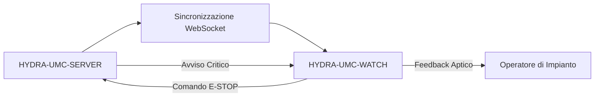

<p align="center">
  
</p>

# ⌚ HYDRA-UMC-WATCH

<p align="center"><a href="README.md">🇺🇸 English</a> | <a href="README_spa.md">🇪🇸 Español</a> | <a href="README_fra.md">🇫🇷 Français</a> | 🇮🇹 <b>Italiano</b> | <a href="README_deu.md">🇩🇪 Deutsch</a> | <a href="README_zho.md">🇨🇳 简体中文</a> | <a href="README_jpn.md">🇯🇵 日本語</a></p>

### 🛡️ Dashboard di Sicurezza Indossabile e Sistema di Allarme Aptico d'Emergenza

<p align="left">
  
  
  
</p>

---

## 1. 🛠️ PANORAMICA TECNICA

**HYDRA-UMC-WATCH** è l'estensione tattica per l'operatore di impianto. Fornisce informazioni critiche a colpo d'occhio e controlli di sicurezza direttamente al polso, garantendo che l'operatore mantenga sempre il controllo, anche lontano dall'HMI principale.

Costruita come app Wear OS autonoma (Kotlin + Jetpack Compose per Wear), riutilizzando la stessa toolchain Gradle/Kotlin del repository gemello HYDRA-UMC-ANDROID-CONTROL invece di introdurne una nuova.

### Caratteristiche Principali:
* 🛑 **E-STOP Wireless** — pulsante di emergenza dedicato con latenza inferiore a 50ms su Wi-Fi industriale. *(pianificato — richiede l'accoppiamento con HYDRA-UMC-SERVER)*
* 📳 **Avvisi Aptici** — pattern di vibrazione differenziati per i vari tipi di avviso (Critico, Avviso, Info). *(pianificato)*
* ⌚ **Stato a Colpo d'Occhio** — riepilogo in tempo reale dell'attivita della flotta e dell'avanzamento delle missioni. *(pianificato)*
* 🔐 **Autenticazione Sicura** — accoppiamento basato su JWT con HYDRA-UMC-SERVER. *(pianificato)*
* ✅ **Toolchain Wear OS autonoma** — una vera app Gradle/Kotlin/Compose per Wear che compila un APK di debug funzionante. *(implementato — vedi COMPILAZIONE ED ESECUZIONE sotto)*

---

## 2. 🔄 FLUSSO DI SINCRONIZZAZIONE DEL WEARABLE



---

## 3. 🧱 ARCHITETTURA E DECISIONI DI PROGETTAZIONE

* **Perché è un'app Wear OS autonoma, non una funzionalità dell'app telefono.** Un orologio esegue il proprio processo indipendente sul proprio sistema operativo - non può essere semplicemente una modalità UI di HYDRA-UMC-ANDROID-CONTROL, ha bisogno del proprio manifest, della propria build, e della propria UI (molto più limitata) per stato a colpo d'occhio/E-STOP rapido.
* **Perché `minSdk 30` (Wear OS 3), inferiore al minSdk proprio dell'app telefono.** Questo mira deliberatamente all'attuale generazione hardware Wear OS 3+, non ai vecchi dispositivi Wear OS 2 - a differenza di HYDRA-UMC-ANDROID-CONTROL, che supporta telefoni più vecchi, un'app orologio companion ha una base hardware realistica da supportare molto più ristretta.
* **Perché il punto di ingresso oggi stampa solo identità/versione/ruolo.** Fase di andamiaje: dimostrare che `./gradlew assembleDebug` ha successo precede la vera logica di sincronizzazione con l'app telefono companion.
* **Come si inserisce nel resto dell'ecosistema.** Si accoppia con HYDRA-UMC-ANDROID-CONTROL e HYDRA-UMC-IOS-CONTROL come companion al polso, a colpo d'occhio - non un sostituto di nessuno dei due, una superficie di stato rapido/E-STOP rapido.

---

## 📂 STRUTTURA DELLE DIRECTORY

App Wear OS autonoma — senza hardware/firmware/os propri (gira su hardware da orologio disponibile in commercio), potati dal template (vedi `SONNET/5.PLAN_EJECUCION_32_PROYECTOS_NUEVOS.txt` per la regola di potatura di tutto l'ecosistema).

```text
HYDRA-UMC-WATCH/
├── app/
│   ├── build.gradle.kts       # Config del modulo app, incremento versione stile contachilometri
│   ├── version.properties     # versionMajor/Minor/Patch/Code (incrementato ad ogni build)
│   └── src/main/
│       ├── AndroidManifest.xml
│       ├── java/com/hydraumc/watch/MainActivity.kt   # Punto di ingresso Compose per Wear
│       └── res/                                        # Stringhe, tema, icona del launcher
├── gradle/
│   ├── libs.versions.toml     # Catalogo delle versioni delle dipendenze
│   └── wrapper/                # Gradle wrapper (fissato a 9.7.0)
├── build.gradle.kts           # Build radice di Gradle
├── settings.gradle.kts        # Cablaggio dei moduli
├── gradlew / gradlew.bat      # Launcher del Gradle wrapper
├── docs/                      # Documentazione e protocolli di sicurezza
├── build/                     # Riservato (l'app/build/ di Gradle stesso è ignorato da git)
├── images/                    # Media e diagrammi
├── scripts/                   # Script di utilità
├── build.sh / build.bat       # Build reale: gradlew assembleDebug
├── run.sh / run.bat           # Esecuzione reale: gradlew installDebug + avvio adb
└── src/                       # Riservato (il codice di questo progetto vive in app/src/)
```

---

## 4. ⚙️ COMPILAZIONE ED ESECUZIONE

Richiede JDK 21, l'Android SDK (`local.properties` → `sdk.dir`, ignorato da git — puntalo alla tua installazione locale dell'SDK) e un dispositivo o emulatore Wear OS per `run`.

```bash
# Linux/macOS
chmod +x gradlew   # una tantum
./build.sh
./run.sh            # richiede un dispositivo/emulatore Wear OS connesso

# Windows
build.bat
run.bat
```

`build` compila l'APK di debug in `app/build/outputs/apk/debug/app-debug.apk`. L'incremento di versione (`app/version.properties`) avviene all'interno dello stesso `app/build.gradle.kts` al momento della configurazione di Gradle, quindi viene eseguito automaticamente ad ogni build reale — nessun passaggio di incremento separato. `run` installa l'APK tramite `gradlew installDebug` e avvia `MainActivity` con `adb`.

---

## 🔗 Progetti Correlati

Questo progetto fa parte di un ecosistema robotico più ampio dello stesso autore (JuanenRac / Electro Hobby 3D), che copre firmware, software di controllo, nodi IA e strumenti di flotta. Utile saperlo, perché una richiesta potrebbe in realtà riguardare uno di questi progetti anziché questo repository.

### Relazione Diretta

- **[HYDRA-UMC-ANDROID-CONTROL](https://github.com/JuanenRac/HYDRA-UMC-ANDROID-CONTROL)** — l'app con cui si accoppia questo wearable.
- **[HYDRA-UMC-IOS-CONTROL](https://github.com/JuanenRac/HYDRA-UMC-IOS-CONTROL)** — l'app con cui si accoppia questo wearable.

### Resto dell'Ecosistema

**Piattaforma HYDRA-UMC** — la cella di micro-fabbrica multi-robot
- **[HYDRA-UMC](https://github.com/JuanenRac/HYDRA-UMC)** — la scheda madre CM5 + STM32H745 che orchestra fino a 8 bracci robotici.
- **[HYDRA-UMC-SERVER](https://github.com/JuanenRac/HYDRA-UMC-SERVER)** — il backend Express/WebSocket con cui parla ogni client di controllo.
- **[HYDRA-UMC-STUDIO](https://github.com/JuanenRac/HYDRA-UMC-STUDIO)** — dashboard di controllo web, visualizzazione 3D multi-robot.
- **[HYDRA-UMC-ANDROID-CONTROL](https://github.com/JuanenRac/HYDRA-UMC-ANDROID-CONTROL)** — app di controllo Android via Wi-Fi/Bluetooth.
- **[HYDRA-UMC-IOS-CONTROL](https://github.com/JuanenRac/HYDRA-UMC-IOS-CONTROL)** — app di controllo iOS/iPadOS costruita in Flutter.
- **[HYDRA-UMC-SUITE](https://github.com/JuanenRac/HYDRA-UMC-SUITE)** — centro di comando sciame desktop (Python/PySide6).
- **[HYDRA-UMC-EDITOR-URDF](https://github.com/JuanenRac/HYDRA-UMC-EDITOR-URDF)** — editor desktop di modelli URDF per il catalogo robot.
- **[HYDRA-UMC-DSI](https://github.com/JuanenRac/HYDRA-UMC-DSI)** — interfaccia touch nativa per lo schermo DSI a bordo.

**Piattaforma URTC** — il controller della testa utensile che ogni braccio HYDRA-UMC porta con sé
- **[URTC](https://github.com/JuanenRac/URTC)** — controller testa utensile su bus CAN, 25 profili utensile.
- **[URTC-FLASHER](https://github.com/JuanenRac/URTC-FLASHER)** — strumento desktop di flashing CAN-OTA + SWD/JTAG.
- **[URTC-TESTER](https://github.com/JuanenRac/URTC-TESTER)** — strumento desktop di diagnostica CAN live.
- **[URTC-WEB-STUDIO](https://github.com/JuanenRac/URTC-WEB-STUDIO)** — alternativa basata su browser via Web Serial API.

**🎥 Vision AI Node (Hailo-8)**
- [HYDRA-UMC-VISION-NODE](https://github.com/JuanenRac/HYDRA-UMC-VISION-NODE)
- [HYDRA-UMC-VISION-STREAMER](https://github.com/JuanenRac/HYDRA-UMC-VISION-STREAMER)
- [HYDRA-UMC-DETECTION-HEF](https://github.com/JuanenRac/HYDRA-UMC-DETECTION-HEF)
- [HYDRA-UMC-SAFETY-ZONES](https://github.com/JuanenRac/HYDRA-UMC-SAFETY-ZONES)
- [HYDRA-UMC-VISUAL-SERVOING-API](https://github.com/JuanenRac/HYDRA-UMC-VISUAL-SERVOING-API)

**🧠 Cognitive AI Node (Hailo-10)**
- [HYDRA-UMC-COGNITIVE-NODE](https://github.com/JuanenRac/HYDRA-UMC-COGNITIVE-NODE)
- [HYDRA-UMC-VLA-ENGINE](https://github.com/JuanenRac/HYDRA-UMC-VLA-ENGINE)
- [HYDRA-UMC-VOICE-UI](https://github.com/JuanenRac/HYDRA-UMC-VOICE-UI)
- [HYDRA-UMC-SEMANTIC-PLANNER](https://github.com/JuanenRac/HYDRA-UMC-SEMANTIC-PLANNER)
- [HYDRA-UMC-DOCS-QA](https://github.com/JuanenRac/HYDRA-UMC-DOCS-QA)

**🐝 Orchestration & Swarm**
- [HYDRA-UMC-ORCHESTRATOR](https://github.com/JuanenRac/HYDRA-UMC-ORCHESTRATOR)
- [HYDRA-UMC-SWARM-SYNC](https://github.com/JuanenRac/HYDRA-UMC-SWARM-SYNC)
- [HYDRA-UMC-PATH-PLANNER-3D](https://github.com/JuanenRac/HYDRA-UMC-PATH-PLANNER-3D)
- [HYDRA-UMC-JOB-DISPATCHER](https://github.com/JuanenRac/HYDRA-UMC-JOB-DISPATCHER)
- [HYDRA-UMC-NODE-HEALING](https://github.com/JuanenRac/HYDRA-UMC-NODE-HEALING)

**🎮 Digital Twin & Simulation**
- [HYDRA-UMC-TWIN](https://github.com/JuanenRac/HYDRA-UMC-TWIN)
- [HYDRA-UMC-PHYSICS-REPLICA](https://github.com/JuanenRac/HYDRA-UMC-PHYSICS-REPLICA)
- [HYDRA-UMC-HIL-BRIDGE](https://github.com/JuanenRac/HYDRA-UMC-HIL-BRIDGE)
- [HYDRA-UMC-SYNTHETIC-DATA-GEN](https://github.com/JuanenRac/HYDRA-UMC-SYNTHETIC-DATA-GEN)

**📊 Data & Analytics**
- [HYDRA-UMC-DATALAKE](https://github.com/JuanenRac/HYDRA-UMC-DATALAKE)
- [HYDRA-UMC-TELEMETRY-COLLECTOR](https://github.com/JuanenRac/HYDRA-UMC-TELEMETRY-COLLECTOR)
- [HYDRA-UMC-ANOMALY-DETECTOR](https://github.com/JuanenRac/HYDRA-UMC-ANOMALY-DETECTOR)
- [HYDRA-UMC-PRODUCTION-REPORTS](https://github.com/JuanenRac/HYDRA-UMC-PRODUCTION-REPORTS)

**🏭 Industrial Gateway**
- [HYDRA-UMC-GATEWAY-INDUSTRIAL](https://github.com/JuanenRac/HYDRA-UMC-GATEWAY-INDUSTRIAL)
- [HYDRA-UMC-OPCUA-SERVER](https://github.com/JuanenRac/HYDRA-UMC-OPCUA-SERVER)
- [HYDRA-UMC-MQTT-BROKER](https://github.com/JuanenRac/HYDRA-UMC-MQTT-BROKER)
- [HYDRA-UMC-MTCONNECT-ADAPTER](https://github.com/JuanenRac/HYDRA-UMC-MTCONNECT-ADAPTER)

**🛠️ Complementary Tools**
- [URTC-SMART-RACK](https://github.com/JuanenRac/URTC-SMART-RACK)
- [URTC-VISION-TOOL](https://github.com/JuanenRac/URTC-VISION-TOOL)
- [HYDRA-UMC-TOOL-CLI](https://github.com/JuanenRac/HYDRA-UMC-TOOL-CLI)
- [HYDRA-UMC-DASHBOARD-AI](https://github.com/JuanenRac/HYDRA-UMC-DASHBOARD-AI)


## 👤 AUTORE
**JuanenRac** (Electro Hobby 3D)
📧 electrohobby3d@gmail.com

## 📜 LICENZA
GPL-3.0 - Vedi LICENSE per i dettagli.
