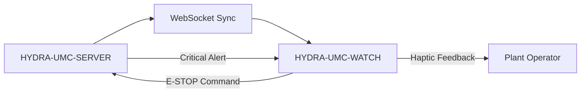

<p align="center">
  
</p>

# ⌚ HYDRA-UMC-WATCH

<p align="center"><a href="README.md">🇺🇸 English</a> | <a href="README_spa.md">🇪🇸 Español</a> | <a href="README_fra.md">🇫🇷 Français</a> | <a href="README_ita.md">🇮🇹 Italiano</a> | <a href="README_deu.md">🇩🇪 Deutsch</a> | <a href="README_zho.md">🇨🇳 简体中文</a> | 🇯🇵 <b>日本語</b></p>

### 🛡️ ウェアラブル安全ダッシュボードとハプティック緊急アラートシステム

<p align="left">
  
  
  
</p>

---

## 1. 🛠️ 技術概要

**HYDRA-UMC-WATCH** は、工場オペレーター向けの戦術的拡張デバイスです。
重要で一目でわかる情報と安全制御を手首に直接提供し、オペレーターが
メインの HMI から離れている場合でも常に状況を把握できるようにします。

Kotlin + Jetpack Compose for Wear で構築された独立した Wear OS アプリ
であり、新しいツールチェーンを導入するのではなく、兄弟リポジトリ
HYDRA-UMC-ANDROID-CONTROL と同じ Gradle/Kotlin ツールチェーンを再利用
しています。

### 主な機能：
* 🛑 **ワイヤレス E-STOP** — 産業用 Wi-Fi 経由でサブ 50ms の遅延を実現する専用の緊急ボタン。*（計画中——HYDRA-UMC-SERVER とのペアリングが必要）*
* 📳 **ハプティックアラート** — さまざまなアラートタイプ（重大、警告、情報）向けの差別化された振動パターン。*（計画中）*
* ⌚ **一目でわかるステータス：** スウォームの活動状況とミッションの進行状況のリアルタイムサマリー。*（計画中）*
* 🔐 **セキュアな認証：** HYDRA-UMC-SERVER との JWT ベースのペアリング。*（計画中）*
* ✅ **独立した Wear OS ツールチェーン** — 動作するデバッグ APK をビルドする実際の Gradle/Kotlin/Compose-for-Wear アプリ。*（実装済み——下記の「ビルドと実行」を参照）*

---

## 2. 🔄 ウェアラブル同期フロー



---

## 3. 🧱 アーキテクチャと設計上の決定

* **スマートフォンアプリの一機能ではなく、独立した Wear OS アプリである理由。** ウォッチは独自の OS 上で独自の独立したプロセスを実行します——それは HYDRA-UMC-ANDROID-CONTROL の UI モードにはなり得ず、独自のマニフェスト、独自のビルド、そして一目でわかるステータス表示/クイック E-STOP のための独自の（はるかに制約の多い）UI を必要とします。
* **`minSdk 30`（Wear OS 3）がスマートフォンアプリ自身の minSdk よりも低い理由。** これは意図的に現在の Wear OS 3+ ハードウェア世代を対象としており、古い Wear OS 2 デバイスは対象外です——古いスマートフォンをサポートする HYDRA-UMC-ANDROID-CONTROL とは異なり、コンパニオンウォッチアプリがサポートすべき現実的なハードウェア基盤ははるかに狭いものです。
* **エントリポイントが今日は身元/バージョン/役割のみを表示する理由。** 足場（アンダミアヘ、スキャフォールディング）段階にあります：`./gradlew assembleDebug` が成功することを証明することが、スマートフォンとの実際のコンパニオンアプリ同期ロジックに先立ちます。
* **エコシステムの他の部分との関係。** HYDRA-UMC-ANDROID-CONTROL および HYDRA-UMC-IOS-CONTROL とペアリングされる、一目でわかる手首上のコンパニオンデバイスです——どちらの代替でもなく、クイックステータス確認/クイック E-STOP のためのインターフェースです。

---

## 📂 リポジトリ構成

独立した Wear OS アプリ——独自のハードウェア/ファームウェア/OS を持たず
（現成の腕時計ハードウェア上で動作します）、テンプレートから省略されて
います（エコシステム全体の省略ルールは
`SONNET/5.PLAN_EJECUCION_32_PROYECTOS_NUEVOS.txt` を参照）。

```text
HYDRA-UMC-WATCH/
├── app/
│   ├── build.gradle.kts       # アプリモジュール設定、オドメーター式バージョンインクリメント
│   ├── version.properties     # versionMajor/Minor/Patch/Code（ビルドごとに自動増加）
│   └── src/main/
│       ├── AndroidManifest.xml
│       ├── java/com/hydraumc/watch/MainActivity.kt   # Compose-for-Wear エントリポイント
│       └── res/                                        # 文字列、テーマ、ランチャーアイコン
├── gradle/
│   ├── libs.versions.toml     # 依存関係バージョンカタログ
│   └── wrapper/                # Gradle wrapper（9.7.0 に固定）
├── build.gradle.kts           # ルート Gradle ビルド
├── settings.gradle.kts        # モジュール接続
├── gradlew / gradlew.bat      # Gradle wrapper ランチャー
├── docs/                      # ドキュメントと安全プロトコル
├── build/                     # 予約済み（Gradle 自身の app/build/ は gitignore 対象）
├── images/                    # メディアと図表
├── scripts/                   # ユーティリティスクリプト
├── build.sh / build.bat       # 実際のビルド：gradlew assembleDebug
├── run.sh / run.bat           # 実際の実行：gradlew installDebug + adb launch
└── src/                       # 予約済み（本プロジェクトのコードは app/src/ 下に存在します）
```

---

## 4. ⚙️ ビルドと実行

JDK 21、Android SDK（`local.properties` → `sdk.dir`、gitignore 対象
——ご自身の SDK インストール先を指定してください）、および `run` 用の
Wear OS デバイスまたはエミュレーターが必要です。

```bash
# Linux/macOS
chmod +x gradlew   # 初回のみ
./build.sh
./run.sh            # 接続された Wear OS デバイス/エミュレーターが必要です

# Windows
build.bat
run.bat
```

`build` は、デバッグ版 APK を
`app/build/outputs/apk/debug/app-debug.apk` にコンパイルします。
バージョンインクリメント（`app/version.properties`）は
`app/build.gradle.kts` 自身の内部で、Gradle の構成時に発生するため、
実際のビルドのたびに自動的に実行されます——個別のインクリメント手順は
不要です。`run` は `gradlew installDebug` 経由でこの APK をインストール
し、`adb` を使用して `MainActivity` を起動します。

---

## 🔗 関連プロジェクト

本プロジェクトは、同一著者（JuanenRac / Electro Hobby 3D）による、
ファームウェア、制御ソフトウェア、AI ノード、フリート管理ツールにまたがる、
より大きなロボティクスエコシステムの一部です。ご要望が実際にはこれらの
プロジェクトのいずれかに関するものであり、本リポジトリのものではない
可能性もあるため、知っておく価値があります。

### 直接関連

- **[HYDRA-UMC-ANDROID-CONTROL](https://github.com/JuanenRac/HYDRA-UMC-ANDROID-CONTROL)** —— 本ウェアラブルデバイスがペアリングされるコンパニオンアプリ。
- **[HYDRA-UMC-IOS-CONTROL](https://github.com/JuanenRac/HYDRA-UMC-IOS-CONTROL)** —— 本ウェアラブルデバイスがペアリングされるコンパニオンアプリ。

### エコシステムのその他のプロジェクト

**HYDRA-UMC プラットフォーム** — マルチロボット・マイクロファクトリーセル
- **[HYDRA-UMC](https://github.com/JuanenRac/HYDRA-UMC)** — 最大 8 台のロボットアームを統括する CM5 + STM32H745 マザーボード。
- **[HYDRA-UMC-SERVER](https://github.com/JuanenRac/HYDRA-UMC-SERVER)** — すべての制御クライアントが接続する Express/WebSocket バックエンド。
- **[HYDRA-UMC-STUDIO](https://github.com/JuanenRac/HYDRA-UMC-STUDIO)** — Web ベースの制御ダッシュボード、マルチロボット 3D 可視化。
- **[HYDRA-UMC-ANDROID-CONTROL](https://github.com/JuanenRac/HYDRA-UMC-ANDROID-CONTROL)** — Wi-Fi/Bluetooth 経由の Android 制御アプリ。
- **[HYDRA-UMC-IOS-CONTROL](https://github.com/JuanenRac/HYDRA-UMC-IOS-CONTROL)** — Flutter で構築された iOS/iPadOS 制御アプリ。
- **[HYDRA-UMC-SUITE](https://github.com/JuanenRac/HYDRA-UMC-SUITE)** — デスクトップ版群制御コマンドセンター（Python/PySide6）。
- **[HYDRA-UMC-EDITOR-URDF](https://github.com/JuanenRac/HYDRA-UMC-EDITOR-URDF)** — ロボットカタログ向けのデスクトップ版 URDF モデルエディター。
- **[HYDRA-UMC-DSI](https://github.com/JuanenRac/HYDRA-UMC-DSI)** — 機載 DSI タッチスクリーン用のネイティブタッチ UI。

**URTC プラットフォーム** — すべての HYDRA-UMC ロボットアームが搭載するツールヘッドコントローラー
- **[URTC](https://github.com/JuanenRac/URTC)** — CAN バスツールヘッドコントローラー、25 種類のツールプロファイル。
- **[URTC-FLASHER](https://github.com/JuanenRac/URTC-FLASHER)** — デスクトップ版 CAN-OTA + SWD/JTAG フラッシュツール。
- **[URTC-TESTER](https://github.com/JuanenRac/URTC-TESTER)** — デスクトップ版ライブ CAN バス診断ツール。
- **[URTC-WEB-STUDIO](https://github.com/JuanenRac/URTC-WEB-STUDIO)** — Web Serial API によるブラウザベースの代替版。

**🎥 ビジョン AI ノード（Hailo-8）**
- [HYDRA-UMC-VISION-NODE](https://github.com/JuanenRac/HYDRA-UMC-VISION-NODE)
- [HYDRA-UMC-VISION-STREAMER](https://github.com/JuanenRac/HYDRA-UMC-VISION-STREAMER)
- [HYDRA-UMC-DETECTION-HEF](https://github.com/JuanenRac/HYDRA-UMC-DETECTION-HEF)
- [HYDRA-UMC-SAFETY-ZONES](https://github.com/JuanenRac/HYDRA-UMC-SAFETY-ZONES)
- [HYDRA-UMC-VISUAL-SERVOING-API](https://github.com/JuanenRac/HYDRA-UMC-VISUAL-SERVOING-API)

**🧠 認知 AI ノード（Hailo-10）**
- [HYDRA-UMC-COGNITIVE-NODE](https://github.com/JuanenRac/HYDRA-UMC-COGNITIVE-NODE)
- [HYDRA-UMC-VLA-ENGINE](https://github.com/JuanenRac/HYDRA-UMC-VLA-ENGINE)
- [HYDRA-UMC-VOICE-UI](https://github.com/JuanenRac/HYDRA-UMC-VOICE-UI)
- [HYDRA-UMC-SEMANTIC-PLANNER](https://github.com/JuanenRac/HYDRA-UMC-SEMANTIC-PLANNER)
- [HYDRA-UMC-DOCS-QA](https://github.com/JuanenRac/HYDRA-UMC-DOCS-QA)

**🐝 オーケストレーションと群制御**
- [HYDRA-UMC-ORCHESTRATOR](https://github.com/JuanenRac/HYDRA-UMC-ORCHESTRATOR)
- [HYDRA-UMC-SWARM-SYNC](https://github.com/JuanenRac/HYDRA-UMC-SWARM-SYNC)
- [HYDRA-UMC-PATH-PLANNER-3D](https://github.com/JuanenRac/HYDRA-UMC-PATH-PLANNER-3D)
- [HYDRA-UMC-JOB-DISPATCHER](https://github.com/JuanenRac/HYDRA-UMC-JOB-DISPATCHER)
- [HYDRA-UMC-NODE-HEALING](https://github.com/JuanenRac/HYDRA-UMC-NODE-HEALING)

**🎮 デジタルツインとシミュレーション**
- [HYDRA-UMC-TWIN](https://github.com/JuanenRac/HYDRA-UMC-TWIN)
- [HYDRA-UMC-PHYSICS-REPLICA](https://github.com/JuanenRac/HYDRA-UMC-PHYSICS-REPLICA)
- [HYDRA-UMC-HIL-BRIDGE](https://github.com/JuanenRac/HYDRA-UMC-HIL-BRIDGE)
- [HYDRA-UMC-SYNTHETIC-DATA-GEN](https://github.com/JuanenRac/HYDRA-UMC-SYNTHETIC-DATA-GEN)

**📊 データと分析**
- [HYDRA-UMC-DATALAKE](https://github.com/JuanenRac/HYDRA-UMC-DATALAKE)
- [HYDRA-UMC-TELEMETRY-COLLECTOR](https://github.com/JuanenRac/HYDRA-UMC-TELEMETRY-COLLECTOR)
- [HYDRA-UMC-ANOMALY-DETECTOR](https://github.com/JuanenRac/HYDRA-UMC-ANOMALY-DETECTOR)
- [HYDRA-UMC-PRODUCTION-REPORTS](https://github.com/JuanenRac/HYDRA-UMC-PRODUCTION-REPORTS)

**🏭 産業用ゲートウェイ**
- [HYDRA-UMC-GATEWAY-INDUSTRIAL](https://github.com/JuanenRac/HYDRA-UMC-GATEWAY-INDUSTRIAL)
- [HYDRA-UMC-OPCUA-SERVER](https://github.com/JuanenRac/HYDRA-UMC-OPCUA-SERVER)
- [HYDRA-UMC-MQTT-BROKER](https://github.com/JuanenRac/HYDRA-UMC-MQTT-BROKER)
- [HYDRA-UMC-MTCONNECT-ADAPTER](https://github.com/JuanenRac/HYDRA-UMC-MTCONNECT-ADAPTER)

**🛠️ 補完ツール**
- [URTC-SMART-RACK](https://github.com/JuanenRac/URTC-SMART-RACK)
- [URTC-VISION-TOOL](https://github.com/JuanenRac/URTC-VISION-TOOL)
- [HYDRA-UMC-TOOL-CLI](https://github.com/JuanenRac/HYDRA-UMC-TOOL-CLI)
- [HYDRA-UMC-DASHBOARD-AI](https://github.com/JuanenRac/HYDRA-UMC-DASHBOARD-AI)


## 👤 作者
**JuanenRac**（Electro Hobby 3D）
📧 electrohobby3d@gmail.com

## 📜 ライセンス
GPL-3.0 —— 詳細は LICENSE を参照してください。
