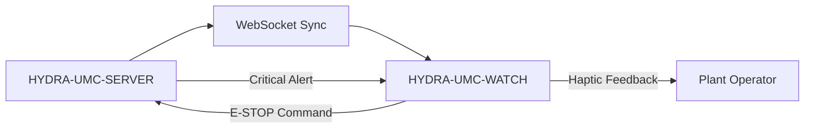

<p align="center">
  
</p>

# ⌚ HYDRA-UMC-WATCH

<p align="center"><a href="README.md">🇺🇸 English</a> | <a href="README_spa.md">🇪🇸 Español</a> | <a href="README_fra.md">🇫🇷 Français</a> | <a href="README_ita.md">🇮🇹 Italiano</a> | <a href="README_deu.md">🇩🇪 Deutsch</a> | <a href="README_zho.md">🇨🇳 简体中文</a> | 🇯🇵 <b>日本語</b></p>

### 🛡️ ウェアラブル安全ダッシュボードとハプティック緊急アラートシステム

<p align="left">
  
  
  
</p>

---

## 1. 🛠️ 技術概要

**HYDRA-UMC-WATCH** は、工場オペレーター向けの戦術的拡張デバイスです。
重要で一目でわかる情報と安全制御を手首に直接提供し、オペレーターが
メインの HMI から離れている場合でも常に状況を把握できるようにします。

Kotlin + Jetpack Compose for Wear で構築された独立した Wear OS アプリ
であり、新しいツールチェーンを導入するのではなく、兄弟リポジトリ
HYDRA-UMC-ANDROID-CONTROL と同じ Gradle/Kotlin ツールチェーンを再利用
しています。

### 主な機能：
* ✅ **実装済み v0 —— ハプティックパターンと同期プロトコル：** `haptics/HapticPatterns.kt` はアラートの重大度（重大/警告/情報）ごとに実際の、区別された振動パターンを定義します。`protocol/SyncMessage.kt` は下記の SERVER<->WATCH 同期フローにおける `EStopCommand`/`Alert` メッセージの実際の形を定義し、（デ）シリアライズします。どちらも純粋な Kotlin でテスト可能です——実行にもテストにも、ウォッチのハードウェア、エミュレーター、開かれた WebSocket は一切不要です。
* 🛑 **ワイヤレス E-STOP** — 産業用 Wi-Fi 経由でサブ 50ms の遅延を実現する専用の緊急ボタン。*（送信することになる `EStopCommand` メッセージは実装済みでテスト済みです。WebSocket トランスポートと物理ボタンの配線はまだ計画中です——HYDRA-UMC-SERVER とのペアリングが必要。）*
* 📳 **ハプティックアラート** — さまざまなアラートタイプ（重大、警告、情報）向けの差別化された振動パターン。Androidの実際の`Vibrator`/`VibratorManager`サービス経由で再生。*（実装済み——`haptics/HapticAlertPlayer.kt`。このアプリの他部分と同様、実際のWear OSデバイスではまだ未検証です。）*
* 🎙️ **音声** — タップして話す：明示的な`RECORD_AUDIO`権限リクエスト、文字起こしのためのシステム音声認識インテント（`RecognizerIntent`）、文字起こし結果を境界付きの`voice_turn`同期メッセージとしてHYDRA-UMC-ANDROID-CONTROLへ中継、そしてウォッチ上でのローカル`TextToSpeech`応答。*（実装済み——`MainActivity.kt`。音声がロボットを直接作動させることは決してありません。下記アーキテクチャおよび完全なエンドツーエンドのメッセージフローと安全境界については [docs/VOICE_AI_PROTOCOL.md](docs/VOICE_AI_PROTOCOL.md) を参照。）*
* ⌚ **一目でわかるステータス：** **ステータス更新**ボタンが、ペアリングされた Data Layer 経由で境界付きのステータス要求を HYDRA-UMC-ANDROID-CONTROL に中継します。返された `system_status` カードは、陳腐化すると「最終既知——古い可能性あり」の表示とともに示されます。*（実装済み——`MainActivity.kt`/`WatchRelayTransport.requestSystemStatus()`。電話のリレー経由のプル型であり、ウォッチからサーバーへの直接プッシュソケットではなく、実際の Wear OS デバイスではまだ未検証です。）*
* 🔐 **セキュアな認証：** HYDRA-UMC-SERVER との JWT ベースのペアリング。*（計画中。）*
* ✅ **独立した Wear OS ツールチェーン** — 動作するデバッグ APK をビルドする実際の Gradle/Kotlin/Compose-for-Wear アプリ。*（実装済み——下記の「ビルドと実行」を参照）*
* 🔁 **リレー再接続ポリシー** — `transport/RelayRetryPolicy.kt` は、リレー送信が失敗した場合（例えばまだペアリングされたスマートフォンがない場合）のための、実装済みの純粋な指数バックオフポリシーであり、上限付きの最大遅延に制限されています。*（実装済み）*
* 🗂️ **最終既知状態キャッシュ** — `transport/LastKnownStateCache.kt` は、最後に中継されたステータス/アラートの実際の陳腐化を追跡し、古い情報が最新のものとして表示されることを防ぎます。*（実装済み）*

---

## 2. 🔄 ウェアラブル同期フロー



*Server との直接 WebSocket が実現した場合の目標アーキテクチャです。今日
実際にテスト済みの経路はペアリングされたスマートフォン経由です：
Watch -> Data Layer -> HYDRA-UMC-ANDROID-CONTROL -> 認証済みの
HYDRA-UMC-SERVER/Voice UI、そして折り返し——下記アーキテクチャおよび
その実際のエンドツーエンドフローについては
[docs/VOICE_AI_PROTOCOL.md](docs/VOICE_AI_PROTOCOL.md) を参照。ウォッチ
自体が Server の認証情報を保持することは決してありません。ウォッチから
サーバーへの直接 WebSocket とワイヤレス E-STOP ボタンは、ハードウェアに
依存する今後の課題のままです。*

---

## 3. 🧱 アーキテクチャと設計上の決定

* **スマートフォンアプリの一機能ではなく、独立した Wear OS アプリである理由。** ウォッチは独自の OS 上で独自の独立したプロセスを実行します——それは HYDRA-UMC-ANDROID-CONTROL の UI モードにはなり得ず、独自のマニフェスト、独自のビルド、そして一目でわかるステータス表示/クイック E-STOP のための独自の（はるかに制約の多い）UI を必要とします。
* **`minSdk 30`（Wear OS 3）がスマートフォンアプリ自身の minSdk よりも低い理由。** これは意図的に現在の Wear OS 3+ ハードウェア世代を対象としており、古い Wear OS 2 デバイスは対象外です——古いスマートフォンをサポートする HYDRA-UMC-ANDROID-CONTROL とは異なり、コンパニオンウォッチアプリがサポートすべき現実的なハードウェア基盤ははるかに狭いものです。
* **ハプティックパターンと同期プロトコルが WebSocket 接続より先に実装される理由。** 双方が合意すべき振動波形とメッセージの形を定義することは、実際の純粋な Kotlin の作業です——記述にもテストにも、開かれたソケット、ペアリングされたサーバー、物理的なウォッチは一切不要です。その接続を実際に開くことが次のステップです。
* **再接続ポリシーと最終既知状態キャッシュが、`WatchRelayTransport` 内にインラインで実装されるのではなく、それぞれ独立した純粋なモジュールである理由。** どちらも実際の、疎結合な Kotlin クラス（`RelayRetryPolicy`、`LastKnownStateCache`）であり、ウォッチ、エミュレーター、ペアリングされたスマートフォンなしに、通常の JVM 上でテスト可能です——これは `HapticPatterns.kt`/`SyncMessage.kt` がすでに確立した基準と同じです。`WatchRelayTransport` 自体は、実際に再試行をスケジュールしたり受信メッセージを記録したりする、必然的に Android 依存の薄い部分のままであり、基盤となるポリシーのロジックが存在する場所ではありません。
* **古くなったキャッシュ状態が、隠されるのではなく明示される理由。** 古いステータスを完全に非表示にすると、電話接続が不安定な——まさに真のリスクの瞬間に——ウォッチの画面が空白のままになってしまいます。「最終既知——古い可能性あり」と明確に表示することで、数分前の読み取り値を最新のものとして扱わせることなく、オペレーターに情報を伝え続けます。
* **エコシステムの他の部分との関係。** HYDRA-UMC-ANDROID-CONTROL および HYDRA-UMC-IOS-CONTROL とペアリングされる、一目でわかる手首上のコンパニオンデバイスです——どちらの代替でもなく、クイックステータス確認/クイック E-STOP のためのインターフェースです。

---

## 📂 リポジトリ構成

独立した Wear OS アプリ——独自のハードウェア/ファームウェア/OS を持たず
（現成の腕時計ハードウェア上で動作します）、テンプレートから省略されて
います。これらのディレクトリはリポジトリ構造ポリシーに従って省略されています。

```text
HYDRA-UMC-WATCH/
├── app/
│   ├── build.gradle.kts       # アプリモジュール設定（version.properties を読むだけで書き込まない）
│   ├── version.properties     # versionMajor/Minor/Patch/Code（build.sh/.bat のみが増加させる）
│   └── src/
│       ├── main/
│       │   ├── AndroidManifest.xml
│       │   └── java/com/hydraumc/watch/
│       │       ├── MainActivity.kt         # Compose-for-Wear エントリポイント
│       │       ├── haptics/                # 重大度別の振動パターン
│       │       ├── protocol/               # SERVER<->WATCH 同期メッセージコーデック
│       │       └── transport/              # Data Layer リレー、リトライポリシー、最終既知状態キャッシュ
│       └── test/java/com/hydraumc/watch/   # 実際の JUnit テスト（haptics、protocol、transport）
├── gradle/
│   ├── libs.versions.toml     # 依存関係バージョンカタログ
│   └── wrapper/                # Gradle wrapper（9.7.0 に固定）
├── tools/
│   ├── build_test.py          # 変更を加えない CI チェック：契約検証 + assembleDebug
│   ├── ci_validate.py         # CI が使用するマニフェスト/CHANGELOG/ドキュメント検証
│   └── verify_paired_relay_contract.py # Watch<->Android Control 間の Data Layer 安全境界の静的検証
├── build.gradle.kts           # ルート Gradle ビルド
├── settings.gradle.kts        # モジュール接続
├── gradlew / gradlew.bat      # Gradle wrapper ランチャー
├── docs/                      # ドキュメントと安全プロトコル
├── build/                     # 予約済み（Gradle 自身の app/build/ は gitignore 対象）
├── images/                    # メディアと図表
├── hydra-umc.project.json     # エコシステムマニフェスト（バージョン、ビルド/健全性メタデータ）
├── keystore.properties.example # gitignore 対象のリリース署名設定のテンプレート
├── bump_manifest_version.py   # major/minor/patch とマニフェストを同時に増加させる
├── bump_version_code.py       # Android 独自の versionCode カウンターを増加させる
├── build.sh / build.bat       # 実際のビルド：バージョンを増加させ、テストを実行し、assembleDebug
├── build-test.sh / build-test.bat # tools/build_test.py 用の、変更を加えないラッパー
├── run.sh / run.bat           # 実際の実行：gradlew installDebug + adb launch
├── update-from-github.sh / .bat # Google Play を使わない更新チャネル：GitHub Release APK + `adb install -r`
└── src/                       # 予約済み（本プロジェクトのコードは app/src/ 下に存在します）
```

---

## 4. ⚙️ ビルドと実行

JDK 21、Android SDK（`local.properties` → `sdk.dir`、gitignore 対象
——ご自身の SDK インストール先を指定してください）、および `run` 用の
Wear OS デバイスまたはエミュレーターが必要です。

```bash
# Linux/macOS
chmod +x gradlew   # 初回のみ
./build.sh
./run.sh            # 接続された Wear OS デバイス/エミュレーターが必要です

# Windows
build.bat
run.bat
```

`build` はバージョンを増加させ（`bump_manifest_version.py` が
`hydra-umc.project.json` と歩調を合わせて major/minor/patch を、
`bump_version_code.py` が Android 独自の `versionCode` を増加させます）、
実際の JUnit テストスイート（`haptics`、`protocol`）を実行し、デバッグ版
APK を `app/build/outputs/apk/debug/app-debug.apk` にコンパイルします
——これらすべてが、`-PhydraUmcReadOnly=true` を付けた 1 回の Gradle
呼び出しの中で行われます。これにより、バージョンを読み取るだけの
`app/build.gradle.kts` のコードが*同時に*それを増加させることは決してあり
ません（同じフラグは `build-test.sh`/`.bat` の、変更を一切加えない
コンパイルのみの CI チェックでも使われています）。`run` は
`gradlew installDebug` 経由でこの APK をインストールし、`adb` を使用して
`MainActivity` を起動します。

実際の例 —— この 2 つのバージョン増加スクリプトは単独でも実行でき、
Gradle を起動せずにビルドが何をするかを確認するのに便利です：

```bash
python3 bump_manifest_version.py   # 例："HYDRA-UMC version: v0.1.2 -> v0.1.3"
python3 bump_version_code.py       # 例："versionCode: 12 -> 13"
```

---

## 5. 📲 GOOGLE PLAY を使わない更新方法

本プロジェクトは Google Play では配布されていません。反復可能な更新経路は、
ADB でインストールする GitHub Release の APK です：

```bash
# プロジェクトルートから、ウォッチをペアリングし Wireless debugging を有効にした状態で
update-from-github.bat    # Windows
./update-from-github.sh   # Linux / macOS / WSL
```

このスクリプトは GitHub の `releases/latest` を読み取り、安定した
`vMAJOR.MINOR.PATCH` タグを要求し、既にインストール済みのバージョンを
確認し、オペレーターの明示的な確認を求めた上で、APK をダウンロードして
`adb install -r` を実行します。リポジトリのバージョン、マニフェスト、
`CHANGELOG.md` には一切触れません。使える ADB 経路がないデバイス向けに、
ダウンロードした APK をウォッチ上のパッケージインストーラーで直接開く
手動でのベストエフォートなインストール手順も文書化されています。完全な
手順、リリース APK の必須命名規則、リリース署名の設定については
[docs/GITHUB_ADB_UPDATES.md](docs/GITHUB_ADB_UPDATES.md) を参照してください。

`HYDRA-UMC-ANDROID-CONTROL` は、コンパニオンバージョンステータスメッセージが
接続された時点で、新しいウォッチのリリースが存在することをオペレーターに
通知できます——これは情報提供のみであり、ウォッチ自体に何かをインストール
することは決してありません。そのメッセージ形式については
[docs/COMPANION_VERSION_PROTOCOL.md](docs/COMPANION_VERSION_PROTOCOL.md)
を参照してください。

---

## ✅ 現在の状況と次のステップ

**現在実装済み：** Android の `Vibrator` サービスによるローカルアラート再生、
明示的なマイク許可とシステム音声認識、可視の文字起こしとローカル音声合成、
さらに `voice_turn`、`assistant_reply`、`system_status`、`EStopCommand`、
`Alert`、コンパニオンのバージョン状態のためのテスト済み型付きメッセージです。公式 Wear OS Data Layer は、制限された音声ターンと状態カード要求を HYDRA-UMC-ANDROID-CONTROL 経由で認証済み Server と Voice UI に中継します。

**統合の境界：** ペアリング済み Android アプリは暗号化された Server JWT を保持し、Server は Voice UI トークンを保持します。Data Layer は両方の APK に同じパッケージ名と署名証明書を要求します。音声でロボットを直接動作させることは決してなく、移動に関係する応答は確認を要求し、物理 E-STOP は独立して維持されます。

**まだ先にあるもの：** 実機 Wear OS でのペアリング、無線転送、マイク/スピーカー、エンドツーエンド状態の検証です。ワイヤレス E-STOP と CM5 ライブテレメトリーは、ハードウェアに依存する別作業です。

---

## 🔗 関連プロジェクト

本プロジェクトは、同じ作者(JuanenRac / Electro Hobby 3D)による HYDRA-UMC ロボティクスエコシステムの一部です。リクエストが実はこの中のどれかについてのものである可能性があるため、知っておく価値があります。

**直接関連**
- **[HYDRA-UMC-ANDROID-CONTROL](https://github.com/JuanenRac/HYDRA-UMC-ANDROID-CONTROL)** — 生体認証ログインとペアリングされた Wear OS コンパニオンを備えたネイティブ Android 制御アプリ ——本ウェアラブルがペアリングするコンパニオンアプリ。
- **[HYDRA-UMC-IOS-CONTROL](https://github.com/JuanenRac/HYDRA-UMC-IOS-CONTROL)** — リアルタイム WebSocket 同期を備えた iOS/iPadOS 制御アプリ(Flutter) ——本ウェアラブルがペアリングするコンパニオンアプリ。
- **[HYDRA-UMC-VOICE-UI](https://github.com/JuanenRac/HYDRA-UMC-VOICE-UI)** — 確認ゲート付きの限定的な Watch リレーを備えた、実際の音声フロントエンド(VAD + 意図解析) ——本ウェアラブルが触覚アラートとして表示する voice_turn メッセージを送信する。

**エコシステムの他のプロジェクト**

*コアハードウェア&プラットフォーム*
- **[HYDRA-UMC](https://github.com/JuanenRac/HYDRA-UMC)** — 実際のロボットアームのマザーボード——CM5 ホスト + デュアルコア STM32H745、CAN-OTA/SPI-OTA 経由で最大 8 本のツールアームを統括。
- **[HYDRA-UMC-OS](https://github.com/JuanenRac/HYDRA-UMC-OS)** — CM5 向けの再現可能な Raspberry Pi OS プロダクト層——読み取り専用エージェント、検証済み設定/プロファイル、WiFi 初回接続プロビジョニング。
- **[HYDRA-UMC-SDK](https://github.com/JuanenRac/HYDRA-UMC-SDK)** — すべてのブリッジが自身のコマンドを検証する共有 JSON-Schema 契約と安全ゲートの境界。

*コアバックエンド&クライアント*
- **[HYDRA-UMC-SERVER](https://github.com/JuanenRac/HYDRA-UMC-SERVER)** — すべての制御クライアントが実際に通信する、本物のヘッドレスバックエンド(REST/WebSocket)。
- **[HYDRA-UMC-STUDIO](https://github.com/JuanenRac/HYDRA-UMC-STUDIO)** — リアルタイムのマルチロボット 3D 可視化を備えたウェブ制御ダッシュボード。
- **[HYDRA-UMC-SUITE](https://github.com/JuanenRac/HYDRA-UMC-SUITE)** — 複数のサーバーを同時に扱えるデスクトップ(PySide6)スウォームコマンドセンター、スタンドアロン実行ファイルとしてパッケージ化。
- **[HYDRA-UMC-DSI](https://github.com/JuanenRac/HYDRA-UMC-DSI)** — 本体搭載の 7 インチ DSI タッチスクリーン向けネイティブタッチ UI、CM5 自体に組み込み。
- **[HYDRA-UMC-EDITOR-URDF](https://github.com/JuanenRac/HYDRA-UMC-EDITOR-URDF)** — 完成したモデルを STUDIO 自身のカタログへ送信するデスクトップ用グラフィカル URDF 作成/編集ツール。
- **[HYDRA-UMC-BRIDGE-AMR](https://github.com/JuanenRac/HYDRA-UMC-BRIDGE-AMR)** — 実際の VDA 5050 MQTT パブリッシャーによる AGV/AMR フリートの調整境界。
- **[HYDRA-UMC-BRIDGE-CNC](https://github.com/JuanenRac/HYDRA-UMC-BRIDGE-CNC)** — 実際の GRBL ステータス/制御バイトへのアクセスを持つ、CNC セルの高レベルコーディネーター。
- **[HYDRA-UMC-BRIDGE-DROIDS](https://github.com/JuanenRac/HYDRA-UMC-BRIDGE-DROIDS)** — 実際の Boston Dynamics Spot コマンド送信機能を持つ、脚型/ヒューマノイドドロイドの調整境界。
- **[HYDRA-UMC-BRIDGE-LASER](https://github.com/JuanenRac/HYDRA-UMC-BRIDGE-LASER)** — 実際のキー/筐体/インターロック GPIO セーフガード 3 系統を読み取る、レーザーセルの安全コーディネーター。
- **[HYDRA-UMC-BRIDGE-OPENPNP](https://github.com/JuanenRac/HYDRA-UMC-BRIDGE-OPENPNP)** — OpenPnP ピックアンドプレースの基板フローを安全に統括する高レベルコーディネーター。
- **[HYDRA-UMC-BRIDGE-PRINTER3D](https://github.com/JuanenRac/HYDRA-UMC-BRIDGE-PRINTER3D)** — 実際にゲート制御されたジョブコマンドを持つ、Moonraker/Klipper 3D プリンター向けの安全な調整境界。
- **[HYDRA-UMC-BRIDGE-ROS2](https://github.com/JuanenRac/HYDRA-UMC-BRIDGE-ROS2)** — 実際の遅延インポート rclpy ROS 2 トランスポートを持つ安全コーディネーター。
- **[HYDRA-UMC-BRIDGE-UAV](https://github.com/JuanenRac/HYDRA-UMC-BRIDGE-UAV)** — 実際の MAVLink コマンド送信機能を持つ、カメラ搭載 UAV の調整境界。

*URTC ツールプラットフォーム*
- **[URTC](https://github.com/JuanenRac/URTC)** — 物理的な Universal Robot Tool Controller 基板向けファームウェア、CAN バス経由の 25 以上のツールプロファイル。
- **[URTC-FLASHER](https://github.com/JuanenRac/URTC-FLASHER)** — URTC 基板用のデスクトップ GUI 書き込みツール、CAN-OTA およびフルチップ SWD/JTAG。
- **[URTC-TESTER](https://github.com/JuanenRac/URTC-TESTER)** — URTC 基板向けのデスクトップ CAN バスライブ診断ツール、ツールプロファイルごとに 1 パネル。
- **[URTC-WEB-STUDIO](https://github.com/JuanenRac/URTC-WEB-STUDIO)** — Web Serial API を使ったブラウザベースの URTC-TESTER の代替、ローカルインストール不要。

*ビジョン AI ノード(Hailo-8)*
- **[HYDRA-UMC-VISION-NODE](https://github.com/JuanenRac/HYDRA-UMC-VISION-NODE)** — Hailo-8 ビジョンパイプラインの統合ハブ、段階ごとの実際のハードウェア準備状況チェック付き。
- **[HYDRA-UMC-DETECTION-HEF](https://github.com/JuanenRac/HYDRA-UMC-DETECTION-HEF)** — Hailo アーキテクチャ/チェックサムによる安全読み込み検証を備えた、実際のコンパイル済みモデルレジストリ。
- **[HYDRA-UMC-VISION-STREAMER](https://github.com/JuanenRac/HYDRA-UMC-VISION-STREAMER)** — 実際の HailoRT 統合境界を持つ、実際の GStreamer パイプライン + MediaMTX 設定生成器。
- **[HYDRA-UMC-VISUAL-SERVOING-API](https://github.com/JuanenRac/HYDRA-UMC-VISUAL-SERVOING-API)** — 上流のゾーン状態に応じて安全ゲート制御される、実際の Position-Based Visual Servoing 補正則。
- **[HYDRA-UMC-SAFETY-ZONES](https://github.com/JuanenRac/HYDRA-UMC-SAFETY-ZONES)** — キャリブレーションの鮮度を強制する、実際のゾーン侵入チェックと E-STOP 要求。

*コグニティブ AI ノード(Hailo-10)*
- **[HYDRA-UMC-COGNITIVE-NODE](https://github.com/JuanenRac/HYDRA-UMC-COGNITIVE-NODE)** — Hailo-10 コグニティブパイプライン(LLM/VLA/音声オーケストレーション)の統合ハブ。
- **[HYDRA-UMC-VLA-ENGINE](https://github.com/JuanenRac/HYDRA-UMC-VLA-ENGINE)** — Vision-Language-Action モデル向けの、実際のアクショントークンのエンコード/デコードと軌道生成。
- **[HYDRA-UMC-SEMANTIC-PLANNER](https://github.com/JuanenRac/HYDRA-UMC-SEMANTIC-PLANNER)** — MCU エラーコードに対する、実際のルールベースのタスク分解と意味的エラー復旧。
- **[HYDRA-UMC-DOCS-QA](https://github.com/JuanenRac/HYDRA-UMC-DOCS-QA)** — このエコシステム自身の Markdown ドキュメントに対する、標準ライブラリのみの実際の TF-IDF 文書検索。

*オーケストレーション&スウォーム*
- **[HYDRA-UMC-ORCHESTRATOR](https://github.com/JuanenRac/HYDRA-UMC-ORCHESTRATOR)** — 実際の gRPC/Protobuf ヘルスレポート契約とミッションステートマシンを持つ統合ハブ。
- **[HYDRA-UMC-JOB-DISPATCHER](https://github.com/JuanenRac/HYDRA-UMC-JOB-DISPATCHER)** — 実際の HTTP API 上に構築された、優先度ベースの実際のジョブキュー(重複排除付き)。
- **[HYDRA-UMC-NODE-HEALING](https://github.com/JuanenRac/HYDRA-UMC-NODE-HEALING)** — リトライ/バックオフとアイデンティティ不一致検出を備えた、実際の gRPC ベースのフリートヘルスウォッチドッグ。
- **[HYDRA-UMC-PATH-PLANNER-3D](https://github.com/JuanenRac/HYDRA-UMC-PATH-PLANNER-3D)** — 実際の障害物/ワークスペース衝突検証を備えた、実際の RRT ベースの 3D 経路プランナー。
- **[HYDRA-UMC-SWARM-SYNC](https://github.com/JuanenRac/HYDRA-UMC-SWARM-SYNC)** — 複数セルの収束についてプロパティテストされた、実際の CRDT LWW-Element-Map 状態同期。

*デジタルツイン&シミュレーション*
- **[HYDRA-UMC-TWIN](https://github.com/JuanenRac/HYDRA-UMC-TWIN)** — 実際のバージョン互換性同期契約を持つ、デジタルツインエンジンの統合ハブ。
- **[HYDRA-UMC-HIL-BRIDGE](https://github.com/JuanenRac/HYDRA-UMC-HIL-BRIDGE)** — シミュレーションと実際のハードウェアの間でコマンドをルーティングする、実際のハードウェア・イン・ザ・ループ安全インターロック。
- **[HYDRA-UMC-PHYSICS-REPLICA](https://github.com/JuanenRac/HYDRA-UMC-PHYSICS-REPLICA)** — 実際の URDF サブセットに対する、実際の順運動学と関節限界検証。
- **[HYDRA-UMC-SYNTHETIC-DATA-GEN](https://github.com/JuanenRac/HYDRA-UMC-SYNTHETIC-DATA-GEN)** — YOLO/COCO アノテーションのエクスポート機能を持つ、実際のプロシージャル 2D シーンジェネレーター。

*データ&分析*
- **[HYDRA-UMC-DATALAKE](https://github.com/JuanenRac/HYDRA-UMC-DATALAKE)** — 実際の取り込み/クエリ HTTP API を備えた、実際の sqlite3 ベースの時系列ストア。
- **[HYDRA-UMC-ANOMALY-DETECTOR](https://github.com/JuanenRac/HYDRA-UMC-ANOMALY-DETECTOR)** — ドリフト監視を備えた、実際の FFT + 統計ベースラインによる異常検知器。
- **[HYDRA-UMC-PRODUCTION-REPORTS](https://github.com/JuanenRac/HYDRA-UMC-PRODUCTION-REPORTS)** — DATALAKE の履歴に対する実際の OEE/稼働率計算、再現可能な CSV エクスポート付き。
- **[HYDRA-UMC-TELEMETRY-COLLECTOR](https://github.com/JuanenRac/HYDRA-UMC-TELEMETRY-COLLECTOR)** — シーケンス重複排除機能を備えた、DATALAKE への実際の CAN/WebSocket 取り込みパイプライン。

*産業用ゲートウェイ*
- **[HYDRA-UMC-GATEWAY-INDUSTRIAL](https://github.com/JuanenRac/HYDRA-UMC-GATEWAY-INDUSTRIAL)** — 実際のコマンド許可リスト/バックプレッシャー層を持つ、産業用プロトコルへ中継する統合ハブ。
- **[HYDRA-UMC-OPCUA-SERVER](https://github.com/JuanenRac/HYDRA-UMC-OPCUA-SERVER)** — 実際のバイナリプロトコルクライアントセッションで検証された、実際の OPC-UA アドレス空間。
- **[HYDRA-UMC-MQTT-BROKER](https://github.com/JuanenRac/HYDRA-UMC-MQTT-BROKER)** — クライアント単位のオプション認証とトピック ACL を備えた、実際の MQTT ブローカー。
- **[HYDRA-UMC-MTCONNECT-ADAPTER](https://github.com/JuanenRac/HYDRA-UMC-MTCONNECT-ADAPTER)** — 縮退モード出力を備えた、実際の MTConnect `/probe` および `/current` XML エンドポイント。

*補完ツール&エコシステム運用*
- **[HYDRA-UMC-DASHBOARD-AI](https://github.com/JuanenRac/HYDRA-UMC-DASHBOARD-AI)** — 誠実な統計フォールバックを備えた、DATALAKE/ANOMALY-DETECTOR 上のスマートサマリーと異常ハイライトパネル。
- **[HYDRA-UMC-TOOL-CLI](https://github.com/JuanenRac/HYDRA-UMC-TOOL-CLI)** — 実際の安定した終了コード契約を持つフリート CLI、HYDRA-UMC-SERVER 自身の API の本物のライブクライアント。
- **[URTC-SMART-RACK](https://github.com/JuanenRac/URTC-SMART-RACK)** — 実際の工具 ID デコードと Smart Idle 予熱ロジックを備えた、基板搭載ラック用ファームウェア。
- **[URTC-VISION-TOOL](https://github.com/JuanenRac/URTC-VISION-TOOL)** — サーマル/RGB 検査ツールヘッド向けの、ファームウェアと実際の Python ビジョンコンパニオン。
- **[HYDRA-UMC-UPDATER](https://github.com/JuanenRac/HYDRA-UMC-UPDATER)** — このエコシステム内のすべてのリポジトリを検出・クローン・更新する、管理用デスクトップツール。


---

## 📚 ドキュメント & コミュニティ

- **[CONTRIBUTING.md](CONTRIBUTING.md)** —— プルリクエストのための技術スタックとコーディング指針。
- **[CODE_OF_CONDUCT.md](CODE_OF_CONDUCT.md)** —— このコミュニティで期待される行動規範。
- **[SECURITY.md](SECURITY.md)** —— 脆弱性の報告方法と、このプロジェクトの実際のセキュリティ重点領域。
- **[SUPPORT.md](SUPPORT.md)** —— 質問の投稿先とバグの報告先。
- **[LICENSE.md](LICENSE.md)** —— このプロジェクト自身のライセンス。

## 👤 作者
**JuanenRac** (Electro Hobby 3D)
📧 electrohobby3d@gmail.com
📺 [youtube.com/@electrohobby3d](https://youtube.com/@electrohobby3d)

## 📜 ライセンス
GPL-3.0 —— 詳細は LICENSE を参照してください。
