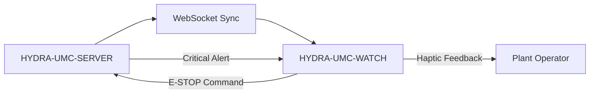

<p align="center">
  
</p>

# ⌚ HYDRA-UMC-WATCH

<p align="center"><a href="README.md">🇺🇸 English</a> | <a href="README_spa.md">🇪🇸 Español</a> | <a href="README_fra.md">🇫🇷 Français</a> | <a href="README_ita.md">🇮🇹 Italiano</a> | <a href="README_deu.md">🇩🇪 Deutsch</a> | <a href="README_zho.md">🇨🇳 简体中文</a> | 🇯🇵 <b>日本語</b></p>

### 🛡️ ウェアラブル安全ダッシュボードとハプティック緊急アラートシステム

<p align="left">
  
  
  
</p>

---

## 1. 🛠️ 技術概要

**HYDRA-UMC-WATCH** は、工場オペレーター向けの戦術的拡張デバイスです。
重要で一目でわかる情報と安全制御を手首に直接提供し、オペレーターが
メインの HMI から離れている場合でも常に状況を把握できるようにします。

Kotlin + Jetpack Compose for Wear で構築された独立した Wear OS アプリ
であり、新しいツールチェーンを導入するのではなく、兄弟リポジトリ
HYDRA-UMC-ANDROID-CONTROL と同じ Gradle/Kotlin ツールチェーンを再利用
しています。

### 主な機能：
* ✅ **実装済み v0 —— ハプティックパターンと同期プロトコル：** `haptics/HapticPatterns.kt` はアラートの重大度（重大/警告/情報）ごとに実際の、区別された振動パターンを定義します。`protocol/SyncMessage.kt` は下記の SERVER<->WATCH 同期フローにおける `EStopCommand`/`Alert` メッセージの実際の形を定義し、（デ）シリアライズします。どちらも純粋な Kotlin でテスト可能です——実行にもテストにも、ウォッチのハードウェア、エミュレーター、開かれた WebSocket は一切不要です。
* 🛑 **ワイヤレス E-STOP** — 産業用 Wi-Fi 経由でサブ 50ms の遅延を実現する専用の緊急ボタン。*（送信することになる `EStopCommand` メッセージは実装済みでテスト済みです。WebSocket トランスポートと物理ボタンの配線はまだ計画中です——HYDRA-UMC-SERVER とのペアリングが必要。）*
* 📳 **ハプティックアラート** — さまざまなアラートタイプ（重大、警告、情報）向けの差別化された振動パターン。*（パターン自体は実装済みです——上記参照。実際の `Vibrator` サービス呼び出しへの接続はまだ計画中です。）*
* ⌚ **一目でわかるステータス：** スウォームの活動状況とミッションの進行状況のリアルタイムサマリー。*（計画中——実際の WebSocket 接続が必要です。）*
* 🔐 **セキュアな認証：** HYDRA-UMC-SERVER との JWT ベースのペアリング。*（計画中。）*
* ✅ **独立した Wear OS ツールチェーン** — 動作するデバッグ APK をビルドする実際の Gradle/Kotlin/Compose-for-Wear アプリ。*（実装済み——下記の「ビルドと実行」を参照）*
* 🔁 **リレー再接続ポリシー** — `transport/RelayRetryPolicy.kt` は、リレー送信が失敗した場合（例えばまだペアリングされたスマートフォンがない場合）のための、実装済みの純粋な指数バックオフポリシーであり、上限付きの最大遅延に制限されています。*（実装済み）*
* 🗂️ **最終既知状態キャッシュ** — `transport/LastKnownStateCache.kt` は、最後に中継されたステータス/アラートの実際の陳腐化を追跡し、古い情報が最新のものとして表示されることを防ぎます。*（実装済み）*

---

## 2. 🔄 ウェアラブル同期フロー



---

## 3. 🧱 アーキテクチャと設計上の決定

* **スマートフォンアプリの一機能ではなく、独立した Wear OS アプリである理由。** ウォッチは独自の OS 上で独自の独立したプロセスを実行します——それは HYDRA-UMC-ANDROID-CONTROL の UI モードにはなり得ず、独自のマニフェスト、独自のビルド、そして一目でわかるステータス表示/クイック E-STOP のための独自の（はるかに制約の多い）UI を必要とします。
* **`minSdk 30`（Wear OS 3）がスマートフォンアプリ自身の minSdk よりも低い理由。** これは意図的に現在の Wear OS 3+ ハードウェア世代を対象としており、古い Wear OS 2 デバイスは対象外です——古いスマートフォンをサポートする HYDRA-UMC-ANDROID-CONTROL とは異なり、コンパニオンウォッチアプリがサポートすべき現実的なハードウェア基盤ははるかに狭いものです。
* **ハプティックパターンと同期プロトコルが WebSocket 接続より先に実装される理由。** 双方が合意すべき振動波形とメッセージの形を定義することは、実際の純粋な Kotlin の作業です——記述にもテストにも、開かれたソケット、ペアリングされたサーバー、物理的なウォッチは一切不要です。その接続を実際に開くことが次のステップです。
* **再接続ポリシーと最終既知状態キャッシュが、`WatchRelayTransport` 内にインラインで実装されるのではなく、それぞれ独立した純粋なモジュールである理由。** どちらも実際の、疎結合な Kotlin クラス（`RelayRetryPolicy`、`LastKnownStateCache`）であり、ウォッチ、エミュレーター、ペアリングされたスマートフォンなしに、通常の JVM 上でテスト可能です——これは `HapticPatterns.kt`/`SyncMessage.kt` がすでに確立した基準と同じです。`WatchRelayTransport` 自体は、実際に再試行をスケジュールしたり受信メッセージを記録したりする、必然的に Android 依存の薄い部分のままであり、基盤となるポリシーのロジックが存在する場所ではありません。
* **古くなったキャッシュ状態が、隠されるのではなく明示される理由。** 古いステータスを完全に非表示にすると、電話接続が不安定な——まさに真のリスクの瞬間に——ウォッチの画面が空白のままになってしまいます。「最終既知——古い可能性あり」と明確に表示することで、数分前の読み取り値を最新のものとして扱わせることなく、オペレーターに情報を伝え続けます。
* **エコシステムの他の部分との関係。** HYDRA-UMC-ANDROID-CONTROL および HYDRA-UMC-IOS-CONTROL とペアリングされる、一目でわかる手首上のコンパニオンデバイスです——どちらの代替でもなく、クイックステータス確認/クイック E-STOP のためのインターフェースです。

---

## 📂 リポジトリ構成

独立した Wear OS アプリ——独自のハードウェア/ファームウェア/OS を持たず
（現成の腕時計ハードウェア上で動作します）、テンプレートから省略されて
います。これらのディレクトリはリポジトリ構造ポリシーに従って省略されています。

```text
HYDRA-UMC-WATCH/
├── app/
│   ├── build.gradle.kts       # アプリモジュール設定（version.properties を読むだけで書き込まない）
│   ├── version.properties     # versionMajor/Minor/Patch/Code（build.sh/.bat のみが増加させる）
│   └── src/
│       ├── main/
│       │   ├── AndroidManifest.xml
│       │   └── java/com/hydraumc/watch/
│       │       ├── MainActivity.kt         # Compose-for-Wear エントリポイント
│       │       ├── haptics/                # 重大度別の振動パターン
│       │       ├── protocol/               # SERVER<->WATCH 同期メッセージコーデック
│       │       └── transport/              # Data Layer リレー、リトライポリシー、最終既知状態キャッシュ
│       └── test/java/com/hydraumc/watch/   # 実際の JUnit テスト（haptics、protocol、transport）
├── gradle/
│   ├── libs.versions.toml     # 依存関係バージョンカタログ
│   └── wrapper/                # Gradle wrapper（9.7.0 に固定）
├── build.gradle.kts           # ルート Gradle ビルド
├── settings.gradle.kts        # モジュール接続
├── gradlew / gradlew.bat      # Gradle wrapper ランチャー
├── docs/                      # ドキュメントと安全プロトコル
├── build/                     # 予約済み（Gradle 自身の app/build/ は gitignore 対象）
├── images/                    # メディアと図表
├── scripts/                   # ユーティリティスクリプト
├── bump_manifest_version.py   # major/minor/patch とマニフェストを同時に増加させる
├── bump_version_code.py       # Android 独自の versionCode カウンターを増加させる
├── build.sh / build.bat       # 実際のビルド：バージョンを増加させ、テストを実行し、assembleDebug
├── run.sh / run.bat           # 実際の実行：gradlew installDebug + adb launch
└── src/                       # 予約済み（本プロジェクトのコードは app/src/ 下に存在します）
```

---

## 4. ⚙️ ビルドと実行

JDK 21、Android SDK（`local.properties` → `sdk.dir`、gitignore 対象
——ご自身の SDK インストール先を指定してください）、および `run` 用の
Wear OS デバイスまたはエミュレーターが必要です。

```bash
# Linux/macOS
chmod +x gradlew   # 初回のみ
./build.sh
./run.sh            # 接続された Wear OS デバイス/エミュレーターが必要です

# Windows
build.bat
run.bat
```

`build` はバージョンを増加させ（`bump_manifest_version.py` が
`hydra-umc.project.json` と歩調を合わせて major/minor/patch を、
`bump_version_code.py` が Android 独自の `versionCode` を増加させます）、
実際の JUnit テストスイート（`haptics`、`protocol`）を実行し、デバッグ版
APK を `app/build/outputs/apk/debug/app-debug.apk` にコンパイルします
——これらすべてが、`-PhydraUmcReadOnly=true` を付けた 1 回の Gradle
呼び出しの中で行われます。これにより、バージョンを読み取るだけの
`app/build.gradle.kts` のコードが*同時に*それを増加させることは決してあり
ません（同じフラグは `build-test.sh`/`.bat` の、変更を一切加えない
コンパイルのみの CI チェックでも使われています）。`run` は
`gradlew installDebug` 経由でこの APK をインストールし、`adb` を使用して
`MainActivity` を起動します。

実際の例 —— この 2 つのバージョン増加スクリプトは単独でも実行でき、
Gradle を起動せずにビルドが何をするかを確認するのに便利です：

```bash
python3 bump_manifest_version.py   # 例："HYDRA-UMC version: v0.1.2 -> v0.1.3"
python3 bump_version_code.py       # 例："versionCode: 12 -> 13"
```

---

## ✅ 現在の状況と次のステップ

**現在実装済み：** Android の `Vibrator` サービスによるローカルアラート再生、
明示的なマイク許可とシステム音声認識、可視の文字起こしとローカル音声合成、
さらに `voice_turn`、`assistant_reply`、`system_status`、`EStopCommand`、
`Alert`、コンパニオンのバージョン状態のためのテスト済み型付きメッセージです。公式 Wear OS Data Layer は、制限された音声ターンと状態カード要求を HYDRA-UMC-ANDROID-CONTROL 経由で認証済み Server と Voice UI に中継します。

**統合の境界：** ペアリング済み Android アプリは暗号化された Server JWT を保持し、Server は Voice UI トークンを保持します。Data Layer は両方の APK に同じパッケージ名と署名証明書を要求します。音声でロボットを直接動作させることは決してなく、移動に関係する応答は確認を要求し、物理 E-STOP は独立して維持されます。

**まだ先にあるもの：** 実機 Wear OS でのペアリング、無線転送、マイク/スピーカー、エンドツーエンド状態の検証です。ワイヤレス E-STOP と CM5 ライブテレメトリーは、ハードウェアに依存する別作業です。

---

## 🔗 関連プロジェクト

本プロジェクトは、同一著者（JuanenRac / Electro Hobby 3D）による、
ファームウェア、制御ソフトウェア、AI ノード、フリート管理ツールにまたがる、
より大きなロボティクスエコシステムの一部です。ご要望が実際にはこれらの
プロジェクトのいずれかに関するものであり、本リポジトリのものではない
可能性もあるため、知っておく価値があります。

### 直接関連

- **[HYDRA-UMC-ANDROID-CONTROL](https://github.com/JuanenRac/HYDRA-UMC-ANDROID-CONTROL)** —— 本ウェアラブルデバイスがペアリングされるコンパニオンアプリ。
- **[HYDRA-UMC-IOS-CONTROL](https://github.com/JuanenRac/HYDRA-UMC-IOS-CONTROL)** —— 本ウェアラブルデバイスがペアリングされるコンパニオンアプリ。

### エコシステムのその他のプロジェクト

**HYDRA-UMC プラットフォーム** — マルチロボット・マイクロファクトリーセル
- **[HYDRA-UMC](https://github.com/JuanenRac/HYDRA-UMC)** — 最大 8 台のロボットアームを統括する CM5 + STM32H745 マザーボード。
- **[HYDRA-UMC-SERVER](https://github.com/JuanenRac/HYDRA-UMC-SERVER)** — すべての制御クライアントが接続する Express/WebSocket バックエンド。
- **[HYDRA-UMC-STUDIO](https://github.com/JuanenRac/HYDRA-UMC-STUDIO)** — Web ベースの制御ダッシュボード、マルチロボット 3D 可視化。
- **[HYDRA-UMC-ANDROID-CONTROL](https://github.com/JuanenRac/HYDRA-UMC-ANDROID-CONTROL)** — Wi-Fi/Bluetooth 経由の Android 制御アプリ。
- **[HYDRA-UMC-IOS-CONTROL](https://github.com/JuanenRac/HYDRA-UMC-IOS-CONTROL)** — Flutter で構築された iOS/iPadOS 制御アプリ。
- **[HYDRA-UMC-SUITE](https://github.com/JuanenRac/HYDRA-UMC-SUITE)** — デスクトップ版群制御コマンドセンター（Python/PySide6）。
- **[HYDRA-UMC-EDITOR-URDF](https://github.com/JuanenRac/HYDRA-UMC-EDITOR-URDF)** — ロボットカタログ向けのデスクトップ版 URDF モデルエディター。
- **[HYDRA-UMC-DSI](https://github.com/JuanenRac/HYDRA-UMC-DSI)** — 機載 DSI タッチスクリーン用のネイティブタッチ UI。

**URTC プラットフォーム** — すべての HYDRA-UMC ロボットアームが搭載するツールヘッドコントローラー
- **[URTC](https://github.com/JuanenRac/URTC)** — CAN バスツールヘッドコントローラー、25 種類のツールプロファイル。
- **[URTC-FLASHER](https://github.com/JuanenRac/URTC-FLASHER)** — デスクトップ版 CAN-OTA + SWD/JTAG フラッシュツール。
- **[URTC-TESTER](https://github.com/JuanenRac/URTC-TESTER)** — デスクトップ版ライブ CAN バス診断ツール。
- **[URTC-WEB-STUDIO](https://github.com/JuanenRac/URTC-WEB-STUDIO)** — Web Serial API によるブラウザベースの代替版。

**🎥 ビジョン AI ノード（Hailo-8）**
- [HYDRA-UMC-VISION-NODE](https://github.com/JuanenRac/HYDRA-UMC-VISION-NODE)
- [HYDRA-UMC-VISION-STREAMER](https://github.com/JuanenRac/HYDRA-UMC-VISION-STREAMER)
- [HYDRA-UMC-DETECTION-HEF](https://github.com/JuanenRac/HYDRA-UMC-DETECTION-HEF)
- [HYDRA-UMC-SAFETY-ZONES](https://github.com/JuanenRac/HYDRA-UMC-SAFETY-ZONES)
- [HYDRA-UMC-VISUAL-SERVOING-API](https://github.com/JuanenRac/HYDRA-UMC-VISUAL-SERVOING-API)

**🧠 認知 AI ノード（Hailo-10）**
- [HYDRA-UMC-COGNITIVE-NODE](https://github.com/JuanenRac/HYDRA-UMC-COGNITIVE-NODE)
- [HYDRA-UMC-VLA-ENGINE](https://github.com/JuanenRac/HYDRA-UMC-VLA-ENGINE)
- [HYDRA-UMC-VOICE-UI](https://github.com/JuanenRac/HYDRA-UMC-VOICE-UI)
- [HYDRA-UMC-SEMANTIC-PLANNER](https://github.com/JuanenRac/HYDRA-UMC-SEMANTIC-PLANNER)
- [HYDRA-UMC-DOCS-QA](https://github.com/JuanenRac/HYDRA-UMC-DOCS-QA)

**🐝 オーケストレーションと群制御**
- [HYDRA-UMC-ORCHESTRATOR](https://github.com/JuanenRac/HYDRA-UMC-ORCHESTRATOR)
- [HYDRA-UMC-SWARM-SYNC](https://github.com/JuanenRac/HYDRA-UMC-SWARM-SYNC)
- [HYDRA-UMC-PATH-PLANNER-3D](https://github.com/JuanenRac/HYDRA-UMC-PATH-PLANNER-3D)
- [HYDRA-UMC-JOB-DISPATCHER](https://github.com/JuanenRac/HYDRA-UMC-JOB-DISPATCHER)
- [HYDRA-UMC-NODE-HEALING](https://github.com/JuanenRac/HYDRA-UMC-NODE-HEALING)

**🎮 デジタルツインとシミュレーション**
- [HYDRA-UMC-TWIN](https://github.com/JuanenRac/HYDRA-UMC-TWIN)
- [HYDRA-UMC-PHYSICS-REPLICA](https://github.com/JuanenRac/HYDRA-UMC-PHYSICS-REPLICA)
- [HYDRA-UMC-HIL-BRIDGE](https://github.com/JuanenRac/HYDRA-UMC-HIL-BRIDGE)
- [HYDRA-UMC-SYNTHETIC-DATA-GEN](https://github.com/JuanenRac/HYDRA-UMC-SYNTHETIC-DATA-GEN)

**📊 データと分析**
- [HYDRA-UMC-DATALAKE](https://github.com/JuanenRac/HYDRA-UMC-DATALAKE)
- [HYDRA-UMC-TELEMETRY-COLLECTOR](https://github.com/JuanenRac/HYDRA-UMC-TELEMETRY-COLLECTOR)
- [HYDRA-UMC-ANOMALY-DETECTOR](https://github.com/JuanenRac/HYDRA-UMC-ANOMALY-DETECTOR)
- [HYDRA-UMC-PRODUCTION-REPORTS](https://github.com/JuanenRac/HYDRA-UMC-PRODUCTION-REPORTS)

**🏭 産業用ゲートウェイ**
- [HYDRA-UMC-GATEWAY-INDUSTRIAL](https://github.com/JuanenRac/HYDRA-UMC-GATEWAY-INDUSTRIAL)
- [HYDRA-UMC-OPCUA-SERVER](https://github.com/JuanenRac/HYDRA-UMC-OPCUA-SERVER)
- [HYDRA-UMC-MQTT-BROKER](https://github.com/JuanenRac/HYDRA-UMC-MQTT-BROKER)
- [HYDRA-UMC-MTCONNECT-ADAPTER](https://github.com/JuanenRac/HYDRA-UMC-MTCONNECT-ADAPTER)

**🛠️ 補完ツール**
- [URTC-SMART-RACK](https://github.com/JuanenRac/URTC-SMART-RACK)
- [URTC-VISION-TOOL](https://github.com/JuanenRac/URTC-VISION-TOOL)
- [HYDRA-UMC-TOOL-CLI](https://github.com/JuanenRac/HYDRA-UMC-TOOL-CLI)
- [HYDRA-UMC-DASHBOARD-AI](https://github.com/JuanenRac/HYDRA-UMC-DASHBOARD-AI)


## 👤 作者
**JuanenRac** (Electro Hobby 3D)
📧 electrohobby3d@gmail.com
📺 [youtube.com/@electrohobby3d](https://youtube.com/@electrohobby3d)

## 📜 ライセンス
GPL-3.0 —— 詳細は LICENSE を参照してください。
