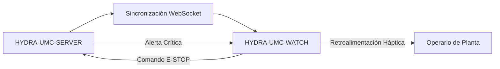

<p align="center">
  
</p>

# ⌚ HYDRA-UMC-WATCH

<p align="center"><a href="README.md">🇺🇸 English</a> | 🇪🇸 <b>Español</b> | <a href="README_fra.md">🇫🇷 Français</a> | <a href="README_ita.md">🇮🇹 Italiano</a> | <a href="README_deu.md">🇩🇪 Deutsch</a> | <a href="README_zho.md">🇨🇳 简体中文</a> | <a href="README_jpn.md">🇯🇵 日本語</a></p>

### 🛡️ Dashboard de Seguridad Portable y Sistema de Alerta Háptica de Emergencia

<p align="left">
  
  
  
</p>

---

## 1. 🛠️ VISIÓN TÉCNICA GENERAL

**HYDRA-UMC-WATCH** es la extensión táctica para el operario de planta. Ofrece información crítica de un vistazo y controles de seguridad directamente en la muñeca, garantizando que el operario siempre tenga el control, incluso lejos del HMI principal.

Construido como una app Wear OS independiente (Kotlin + Jetpack Compose para Wear), reutilizando el mismo toolchain Gradle/Kotlin que el repositorio hermano HYDRA-UMC-ANDROID-CONTROL en vez de introducir uno nuevo.

### Características Clave:
* ✅ **Real v0 - patrones hápticos y protocolo de sincronización:** `haptics/HapticPatterns.kt` define un patrón de vibración real y distinto por severidad de alerta (Crítica/Advertencia/Info); `protocol/SyncMessage.kt` define y (de)serializa las formas reales de los mensajes `EStopCommand`/`Alert` del flujo de sincronización SERVER<->WATCH de abajo. Ambos son Kotlin puro, testeable - no necesitan hardware de reloj, emulador, ni un WebSocket abierto para ejecutarse ni testearse.
* 🛑 **E-STOP Inalámbrico** — botón de emergencia dedicado con latencia inferior a 50ms sobre Wi-Fi industrial. *(el mensaje `EStopCommand` que enviaría es real y está testeado; el transporte WebSocket y el cableado del botón físico siguen siendo planeados — necesita emparejamiento con HYDRA-UMC-SERVER.)*
* 📳 **Alertas Hápticas** — patrones de vibración diferenciados para distintos tipos de alerta (Crítica, Advertencia, Info), reproducidos a través del servicio real `Vibrator`/`VibratorManager` de Android. *(implementado - `haptics/HapticAlertPlayer.kt`; aún sin verificar en un dispositivo Wear OS real, igual que el resto de esta app.)*
* 🎙️ **Voz** — pulsar para hablar: solicitud explícita del permiso `RECORD_AUDIO`, el intent de reconocimiento de voz del sistema (`RecognizerIntent`) para la transcripción, la transcripción retransmitida a HYDRA-UMC-ANDROID-CONTROL como un mensaje de sync `voice_turn` acotado, y una respuesta local por `TextToSpeech` en el reloj. *(implementado - `MainActivity.kt`; la voz nunca puede accionar un robot directamente, ver Arquitectura más abajo.)*
* ⌚ **Estado de un Vistazo** — resumen en tiempo real de la actividad de la flota y el progreso de la misión. *(planeado - necesita la conexión WebSocket real.)*
* 🔐 **Autenticación Segura** — emparejamiento basado en JWT con HYDRA-UMC-SERVER. *(planeado.)*
* ✅ **Toolchain Wear OS independiente** — una app real de Gradle/Kotlin/Compose para Wear que compila un APK de depuración funcional. *(implementado — ver COMPILACIÓN Y EJECUCIÓN abajo)*
* 🔁 **Política de Reconexión del Relay** — `transport/RelayRetryPolicy.kt` es una política real y pura de backoff exponencial para un envío de relay fallido (p. ej. sin teléfono emparejado todavía), con un límite máximo de retraso acotado. *(implementado)*
* 🗂️ **Caché de Último Estado Conocido** — `transport/LastKnownStateCache.kt` rastrea la obsolescencia real del último estado/alerta retransmitido, de modo que uno antiguo nunca se muestra como actual. *(implementado)*

---

## 2. 🔄 FLUJO DE SINCRONIZACIÓN DEL WEARABLE



---

## 3. 🧱 ARQUITECTURA Y DECISIONES DE DISEÑO

* **Por qué es una app Wear OS independiente, no una función de la app de teléfono.** Un reloj corre su propio proceso independiente en su propio sistema operativo - no puede ser simplemente un modo de interfaz de HYDRA-UMC-ANDROID-CONTROL, necesita su propio manifiesto, su propia compilación, y su propia interfaz (mucho más limitada) para estado de un vistazo/E-STOP rápido.
* **Por qué `minSdk 30` (Wear OS 3), menor que el propio minSdk de la app de teléfono.** Esto apunta deliberadamente a la generación actual de hardware Wear OS 3+, no a dispositivos Wear OS 2 antiguos - a diferencia de HYDRA-UMC-ANDROID-CONTROL, que soporta teléfonos más viejos, una app de reloj complementaria tiene una base realista de hardware que soportar mucho más estrecha.
* **Por qué los patrones hápticos y el protocolo de sincronización llegan antes que la conexión WebSocket.** Definir las formas de onda de vibración y las formas de los mensajes que ambos lados deben acordar es trabajo real en Kotlin puro - no necesita un socket abierto, un servidor emparejado ni un reloj físico para escribirse ni testearse. Abrir esa conexión de verdad es lo siguiente.
* **Por qué la política de reconexión y la caché de último estado conocido son módulos puros propios, no código en línea dentro de `WatchRelayTransport`.** Ambas son clases Kotlin reales y desacopladas (`RelayRetryPolicy`, `LastKnownStateCache`) testeables en una JVM sencilla sin reloj, emulador ni teléfono emparejado - el mismo estándar que ya fijaron `HapticPatterns.kt`/`SyncMessage.kt`. `WatchRelayTransport` en sí sigue siendo la pieza delgada, necesariamente Android, que realmente programa un reintento o registra un mensaje recibido, no el lugar donde vive la lógica matemática de la política subyacente.
* **Por qué un estado cacheado obsoleto se marca, no se oculta.** Ocultar por completo un estado antiguo dejaría la pantalla del reloj en blanco justo cuando la conexión con el teléfono es inestable - el verdadero momento de riesgo. Mostrarlo claramente marcado como "último conocido - puede estar desactualizado" mantiene al operario informado sin dejar que una lectura de minutos de antigüedad pase como una en vivo.
* **Cómo encaja en el resto del ecosistema.** Hace pareja con HYDRA-UMC-ANDROID-CONTROL y HYDRA-UMC-IOS-CONTROL como complemento de un vistazo, en la muñeca - no un sustituto de ninguna de las dos, sino una superficie de estado rápido/E-STOP rápido.

---

## 📂 ESTRUCTURA DE DIRECTORIOS

App Wear OS independiente — sin hardware, firmware ni sistema operativo propios (corre sobre hardware de reloj comercial estándar); esas carpetas se omiten por política de estructura del repositorio.

```text
HYDRA-UMC-WATCH/
├── app/
│   ├── build.gradle.kts       # Config del módulo app (lee version.properties, nunca lo escribe)
│   ├── version.properties     # versionMajor/Minor/Patch/Code (solo lo incrementan build.sh/.bat)
│   └── src/
│       ├── main/
│       │   ├── AndroidManifest.xml
│       │   └── java/com/hydraumc/watch/
│       │       ├── MainActivity.kt         # Punto de entrada Compose para Wear
│       │       ├── haptics/                # Patrones de vibración por severidad
│       │       ├── protocol/               # Codec de mensajes de sincronización SERVER<->WATCH
│       │       └── transport/              # Relay Data Layer, política de reintentos, caché de último estado conocido
│       └── test/java/com/hydraumc/watch/   # Tests JUnit reales (haptics, protocol, transport)
├── gradle/
│   ├── libs.versions.toml     # Catálogo de versiones de dependencias
│   └── wrapper/                # Gradle wrapper (fijado a 9.7.0)
├── build.gradle.kts           # Build raíz de Gradle
├── settings.gradle.kts        # Cableado de módulos
├── gradlew / gradlew.bat      # Lanzador del Gradle wrapper
├── docs/                      # Documentación y protocolos de seguridad
├── build/                     # Reservado (el propio app/build/ de Gradle está ignorado por git)
├── images/                    # Medios y diagramas
├── bump_manifest_version.py   # Incrementa major/minor/patch + el manifiesto, a la vez
├── bump_version_code.py       # Incrementa el contador versionCode propio de Android
├── build.sh / build.bat       # Build real: incrementa versión, corre tests, assembleDebug
├── run.sh / run.bat           # Ejecución real: gradlew installDebug + lanzamiento adb
└── src/                       # Reservado (el código de este proyecto vive en app/src/)
```

---

## 4. ⚙️ COMPILACIÓN Y EJECUCIÓN

Requiere JDK 21, el Android SDK (`local.properties` → `sdk.dir`, ignorado por git — apunta a tu propia instalación del SDK) y un dispositivo o emulador Wear OS para `run`.

```bash
# Linux/macOS
chmod +x gradlew   # una sola vez
./build.sh
./run.sh            # necesita un dispositivo/emulador Wear OS conectado

# Windows
build.bat
run.bat
```

`build` incrementa la versión (`bump_manifest_version.py` para major/minor/patch en sincronía con `hydra-umc.project.json`, `bump_version_code.py` para el `versionCode` propio de Android), corre la suite de tests JUnit real (`haptics`, `protocol`), y compila el APK de depuracion en `app/build/outputs/apk/debug/app-debug.apk` - todo en una sola invocación de Gradle ejecutada con `-PhydraUmcReadOnly=true` para que el código de `app/build.gradle.kts` que lee la versión nunca *también* la incremente (esa misma bandera es como `build-test.sh`/`.bat` ejecutan su comprobación de CI aparte, solo-compilar, sin mutar nada). `run` instala el APK via `gradlew installDebug` y lanza `MainActivity` con `adb`.

Ejemplo real - los dos scripts de incremento de versión también corren de forma independiente, útil para inspeccionar qué hará un build sin disparar Gradle:

```bash
python3 bump_manifest_version.py   # p.ej. "HYDRA-UMC version: v0.1.2 -> v0.1.3"
python3 bump_version_code.py       # p.ej. "versionCode: 12 -> 13"
```

---

## ✅ Estado Actual y Próximos Pasos

**Real hoy:** reproducción local de alertas mediante el servicio Android `Vibrator`, permiso explícito de micrófono y reconocimiento de voz del sistema, transcripción visible y texto a voz local; además de mensajes tipados y probados para `voice_turn`, `assistant_reply`, `system_status`, `EStopCommand`, `Alert` y el estado de versión del compañero. El transporte oficial Wear OS Data Layer reenvía turnos de voz limitados y solicitudes de estado mediante HYDRA-UMC-ANDROID-CONTROL al Server autenticado y Voice UI.

**Límite de integración:** la app Android emparejada conserva el JWT cifrado del Server; Server conserva el token de Voice UI. Data Layer exige el mismo nombre de paquete y certificado de firma en ambas APK. La voz nunca puede accionar directamente un robot; una respuesta relacionada con movimiento debe pedir confirmación y el E-STOP físico permanece independiente.

**Pendiente:** validación de emparejamiento, transporte de radio, micrófono/altavoz y estado extremo a extremo en un Wear OS real; el E-STOP inalámbrico y la telemetría CM5 en vivo siguen siendo trabajo separado condicionado por hardware.

---

## 🔗 Proyectos Relacionados

Este proyecto forma parte de un ecosistema de robótica más amplio del mismo autor (JuanenRac / Electro Hobby 3D), que abarca firmware, software de control, nodos de IA y herramientas de flota. Vale la pena conocerlo, ya que una petición podría en realidad ser sobre uno de estos proyectos en vez de sobre este repositorio.

### Relación Directa

- **[HYDRA-UMC-ANDROID-CONTROL](https://github.com/JuanenRac/HYDRA-UMC-ANDROID-CONTROL)** — la app con la que se empareja este wearable.
- **[HYDRA-UMC-IOS-CONTROL](https://github.com/JuanenRac/HYDRA-UMC-IOS-CONTROL)** — la app con la que se empareja este wearable.

### Resto del Ecosistema

**Plataforma HYDRA-UMC** — la célula de micro-fábrica multi-robot
- **[HYDRA-UMC](https://github.com/JuanenRac/HYDRA-UMC)** — la placa base CM5 + STM32H745 que orquesta hasta 8 brazos robóticos.
- **[HYDRA-UMC-SERVER](https://github.com/JuanenRac/HYDRA-UMC-SERVER)** — el backend Express/WebSocket con el que habla cada cliente de control.
- **[HYDRA-UMC-STUDIO](https://github.com/JuanenRac/HYDRA-UMC-STUDIO)** — panel de control web, visualización 3D multi-robot.
- **[HYDRA-UMC-ANDROID-CONTROL](https://github.com/JuanenRac/HYDRA-UMC-ANDROID-CONTROL)** — app de control Android por Wi-Fi/Bluetooth.
- **[HYDRA-UMC-IOS-CONTROL](https://github.com/JuanenRac/HYDRA-UMC-IOS-CONTROL)** — app de control iOS/iPadOS construida en Flutter.
- **[HYDRA-UMC-SUITE](https://github.com/JuanenRac/HYDRA-UMC-SUITE)** — centro de mando de enjambre de escritorio (Python/PySide6).
- **[HYDRA-UMC-EDITOR-URDF](https://github.com/JuanenRac/HYDRA-UMC-EDITOR-URDF)** — editor de modelos URDF de escritorio para el catálogo de robots.
- **[HYDRA-UMC-DSI](https://github.com/JuanenRac/HYDRA-UMC-DSI)** — interfaz táctil nativa para la pantalla DSI integrada.

**Plataforma URTC** — el controlador de cabezal de herramienta que lleva cada brazo HYDRA-UMC
- **[URTC](https://github.com/JuanenRac/URTC)** — controlador de cabezal de herramienta CAN, 25 perfiles de herramienta.
- **[URTC-FLASHER](https://github.com/JuanenRac/URTC-FLASHER)** — herramienta de escritorio de flasheo CAN-OTA + SWD/JTAG.
- **[URTC-TESTER](https://github.com/JuanenRac/URTC-TESTER)** — herramienta de escritorio de diagnóstico CAN en vivo.
- **[URTC-WEB-STUDIO](https://github.com/JuanenRac/URTC-WEB-STUDIO)** — alternativa basada en navegador vía Web Serial API.

**🎥 Nodo de IA de Visión (Hailo-8)**
- [HYDRA-UMC-VISION-NODE](https://github.com/JuanenRac/HYDRA-UMC-VISION-NODE)
- [HYDRA-UMC-VISION-STREAMER](https://github.com/JuanenRac/HYDRA-UMC-VISION-STREAMER)
- [HYDRA-UMC-DETECTION-HEF](https://github.com/JuanenRac/HYDRA-UMC-DETECTION-HEF)
- [HYDRA-UMC-SAFETY-ZONES](https://github.com/JuanenRac/HYDRA-UMC-SAFETY-ZONES)
- [HYDRA-UMC-VISUAL-SERVOING-API](https://github.com/JuanenRac/HYDRA-UMC-VISUAL-SERVOING-API)

**🧠 Nodo de IA Cognitiva (Hailo-10)**
- [HYDRA-UMC-COGNITIVE-NODE](https://github.com/JuanenRac/HYDRA-UMC-COGNITIVE-NODE)
- [HYDRA-UMC-VLA-ENGINE](https://github.com/JuanenRac/HYDRA-UMC-VLA-ENGINE)
- [HYDRA-UMC-VOICE-UI](https://github.com/JuanenRac/HYDRA-UMC-VOICE-UI)
- [HYDRA-UMC-SEMANTIC-PLANNER](https://github.com/JuanenRac/HYDRA-UMC-SEMANTIC-PLANNER)
- [HYDRA-UMC-DOCS-QA](https://github.com/JuanenRac/HYDRA-UMC-DOCS-QA)

**🐝 Orquestación y Enjambre**
- [HYDRA-UMC-ORCHESTRATOR](https://github.com/JuanenRac/HYDRA-UMC-ORCHESTRATOR)
- [HYDRA-UMC-SWARM-SYNC](https://github.com/JuanenRac/HYDRA-UMC-SWARM-SYNC)
- [HYDRA-UMC-PATH-PLANNER-3D](https://github.com/JuanenRac/HYDRA-UMC-PATH-PLANNER-3D)
- [HYDRA-UMC-JOB-DISPATCHER](https://github.com/JuanenRac/HYDRA-UMC-JOB-DISPATCHER)
- [HYDRA-UMC-NODE-HEALING](https://github.com/JuanenRac/HYDRA-UMC-NODE-HEALING)

**🎮 Gemelo Digital y Simulación**
- [HYDRA-UMC-TWIN](https://github.com/JuanenRac/HYDRA-UMC-TWIN)
- [HYDRA-UMC-PHYSICS-REPLICA](https://github.com/JuanenRac/HYDRA-UMC-PHYSICS-REPLICA)
- [HYDRA-UMC-HIL-BRIDGE](https://github.com/JuanenRac/HYDRA-UMC-HIL-BRIDGE)
- [HYDRA-UMC-SYNTHETIC-DATA-GEN](https://github.com/JuanenRac/HYDRA-UMC-SYNTHETIC-DATA-GEN)

**📊 Datos y Analítica**
- [HYDRA-UMC-DATALAKE](https://github.com/JuanenRac/HYDRA-UMC-DATALAKE)
- [HYDRA-UMC-TELEMETRY-COLLECTOR](https://github.com/JuanenRac/HYDRA-UMC-TELEMETRY-COLLECTOR)
- [HYDRA-UMC-ANOMALY-DETECTOR](https://github.com/JuanenRac/HYDRA-UMC-ANOMALY-DETECTOR)
- [HYDRA-UMC-PRODUCTION-REPORTS](https://github.com/JuanenRac/HYDRA-UMC-PRODUCTION-REPORTS)

**🏭 Pasarela Industrial**
- [HYDRA-UMC-GATEWAY-INDUSTRIAL](https://github.com/JuanenRac/HYDRA-UMC-GATEWAY-INDUSTRIAL)
- [HYDRA-UMC-OPCUA-SERVER](https://github.com/JuanenRac/HYDRA-UMC-OPCUA-SERVER)
- [HYDRA-UMC-MQTT-BROKER](https://github.com/JuanenRac/HYDRA-UMC-MQTT-BROKER)
- [HYDRA-UMC-MTCONNECT-ADAPTER](https://github.com/JuanenRac/HYDRA-UMC-MTCONNECT-ADAPTER)

**🛠️ Herramientas Complementarias**
- [URTC-SMART-RACK](https://github.com/JuanenRac/URTC-SMART-RACK)
- [URTC-VISION-TOOL](https://github.com/JuanenRac/URTC-VISION-TOOL)
- [HYDRA-UMC-TOOL-CLI](https://github.com/JuanenRac/HYDRA-UMC-TOOL-CLI)
- [HYDRA-UMC-DASHBOARD-AI](https://github.com/JuanenRac/HYDRA-UMC-DASHBOARD-AI)


## 👤 AUTOR
**JuanenRac** (Electro Hobby 3D)
📧 electrohobby3d@gmail.com
📺 [youtube.com/@electrohobby3d](https://youtube.com/@electrohobby3d)

## 📜 LICENCIA
GPL-3.0 - Ver LICENSE para más detalles.
