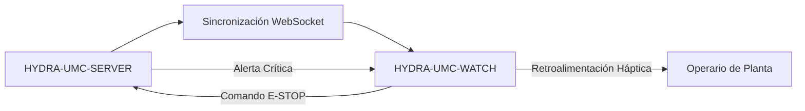

<p align="center">
  
</p>

# ⌚ HYDRA-UMC-WATCH

<p align="center"><a href="README.md">🇺🇸 English</a> | 🇪🇸 <b>Español</b> | <a href="README_fra.md">🇫🇷 Français</a> | <a href="README_ita.md">🇮🇹 Italiano</a> | <a href="README_deu.md">🇩🇪 Deutsch</a> | <a href="README_zho.md">🇨🇳 简体中文</a> | <a href="README_jpn.md">🇯🇵 日本語</a></p>

### 🛡️ Dashboard de Seguridad Portable y Sistema de Alerta Háptica de Emergencia

<p align="left">
  
  
  
</p>

---

## 1. 🛠️ VISIÓN TÉCNICA GENERAL

**HYDRA-UMC-WATCH** es la extensión táctica para el operario de planta. Ofrece información crítica de un vistazo y controles de seguridad directamente en la muñeca, garantizando que el operario siempre tenga el control, incluso lejos del HMI principal.

Construido como una app Wear OS independiente (Kotlin + Jetpack Compose para Wear), reutilizando el mismo toolchain Gradle/Kotlin que el repositorio hermano HYDRA-UMC-ANDROID-CONTROL en vez de introducir uno nuevo.

### Características Clave:
* ✅ **Real v0 - patrones hápticos y protocolo de sincronización:** `haptics/HapticPatterns.kt` define un patrón de vibración real y distinto por severidad de alerta (Crítica/Advertencia/Info); `protocol/SyncMessage.kt` define y (de)serializa las formas reales de los mensajes `EStopCommand`/`Alert` del flujo de sincronización SERVER<->WATCH de abajo. Ambos son Kotlin puro, testeable - no necesitan hardware de reloj, emulador, ni un WebSocket abierto para ejecutarse ni testearse.
* 🛑 **E-STOP Inalámbrico** — botón de emergencia dedicado con latencia inferior a 50ms sobre Wi-Fi industrial. *(el mensaje `EStopCommand` que enviaría es real y está testeado; el transporte WebSocket y el cableado del botón físico siguen siendo planeados — necesita emparejamiento con HYDRA-UMC-SERVER.)*
* 📳 **Alertas Hápticas** — patrones de vibración diferenciados para distintos tipos de alerta (Crítica, Advertencia, Info), reproducidos a través del servicio real `Vibrator`/`VibratorManager` de Android. *(implementado - `haptics/HapticAlertPlayer.kt`; aún sin verificar en un dispositivo Wear OS real, igual que el resto de esta app.)*
* 🎙️ **Voz** — pulsar para hablar: solicitud explícita del permiso `RECORD_AUDIO`, el intent de reconocimiento de voz del sistema (`RecognizerIntent`) para la transcripción, la transcripción retransmitida a HYDRA-UMC-ANDROID-CONTROL como un mensaje de sync `voice_turn` acotado, y una respuesta local por `TextToSpeech` en el reloj. *(implementado - `MainActivity.kt`; la voz nunca puede accionar un robot directamente, ver Arquitectura más abajo y [docs/VOICE_AI_PROTOCOL.md](docs/VOICE_AI_PROTOCOL.md) para el flujo completo de mensajes y el límite de seguridad.)*
* ⌚ **Estado de un Vistazo** — un botón **Actualizar estado** retransmite una petición de estado acotada a HYDRA-UMC-ANDROID-CONTROL a través del Data Layer emparejado; la tarjeta `system_status` recibida se muestra con un indicador "último conocido - puede estar desactualizado" en cuanto queda obsoleta. *(implementado - `MainActivity.kt`/`WatchRelayTransport.requestSystemStatus()`; basado en solicitud a través del relay del teléfono, no un socket directo reloj-servidor, y aún sin verificar en un dispositivo Wear OS real.)*
* 🔐 **Autenticación Segura** — emparejamiento basado en JWT con HYDRA-UMC-SERVER. *(planeado.)*
* ✅ **Toolchain Wear OS independiente** — una app real de Gradle/Kotlin/Compose para Wear que compila un APK de depuración funcional. *(implementado — ver COMPILACIÓN Y EJECUCIÓN abajo)*
* 🔁 **Política de Reconexión del Relay** — `transport/RelayRetryPolicy.kt` es una política real y pura de backoff exponencial para un envío de relay fallido (p. ej. sin teléfono emparejado todavía), con un límite máximo de retraso acotado. *(implementado)*
* 🗂️ **Caché de Último Estado Conocido** — `transport/LastKnownStateCache.kt` rastrea la obsolescencia real del último estado/alerta retransmitido, de modo que uno antiguo nunca se muestra como actual. *(implementado)*

---

## 2. 🔄 FLUJO DE SINCRONIZACIÓN DEL WEARABLE



*Arquitectura objetivo una vez exista un WebSocket directo con el Server. El
camino real y testeado hoy pasa por el teléfono emparejado: Watch -> Data
Layer -> HYDRA-UMC-ANDROID-CONTROL -> HYDRA-UMC-SERVER/Voice UI autenticado,
y de vuelta - ver Arquitectura más abajo y
[docs/VOICE_AI_PROTOCOL.md](docs/VOICE_AI_PROTOCOL.md) para ese flujo real
de extremo a extremo. El reloj nunca guarda una credencial del Server por sí
mismo; un WebSocket directo Watch-Server y el botón de E-STOP inalámbrico
siguen siendo trabajo futuro condicionado al hardware.*

---

## 3. 🧱 ARQUITECTURA Y DECISIONES DE DISEÑO

* **Por qué es una app Wear OS independiente, no una función de la app de teléfono.** Un reloj corre su propio proceso independiente en su propio sistema operativo - no puede ser simplemente un modo de interfaz de HYDRA-UMC-ANDROID-CONTROL, necesita su propio manifiesto, su propia compilación, y su propia interfaz (mucho más limitada) para estado de un vistazo/E-STOP rápido.
* **Por qué `minSdk 30` (Wear OS 3), menor que el propio minSdk de la app de teléfono.** Esto apunta deliberadamente a la generación actual de hardware Wear OS 3+, no a dispositivos Wear OS 2 antiguos - a diferencia de HYDRA-UMC-ANDROID-CONTROL, que soporta teléfonos más viejos, una app de reloj complementaria tiene una base realista de hardware que soportar mucho más estrecha.
* **Por qué los patrones hápticos y el protocolo de sincronización llegan antes que la conexión WebSocket.** Definir las formas de onda de vibración y las formas de los mensajes que ambos lados deben acordar es trabajo real en Kotlin puro - no necesita un socket abierto, un servidor emparejado ni un reloj físico para escribirse ni testearse. Abrir esa conexión de verdad es lo siguiente.
* **Por qué la política de reconexión y la caché de último estado conocido son módulos puros propios, no código en línea dentro de `WatchRelayTransport`.** Ambas son clases Kotlin reales y desacopladas (`RelayRetryPolicy`, `LastKnownStateCache`) testeables en una JVM sencilla sin reloj, emulador ni teléfono emparejado - el mismo estándar que ya fijaron `HapticPatterns.kt`/`SyncMessage.kt`. `WatchRelayTransport` en sí sigue siendo la pieza delgada, necesariamente Android, que realmente programa un reintento o registra un mensaje recibido, no el lugar donde vive la lógica matemática de la política subyacente.
* **Por qué un estado cacheado obsoleto se marca, no se oculta.** Ocultar por completo un estado antiguo dejaría la pantalla del reloj en blanco justo cuando la conexión con el teléfono es inestable - el verdadero momento de riesgo. Mostrarlo claramente marcado como "último conocido - puede estar desactualizado" mantiene al operario informado sin dejar que una lectura de minutos de antigüedad pase como una en vivo.
* **Cómo encaja en el resto del ecosistema.** Hace pareja con HYDRA-UMC-ANDROID-CONTROL y HYDRA-UMC-IOS-CONTROL como complemento de un vistazo, en la muñeca - no un sustituto de ninguna de las dos, sino una superficie de estado rápido/E-STOP rápido.

---

## 📂 ESTRUCTURA DE DIRECTORIOS

App Wear OS independiente — sin hardware, firmware ni sistema operativo propios (corre sobre hardware de reloj comercial estándar); esas carpetas se omiten por política de estructura del repositorio.

```text
HYDRA-UMC-WATCH/
├── app/
│   ├── build.gradle.kts       # Config del módulo app (lee version.properties, nunca lo escribe)
│   ├── version.properties     # versionMajor/Minor/Patch/Code (solo lo incrementan build.sh/.bat)
│   └── src/
│       ├── main/
│       │   ├── AndroidManifest.xml
│       │   └── java/com/hydraumc/watch/
│       │       ├── MainActivity.kt         # Punto de entrada Compose para Wear
│       │       ├── haptics/                # Patrones de vibración por severidad
│       │       ├── protocol/               # Codec de mensajes de sincronización SERVER<->WATCH
│       │       └── transport/              # Relay Data Layer, política de reintentos, caché de último estado conocido
│       └── test/java/com/hydraumc/watch/   # Tests JUnit reales (haptics, protocol, transport)
├── gradle/
│   ├── libs.versions.toml     # Catálogo de versiones de dependencias
│   └── wrapper/                # Gradle wrapper (fijado a 9.7.0)
├── tools/
│   ├── build_test.py          # Chequeo de CI sin mutación: verificación de contrato + assembleDebug
│   ├── ci_validate.py         # Validación de manifiesto/CHANGELOG/docs usada por CI
│   └── verify_paired_relay_contract.py # Chequeo estático del límite de seguridad Data Layer Watch<->Android Control
├── build.gradle.kts           # Build raíz de Gradle
├── settings.gradle.kts        # Cableado de módulos
├── gradlew / gradlew.bat      # Lanzador del Gradle wrapper
├── docs/                      # Documentación y protocolos de seguridad
├── build/                     # Reservado (el propio app/build/ de Gradle está ignorado por git)
├── images/                    # Medios y diagramas
├── hydra-umc.project.json     # Manifiesto del ecosistema (versión, metadatos de build/salud)
├── keystore.properties.example # Plantilla para la config de firma de release ignorada por git
├── bump_manifest_version.py   # Incrementa major/minor/patch + el manifiesto, a la vez
├── bump_version_code.py       # Incrementa el contador versionCode propio de Android
├── build.sh / build.bat       # Build real: incrementa versión, corre tests, assembleDebug
├── build-test.sh / build-test.bat # Envoltorio sin mutación para tools/build_test.py
├── run.sh / run.bat           # Ejecución real: gradlew installDebug + lanzamiento adb
├── update-from-github.sh / .bat # Canal de actualización sin Play: APK de GitHub Release + `adb install -r`
└── src/                       # Reservado (el código de este proyecto vive en app/src/)
```

---

## 4. ⚙️ COMPILACIÓN Y EJECUCIÓN

Requiere JDK 21, el Android SDK (`local.properties` → `sdk.dir`, ignorado por git — apunta a tu propia instalación del SDK) y un dispositivo o emulador Wear OS para `run`.

```bash
# Linux/macOS
chmod +x gradlew   # una sola vez
./build.sh
./run.sh            # necesita un dispositivo/emulador Wear OS conectado

# Windows
build.bat
run.bat
```

`build` incrementa la versión (`bump_manifest_version.py` para major/minor/patch en sincronía con `hydra-umc.project.json`, `bump_version_code.py` para el `versionCode` propio de Android), corre la suite de tests JUnit real (`haptics`, `protocol`), y compila el APK de depuracion en `app/build/outputs/apk/debug/app-debug.apk` - todo en una sola invocación de Gradle ejecutada con `-PhydraUmcReadOnly=true` para que el código de `app/build.gradle.kts` que lee la versión nunca *también* la incremente (esa misma bandera es como `build-test.sh`/`.bat` ejecutan su comprobación de CI aparte, solo-compilar, sin mutar nada). `run` instala el APK via `gradlew installDebug` y lanza `MainActivity` con `adb`.

Ejemplo real - los dos scripts de incremento de versión también corren de forma independiente, útil para inspeccionar qué hará un build sin disparar Gradle:

```bash
python3 bump_manifest_version.py   # p.ej. "HYDRA-UMC version: v0.1.2 -> v0.1.3"
python3 bump_version_code.py       # p.ej. "versionCode: 12 -> 13"
```

---

## 5. 📲 ACTUALIZACIONES SIN GOOGLE PLAY

Este proyecto no se distribuye a través de Google Play. El camino repetible
de actualización es un APK de GitHub Release instalado por ADB:

```bash
# desde la raíz del proyecto, con el reloj emparejado y Wireless debugging activo
update-from-github.bat    # Windows
./update-from-github.sh   # Linux / macOS / WSL
```

El script lee `releases/latest` de GitHub, exige una etiqueta estable
`vMAJOR.MINOR.PATCH`, comprueba la versión ya instalada, pide confirmación
explícita del operario, y luego descarga e invoca `adb install -r`. Nunca
toca la versión del repositorio, el manifiesto ni `CHANGELOG.md`. También se
documenta una instalación manual, de mejor esfuerzo (abrir el APK descargado
con el instalador de paquetes directamente en el reloj) para dispositivos
sin un camino ADB utilizable. Ver
[docs/GITHUB_ADB_UPDATES.md](docs/GITHUB_ADB_UPDATES.md) para el
procedimiento completo, el nombre exigido del APK de release, y la
configuración de firma de release.

`HYDRA-UMC-ANDROID-CONTROL` puede avisar al operario de que existe una
nueva versión del reloj una vez que el mensaje de estado de versión del
companion esté conectado — es solo informativo y nunca puede instalar nada
en el reloj por sí mismo. Ver
[docs/COMPANION_VERSION_PROTOCOL.md](docs/COMPANION_VERSION_PROTOCOL.md)
para esa forma de mensaje.

---

## ✅ Estado Actual y Próximos Pasos

**Real hoy:** reproducción local de alertas mediante el servicio Android `Vibrator`, permiso explícito de micrófono y reconocimiento de voz del sistema, transcripción visible y texto a voz local; además de mensajes tipados y probados para `voice_turn`, `assistant_reply`, `system_status`, `EStopCommand`, `Alert` y el estado de versión del compañero. El transporte oficial Wear OS Data Layer reenvía turnos de voz limitados y solicitudes de estado mediante HYDRA-UMC-ANDROID-CONTROL al Server autenticado y Voice UI.

**Límite de integración:** la app Android emparejada conserva el JWT cifrado del Server; Server conserva el token de Voice UI. Data Layer exige el mismo nombre de paquete y certificado de firma en ambas APK. La voz nunca puede accionar directamente un robot; una respuesta relacionada con movimiento debe pedir confirmación y el E-STOP físico permanece independiente.

**Pendiente:** validación de emparejamiento, transporte de radio, micrófono/altavoz y estado extremo a extremo en un Wear OS real; el E-STOP inalámbrico y la telemetría CM5 en vivo siguen siendo trabajo separado condicionado por hardware.

---

## 🔗 Proyectos Relacionados

Este proyecto es parte del ecosistema de robótica HYDRA-UMC del mismo autor (JuanenRac / Electro Hobby 3D). Vale la pena conocerlo, ya que una petición podría en realidad ser sobre alguno de estos en vez de sobre este repositorio.

**Directamente Relacionados**
- **[HYDRA-UMC-ANDROID-CONTROL](https://github.com/JuanenRac/HYDRA-UMC-ANDROID-CONTROL)** — app nativa de control para Android con inicio de sesión biométrico y un compañero Wear OS emparejado — la app compañera con la que se empareja este dispositivo vestible.
- **[HYDRA-UMC-IOS-CONTROL](https://github.com/JuanenRac/HYDRA-UMC-IOS-CONTROL)** — app de control para iOS/iPadOS (Flutter) con sincronización en tiempo real por WebSocket — la app compañera con la que se empareja este dispositivo vestible.
- **[HYDRA-UMC-VOICE-UI](https://github.com/JuanenRac/HYDRA-UMC-VOICE-UI)** — front-end de voz real (VAD + analizador de intención) con un relé a Watch acotado y con confirmación — envía los mensajes voice_turn que este dispositivo vestible muestra como alertas hápticas.

**También Forma Parte del Ecosistema**

*Hardware y Plataforma Base*
- **[HYDRA-UMC](https://github.com/JuanenRac/HYDRA-UMC)** — la placa madre física del brazo robótico: host CM5 + coprocesador STM32H745 de doble núcleo, coordinando hasta 8 brazos herramienta por CAN-OTA/SPI-OTA.
- **[HYDRA-UMC-OS](https://github.com/JuanenRac/HYDRA-UMC-OS)** — capa de producto reproducible sobre Raspberry Pi OS para el CM5: agente de solo lectura, config/perfiles validados, aprovisionamiento WiFi de primer contacto.
- **[HYDRA-UMC-SDK](https://github.com/JuanenRac/HYDRA-UMC-SDK)** — el contrato JSON-Schema compartido y la barrera de seguridad contra la que cada bridge valida sus comandos.

*Backend Central y Clientes*
- **[HYDRA-UMC-SERVER](https://github.com/JuanenRac/HYDRA-UMC-SERVER)** — el backend headless real (REST/WebSocket) con el que habla de verdad cada cliente de control.
- **[HYDRA-UMC-STUDIO](https://github.com/JuanenRac/HYDRA-UMC-STUDIO)** — panel de control web con visualización 3D multi-robot en tiempo real.
- **[HYDRA-UMC-SUITE](https://github.com/JuanenRac/HYDRA-UMC-SUITE)** — centro de mando de enjambre de escritorio (PySide6) para varios servidores a la vez, empaquetado como ejecutable independiente.
- **[HYDRA-UMC-DSI](https://github.com/JuanenRac/HYDRA-UMC-DSI)** — interfaz táctil nativa para la pantalla táctil DSI de 7" a bordo, embebida en el propio CM5.
- **[HYDRA-UMC-EDITOR-URDF](https://github.com/JuanenRac/HYDRA-UMC-EDITOR-URDF)** — creador/editor gráfico de URDF de escritorio que envía los modelos terminados al propio catálogo de STUDIO.
- **[HYDRA-UMC-BRIDGE-AMR](https://github.com/JuanenRac/HYDRA-UMC-BRIDGE-AMR)** — barrera de coordinación para flotas AGV/AMR mediante un publicador MQTT VDA 5050 real.
- **[HYDRA-UMC-BRIDGE-CNC](https://github.com/JuanenRac/HYDRA-UMC-BRIDGE-CNC)** — coordinador de alto nivel para celdas CNC con acceso real a estado/bytes de control GRBL.
- **[HYDRA-UMC-BRIDGE-DROIDS](https://github.com/JuanenRac/HYDRA-UMC-BRIDGE-DROIDS)** — barrera de coordinación para droides con patas/humanoides, con un emisor de comandos real para Boston Dynamics Spot.
- **[HYDRA-UMC-BRIDGE-LASER](https://github.com/JuanenRac/HYDRA-UMC-BRIDGE-LASER)** — coordinador de seguridad para celdas láser que lee 3 salvaguardas GPIO reales de llave/carcasa/enclavamiento.
- **[HYDRA-UMC-BRIDGE-OPENPNP](https://github.com/JuanenRac/HYDRA-UMC-BRIDGE-OPENPNP)** — coordinador de alto nivel seguro para el flujo de placas de pick-and-place OpenPnP.
- **[HYDRA-UMC-BRIDGE-PRINTER3D](https://github.com/JuanenRac/HYDRA-UMC-BRIDGE-PRINTER3D)** — barrera de coordinación segura para impresoras 3D Moonraker/Klipper, con comandos de trabajo reales y controlados.
- **[HYDRA-UMC-BRIDGE-ROS2](https://github.com/JuanenRac/HYDRA-UMC-BRIDGE-ROS2)** — coordinador de seguridad con un transporte ROS 2 rclpy real, importado de forma perezosa.
- **[HYDRA-UMC-BRIDGE-UAV](https://github.com/JuanenRac/HYDRA-UMC-BRIDGE-UAV)** — barrera de coordinación para UAV equipados con cámara, con un emisor de comandos MAVLink real.

*Plataforma de Herramientas URTC*
- **[URTC](https://github.com/JuanenRac/URTC)** — firmware para la placa física del Universal Robot Tool Controller, más de 25 perfiles de herramienta por bus CAN.
- **[URTC-FLASHER](https://github.com/JuanenRac/URTC-FLASHER)** — herramienta de escritorio con GUI para flashear placas URTC, CAN-OTA más SWD/JTAG de chip completo.
- **[URTC-TESTER](https://github.com/JuanenRac/URTC-TESTER)** — herramienta de escritorio de diagnóstico CAN-bus en vivo para placas URTC, un panel por perfil de herramienta.
- **[URTC-WEB-STUDIO](https://github.com/JuanenRac/URTC-WEB-STUDIO)** — alternativa basada en navegador a URTC-TESTER mediante la Web Serial API, sin instalación local.

*Nodo IA de Visión (Hailo-8)*
- **[HYDRA-UMC-VISION-NODE](https://github.com/JuanenRac/HYDRA-UMC-VISION-NODE)** — nodo de integración para el pipeline de visión Hailo-8, con una comprobación real de disponibilidad de hardware por etapa.
- **[HYDRA-UMC-DETECTION-HEF](https://github.com/JuanenRac/HYDRA-UMC-DETECTION-HEF)** — registro real de modelos compilados con verificación de carga segura por arquitectura Hailo/checksum.
- **[HYDRA-UMC-VISION-STREAMER](https://github.com/JuanenRac/HYDRA-UMC-VISION-STREAMER)** — generador real de pipeline GStreamer + config MediaMTX, con una frontera de integración HailoRT real.
- **[HYDRA-UMC-VISUAL-SERVOING-API](https://github.com/JuanenRac/HYDRA-UMC-VISUAL-SERVOING-API)** — ley de corrección real de Position-Based Visual Servoing, con puerta de seguridad según el estado de zona previo.
- **[HYDRA-UMC-SAFETY-ZONES](https://github.com/JuanenRac/HYDRA-UMC-SAFETY-ZONES)** — comprobación real de invasión de zona y solicitud de E-STOP, con exigencia de vigencia de calibración.

*Nodo IA Cognitivo (Hailo-10)*
- **[HYDRA-UMC-COGNITIVE-NODE](https://github.com/JuanenRac/HYDRA-UMC-COGNITIVE-NODE)** — nodo de integración para el pipeline cognitivo Hailo-10 (orquestación de LLM/VLA/voz).
- **[HYDRA-UMC-VLA-ENGINE](https://github.com/JuanenRac/HYDRA-UMC-VLA-ENGINE)** — codificación/decodificación real de tokens de acción y generación de trayectoria para un modelo Vision-Language-Action.
- **[HYDRA-UMC-SEMANTIC-PLANNER](https://github.com/JuanenRac/HYDRA-UMC-SEMANTIC-PLANNER)** — descomposición real de tareas basada en reglas y recuperación semántica de errores sobre códigos de error del MCU.
- **[HYDRA-UMC-DOCS-QA](https://github.com/JuanenRac/HYDRA-UMC-DOCS-QA)** — búsqueda real de documentos TF-IDF (solo librería estándar) sobre los propios documentos Markdown de este ecosistema.

*Orquestación y Enjambre*
- **[HYDRA-UMC-ORCHESTRATOR](https://github.com/JuanenRac/HYDRA-UMC-ORCHESTRATOR)** — nodo de integración con un contrato real de informe de salud gRPC/Protobuf y una máquina de estados de misión.
- **[HYDRA-UMC-JOB-DISPATCHER](https://github.com/JuanenRac/HYDRA-UMC-JOB-DISPATCHER)** — cola de trabajos real basada en prioridad con deduplicación, sobre una API HTTP real.
- **[HYDRA-UMC-NODE-HEALING](https://github.com/JuanenRac/HYDRA-UMC-NODE-HEALING)** — watchdog de salud de flota real basado en gRPC, con reintento/backoff y detección de discrepancia de identidad.
- **[HYDRA-UMC-PATH-PLANNER-3D](https://github.com/JuanenRac/HYDRA-UMC-PATH-PLANNER-3D)** — planificador de rutas 3D real basado en RRT, con validación real de colisión de obstáculos/espacio de trabajo.
- **[HYDRA-UMC-SWARM-SYNC](https://github.com/JuanenRac/HYDRA-UMC-SWARM-SYNC)** — sincronización de estado real mediante CRDT LWW-Element-Map, con pruebas de propiedades para convergencia multi-celda.

*Gemelo Digital y Simulación*
- **[HYDRA-UMC-TWIN](https://github.com/JuanenRac/HYDRA-UMC-TWIN)** — nodo de integración para el motor de gemelo digital, con un contrato real de sincronización por compatibilidad de versión.
- **[HYDRA-UMC-HIL-BRIDGE](https://github.com/JuanenRac/HYDRA-UMC-HIL-BRIDGE)** — enclavamiento de seguridad real hardware-in-the-loop que enruta comandos entre simulación y hardware real.
- **[HYDRA-UMC-PHYSICS-REPLICA](https://github.com/JuanenRac/HYDRA-UMC-PHYSICS-REPLICA)** — cinemática directa real y validación de límites articulares sobre un subconjunto real de URDF.
- **[HYDRA-UMC-SYNTHETIC-DATA-GEN](https://github.com/JuanenRac/HYDRA-UMC-SYNTHETIC-DATA-GEN)** — generador real de escenas 2D procedurales con exportación de anotaciones YOLO/COCO.

*Datos y Analítica*
- **[HYDRA-UMC-DATALAKE](https://github.com/JuanenRac/HYDRA-UMC-DATALAKE)** — almacén de series temporales real respaldado por sqlite3, con una API HTTP real de ingesta/consulta.
- **[HYDRA-UMC-ANOMALY-DETECTOR](https://github.com/JuanenRac/HYDRA-UMC-ANOMALY-DETECTOR)** — detector de anomalías real basado en FFT + línea base estadística, con monitorización de deriva.
- **[HYDRA-UMC-PRODUCTION-REPORTS](https://github.com/JuanenRac/HYDRA-UMC-PRODUCTION-REPORTS)** — cálculo real de OEE/disponibilidad sobre el histórico de DATALAKE, con exportación CSV reproducible.
- **[HYDRA-UMC-TELEMETRY-COLLECTOR](https://github.com/JuanenRac/HYDRA-UMC-TELEMETRY-COLLECTOR)** — pipeline real de ingesta CAN/WebSocket hacia DATALAKE, con deduplicación por secuencia.

*Pasarela Industrial*
- **[HYDRA-UMC-GATEWAY-INDUSTRIAL](https://github.com/JuanenRac/HYDRA-UMC-GATEWAY-INDUSTRIAL)** — nodo de integración que retransmite a protocolos industriales, con una capa real de lista blanca de comandos/contrapresión.
- **[HYDRA-UMC-OPCUA-SERVER](https://github.com/JuanenRac/HYDRA-UMC-OPCUA-SERVER)** — espacio de direcciones OPC-UA real, verificado con una sesión de cliente real del protocolo binario.
- **[HYDRA-UMC-MQTT-BROKER](https://github.com/JuanenRac/HYDRA-UMC-MQTT-BROKER)** — broker MQTT real con autenticación por cliente opcional y ACL de tópicos.
- **[HYDRA-UMC-MTCONNECT-ADAPTER](https://github.com/JuanenRac/HYDRA-UMC-MTCONNECT-ADAPTER)** — endpoints XML reales `/probe` y `/current` de MTConnect, con salida en modo degradado.

*Herramientas Complementarias y Operaciones del Ecosistema*
- **[HYDRA-UMC-DASHBOARD-AI](https://github.com/JuanenRac/HYDRA-UMC-DASHBOARD-AI)** — paneles de Resúmenes Inteligentes y Resaltado de Anomalías sobre DATALAKE/ANOMALY-DETECTOR, con un respaldo estadístico honesto.
- **[HYDRA-UMC-TOOL-CLI](https://github.com/JuanenRac/HYDRA-UMC-TOOL-CLI)** — CLI de flota con un contrato real y estable de códigos de salida, cliente real y en vivo de la propia API de HYDRA-UMC-SERVER.
- **[URTC-SMART-RACK](https://github.com/JuanenRac/URTC-SMART-RACK)** — firmware para un rack de montaje de placas con decodificación real de ID de herramienta y lógica de precalentamiento Smart Idle.
- **[URTC-VISION-TOOL](https://github.com/JuanenRac/URTC-VISION-TOOL)** — firmware más un compañero de visión real en Python para un cabezal de inspección térmica/RGB.
- **[HYDRA-UMC-UPDATER](https://github.com/JuanenRac/HYDRA-UMC-UPDATER)** — herramienta administrativa de escritorio que descubre, clona y actualiza cada repositorio de este ecosistema.
- **[HYDRA-UMC-OS-REBUILDER](https://github.com/JuanenRac/HYDRA-UMC-OS-REBUILDER)** — herramienta de escritorio Windows/Linux que construye una imagen de la CM5 lista para grabar, precargada con las versiones más actuales del ecosistema, con configuración de primer arranque de Wi-Fi/usuario/SSH al estilo de Raspberry Pi Imager.


---

## 📚 Documentación y Comunidad

- **[CONTRIBUTING.md](CONTRIBUTING.md)** — stack tecnológico y pautas de codificación para un pull request.
- **[CODE_OF_CONDUCT.md](CODE_OF_CONDUCT.md)** — los estándares de comportamiento esperados en esta comunidad.
- **[SECURITY.md](SECURITY.md)** — cómo reportar una vulnerabilidad, y las áreas reales de enfoque en seguridad de este proyecto.
- **[SUPPORT.md](SUPPORT.md)** — dónde hacer preguntas y reportar errores.
- **[LICENSE.md](LICENSE.md)** — la licencia propia de este proyecto.

## 👤 AUTOR
**JuanenRac** (Electro Hobby 3D)
📧 electrohobby3d@gmail.com
📺 [youtube.com/@electrohobby3d](https://youtube.com/@electrohobby3d)

## 📜 LICENCIA
GPL-3.0 - Ver LICENSE para más detalles.
