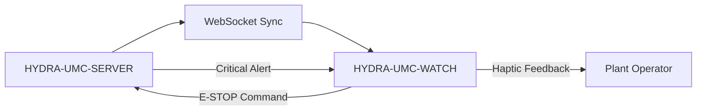

<p align="center">
  
</p>

# ⌚ HYDRA-UMC-WATCH

<p align="center"><a href="README.md">🇺🇸 English</a> | <a href="README_spa.md">🇪🇸 Español</a> | <a href="README_fra.md">🇫🇷 Français</a> | <a href="README_ita.md">🇮🇹 Italiano</a> | <a href="README_deu.md">🇩🇪 Deutsch</a> | 🇨🇳 <b>简体中文</b> | <a href="README_jpn.md">🇯🇵 日本語</a></p>

### 🛡️ 可穿戴安全仪表盘与触觉紧急告警系统

<p align="left">
  
  
  
</p>

---

## 1. 🛠️ 技术概述

**HYDRA-UMC-WATCH** 是面向工厂操作员的战术延伸设备。它直接在手腕上提供
关键的、一目了然的信息和安全控制，确保操作员即使远离主 HMI 也始终掌控
局势。

它是一款独立的 Wear OS 应用（Kotlin + Jetpack Compose for Wear），复用
与兄弟仓库 HYDRA-UMC-ANDROID-CONTROL 相同的 Gradle/Kotlin 工具链，而非
另起炉灶。

### 关键特性：
* ✅ **真实 v0 —— 触觉模式与同步协议：** `haptics/HapticPatterns.kt` 为每种告警严重程度（严重/警告/信息）定义了一个真实且各不相同的振动模式；`protocol/SyncMessage.kt` 定义并（反）序列化了下方 SERVER<->WATCH 同步流程中 `EStopCommand`/`Alert` 消息的真实结构。两者都是纯 Kotlin 代码，可测试——运行或测试都不需要手表硬件、模拟器，或者打开的 WebSocket。
* 🛑 **无线 E-STOP** —— 通过工业 Wi-Fi 实现亚 50ms 延迟的专用紧急按钮。*（它会发送的 `EStopCommand` 消息是真实的并且已测试；WebSocket 传输和物理按钮的接线仍是计划中——需要与 HYDRA-UMC-SERVER 配对。）*
* 📳 **触觉告警** —— 针对不同告警类型（严重、警告、信息）的差异化振动模式，通过 Android 真实的 `Vibrator`/`VibratorManager` 服务播放。*（已实现——`haptics/HapticAlertPlayer.kt`；与本应用其余部分一样，尚未在真实 Wear OS 设备上验证。）*
* 🎙️ **语音** —— 按住说话：明确请求 `RECORD_AUDIO` 权限、使用系统语音识别 intent（`RecognizerIntent`）进行转录、将转录内容作为受限的 `voice_turn` 同步消息中继给 HYDRA-UMC-ANDROID-CONTROL，并在手表上通过本地 `TextToSpeech` 回复。*（已实现——`MainActivity.kt`；语音绝不能直接操控机器人，见下文架构部分。）*
* ⌚ **一目了然的状态：** 集群活动和任务进度的实时摘要。*（计划中——需要真实的 WebSocket 连接。）*
* 🔐 **安全认证：** 与 HYDRA-UMC-SERVER 基于 JWT 的配对。*（计划中。）*
* ✅ **独立的 Wear OS 工具链** —— 一个真实的 Gradle/Kotlin/Compose-for-Wear 应用，能够构建出可用的调试 APK。*（已实现——见下方"构建与运行"）*
* 🔁 **中继重连策略** —— `transport/RelayRetryPolicy.kt` 是一个真实的、纯粹的指数退避策略，用于处理失败的中继发送（例如尚未配对手机的情况），并设有一个有上限的最大延迟。*（已实现）*
* 🗂️ **最后已知状态缓存** —— `transport/LastKnownStateCache.kt` 会跟踪最后一次中继的状态/告警的真实过时程度，确保旧数据永远不会被当作最新数据显示。*（已实现）*

---

## 2. 🔄 可穿戴同步流程



---

## 3. 🧱 架构与设计决策

* **为何这是一款独立的 Wear OS 应用，而非手机应用的一项功能。** 手表运行在自己独立的操作系统进程上——它不能只是 HYDRA-UMC-ANDROID-CONTROL 的一种 UI 模式，它需要自己的清单文件、自己的构建，以及自己的（约束条件严格得多的）UI，用于一目了然的状态显示/快速 E-STOP。
* **为何 `minSdk 30`（Wear OS 3）低于手机应用自身的 minSdk。** 这是刻意针对当前 Wear OS 3+ 硬件世代，而非旧款 Wear OS 2 设备——与支持较旧手机的 HYDRA-UMC-ANDROID-CONTROL 不同，一款配套手表应用需要支持的现实硬件基础要窄得多。
* **为何触觉模式与同步协议先于 WebSocket 连接落地。** 定义双方必须一致的振动波形和消息结构，是真正的纯 Kotlin 工作——编写和测试都不需要打开的套接字、已配对的服务器，或者物理手表。真正打开那条连接是下一步。
* **为何重连策略和最后已知状态缓存是各自独立的纯模块，而非内嵌在 `WatchRelayTransport` 中。** 两者都是真实的、解耦的 Kotlin 类（`RelayRetryPolicy`、`LastKnownStateCache`），可以在普通 JVM 上测试，无需手表、模拟器或已配对的手机——这与 `HapticPatterns.kt`/`SyncMessage.kt` 已经确立的标准相同。`WatchRelayTransport` 本身仍然是那个精简的、必然依赖 Android 的部分，实际负责调度重试或记录接收到的消息，而不是底层策略运算逻辑所在之处。
* **为何过时的缓存状态会被标记，而不是被隐藏。** 完全隐藏旧状态会导致手表表盘在手机连接不稳定——真正的风险时刻——时恰好一片空白。清晰地标记为"最后已知——可能已过时"能让操作员保持知情，同时不会让几分钟前的读数被误当作实时数据。
* **这如何融入生态系统的其余部分。** 与 HYDRA-UMC-ANDROID-CONTROL 和 HYDRA-UMC-IOS-CONTROL 配对，作为一目了然的手腕端配套设备——它不是取代二者中的任何一个，而是一个快速状态查看/快速 E-STOP 的界面。

---

## 📂 目录结构

独立的 Wear OS 应用——没有自己的硬件/固件/操作系统（它运行在现成的手表
硬件上）；这些目录按照仓库结构策略予以省略。

```text
HYDRA-UMC-WATCH/
├── app/
│   ├── build.gradle.kts       # 应用模块配置（只读取 version.properties，从不写入）
│   ├── version.properties     # versionMajor/Minor/Patch/Code（仅由 build.sh/.bat 递增）
│   └── src/
│       ├── main/
│       │   ├── AndroidManifest.xml
│       │   └── java/com/hydraumc/watch/
│       │       ├── MainActivity.kt         # Compose-for-Wear 入口点
│       │       ├── haptics/                # 按严重程度划分的振动模式
│       │       ├── protocol/               # SERVER<->WATCH 同步消息编解码器
│       │       └── transport/              # Data Layer 中继、重试策略、最后已知状态缓存
│       └── test/java/com/hydraumc/watch/   # 真实 JUnit 测试（haptics、protocol、transport）
├── gradle/
│   ├── libs.versions.toml     # 依赖版本目录
│   └── wrapper/                # Gradle wrapper（锁定在 9.7.0）
├── build.gradle.kts           # 根 Gradle 构建
├── settings.gradle.kts        # 模块接入
├── gradlew / gradlew.bat      # Gradle wrapper 启动器
├── docs/                      # 文档与安全协议
├── build/                     # 预留（Gradle 自身的 app/build/ 已被 gitignore）
├── images/                    # 媒体与图表
├── bump_manifest_version.py   # 同时递增 major/minor/patch 和清单文件
├── bump_version_code.py       # 递增 Android 自身的 versionCode 计数器
├── build.sh / build.bat       # 真实构建：递增版本、运行测试、assembleDebug
├── run.sh / run.bat           # 真实运行：gradlew installDebug + adb launch
└── src/                       # 预留（本项目的代码位于 app/src/ 下）
```

---

## 4. ⚙️ 构建与运行

需要 JDK 21、Android SDK（`local.properties` → `sdk.dir`，已被
gitignore——请指向你自己的 SDK 安装路径），以及用于 `run` 的 Wear OS
设备或模拟器。

```bash
# Linux/macOS
chmod +x gradlew   # 仅需一次
./build.sh
./run.sh            # 需要连接的 Wear OS 设备/模拟器

# Windows
build.bat
run.bat
```

`build` 会递增版本号（`bump_manifest_version.py` 同步递增 major/minor/patch
与 `hydra-umc.project.json`，`bump_version_code.py` 递增 Android 自身的
`versionCode`），运行真实的 JUnit 测试套件（`haptics`、`protocol`），并将
调试版 APK 编译到 `app/build/outputs/apk/debug/app-debug.apk`——全部在
一次以 `-PhydraUmcReadOnly=true` 执行的 Gradle 调用中完成，这样
`app/build.gradle.kts` 中读取版本号的代码就永远不会*也*去递增它（
`build-test.sh`/`.bat` 的仅编译、不产生变更的 CI 检查也使用同一个标志）。
`run` 通过 `gradlew installDebug` 安装该 APK，并使用 `adb`
启动 `MainActivity`。

真实示例——这两个版本递增脚本也可以独立运行，便于在不触发 Gradle 的情况下检查一次构建会做什么：

```bash
python3 bump_manifest_version.py   # 例如 "HYDRA-UMC version: v0.1.2 -> v0.1.3"
python3 bump_version_code.py       # 例如 "versionCode: 12 -> 13"
```

---

## ✅ 当前状态与后续步骤

**今天的真实进展：** 已通过 Android `Vibrator` 服务播放本地告警，已实现显式
麦克风权限与系统语音识别、可见转写和本地文字转语音；还具有经过测试的
`voice_turn`、`assistant_reply`、`system_status`、`EStopCommand`、`Alert`
及配套版本状态等类型化消息。官方 Wear OS Data Layer 通过 HYDRA-UMC-ANDROID-CONTROL
将受限语音请求和状态卡请求转发到已认证的 Server 与 Voice UI。

**集成边界：** 已配对 Android 应用保留加密的 Server JWT；Server 保留 Voice UI 令牌。
Data Layer 要求两端 APK 使用相同包名和签名证书。语音绝不能直接驱动机器人；涉及运动的回复必须要求确认，物理 E-STOP 保持独立。

**仍待完成：** 在真实 Wear OS 设备上验证配对、无线传输、麦克风/扬声器和端到端状态；无线 E-STOP 与实时 CM5 遥测仍是受硬件限制的独立工作。

---

## 🔗 相关项目

本项目是同一作者(JuanenRac / Electro Hobby 3D)打造的 HYDRA-UMC 机器人生态系统的一部分。值得了解,因为某个请求实际上可能是关于这些项目之一,而非本仓库本身。

**直接相关**
- **[HYDRA-UMC-ANDROID-CONTROL](https://github.com/JuanenRac/HYDRA-UMC-ANDROID-CONTROL)** — 具有生物识别登录和配对 Wear OS 伴侣应用的原生 Android 控制应用 —— 本可穿戴设备配对的伴侣应用。
- **[HYDRA-UMC-IOS-CONTROL](https://github.com/JuanenRac/HYDRA-UMC-IOS-CONTROL)** — 具有实时 WebSocket 同步的 iOS/iPadOS 控制应用(Flutter) —— 本可穿戴设备配对的伴侣应用。
- **[HYDRA-UMC-VOICE-UI](https://github.com/JuanenRac/HYDRA-UMC-VOICE-UI)** — 具备受限、需确认的 Watch 中继的真实语音前端(VAD + 意图解析) —— 发送本可穿戴设备以触觉提醒形式呈现的 voice_turn 消息。

**生态系统中的其他项目**

*核心硬件与平台*
- **[HYDRA-UMC](https://github.com/JuanenRac/HYDRA-UMC)** — 机器人手臂的真实主板——CM5 主机 + 双核 STM32H745，通过 CAN-OTA/SPI-OTA 协调最多 8 条工具臂。
- **[HYDRA-UMC-OS](https://github.com/JuanenRac/HYDRA-UMC-OS)** — 面向 CM5 的可复现 Raspberry Pi OS 产品层——只读代理、经过验证的配置/配置文件、WiFi 首次配网。
- **[HYDRA-UMC-SDK](https://github.com/JuanenRac/HYDRA-UMC-SDK)** — 每个桥接都据此校验自身指令的共享 JSON-Schema 契约与安全门限边界。

*核心后端与客户端*
- **[HYDRA-UMC-SERVER](https://github.com/JuanenRac/HYDRA-UMC-SERVER)** — 每个控制客户端真正通信的真实无头后端(REST/WebSocket)。
- **[HYDRA-UMC-STUDIO](https://github.com/JuanenRac/HYDRA-UMC-STUDIO)** — 具有实时多机器人 3D 可视化的网页控制面板。
- **[HYDRA-UMC-SUITE](https://github.com/JuanenRac/HYDRA-UMC-SUITE)** — 面向多台服务器的桌面(PySide6)集群指挥中心，打包为独立可执行文件。
- **[HYDRA-UMC-DSI](https://github.com/JuanenRac/HYDRA-UMC-DSI)** — 面向机载 7 英寸 DSI 触摸屏的原生触控界面，直接嵌入 CM5 本体。
- **[HYDRA-UMC-EDITOR-URDF](https://github.com/JuanenRac/HYDRA-UMC-EDITOR-URDF)** — 将完成的模型推送到 STUDIO 自身目录的桌面版图形化 URDF 创建/编辑工具。
- **[HYDRA-UMC-BRIDGE-AMR](https://github.com/JuanenRac/HYDRA-UMC-BRIDGE-AMR)** — 通过真实的 VDA 5050 MQTT 发布者为 AGV/AMR 车队提供的协调边界。
- **[HYDRA-UMC-BRIDGE-CNC](https://github.com/JuanenRac/HYDRA-UMC-BRIDGE-CNC)** — 具备真实 GRBL 状态/控制字节访问能力的高层 CNC 单元协调器。
- **[HYDRA-UMC-BRIDGE-DROIDS](https://github.com/JuanenRac/HYDRA-UMC-BRIDGE-DROIDS)** — 面向足式/人形机器人的协调边界，具备真实的 Boston Dynamics Spot 指令发送器。
- **[HYDRA-UMC-BRIDGE-LASER](https://github.com/JuanenRac/HYDRA-UMC-BRIDGE-LASER)** — 读取 3 项真实钥匙/外壳/联锁 GPIO 安全信号的激光单元安全协调器。
- **[HYDRA-UMC-BRIDGE-OPENPNP](https://github.com/JuanenRac/HYDRA-UMC-BRIDGE-OPENPNP)** — 面向 OpenPnP 贴片机板级流程的安全高层协调器。
- **[HYDRA-UMC-BRIDGE-PRINTER3D](https://github.com/JuanenRac/HYDRA-UMC-BRIDGE-PRINTER3D)** — 面向 Moonraker/Klipper 3D 打印机的安全协调边界，具备真实的受控作业指令。
- **[HYDRA-UMC-BRIDGE-ROS2](https://github.com/JuanenRac/HYDRA-UMC-BRIDGE-ROS2)** — 具备真实的惰性导入 rclpy ROS 2 传输层的安全协调器。
- **[HYDRA-UMC-BRIDGE-UAV](https://github.com/JuanenRac/HYDRA-UMC-BRIDGE-UAV)** — 面向搭载摄像头的无人机的协调边界，具备真实的 MAVLink 指令发送器。

*URTC 工具平台*
- **[URTC](https://github.com/JuanenRac/URTC)** — 面向实体 Universal Robot Tool Controller 板卡的固件，通过 CAN 总线支持 25 种以上工具配置。
- **[URTC-FLASHER](https://github.com/JuanenRac/URTC-FLASHER)** — 面向 URTC 板卡的桌面图形烧录工具，支持 CAN-OTA 以及全芯片 SWD/JTAG。
- **[URTC-TESTER](https://github.com/JuanenRac/URTC-TESTER)** — 面向 URTC 板卡的桌面实时 CAN 总线诊断工具，每种工具配置对应一个面板。
- **[URTC-WEB-STUDIO](https://github.com/JuanenRac/URTC-WEB-STUDIO)** — 通过 Web Serial API 实现的浏览器版 URTC-TESTER 替代方案，无需本地安装。

*视觉 AI 节点(Hailo-8)*
- **[HYDRA-UMC-VISION-NODE](https://github.com/JuanenRac/HYDRA-UMC-VISION-NODE)** — 面向 Hailo-8 视觉流水线的集成中枢，具备逐阶段的真实硬件就绪检测。
- **[HYDRA-UMC-DETECTION-HEF](https://github.com/JuanenRac/HYDRA-UMC-DETECTION-HEF)** — 具备 Hailo 架构/校验和安全加载验证的真实编译模型注册表。
- **[HYDRA-UMC-VISION-STREAMER](https://github.com/JuanenRac/HYDRA-UMC-VISION-STREAMER)** — 具备真实 HailoRT 集成边界的真实 GStreamer 流水线 + MediaMTX 配置生成器。
- **[HYDRA-UMC-VISUAL-SERVOING-API](https://github.com/JuanenRac/HYDRA-UMC-VISUAL-SERVOING-API)** — 具备真实 Position-Based Visual Servoing 修正律，并依据上游区域状态进行安全门控。
- **[HYDRA-UMC-SAFETY-ZONES](https://github.com/JuanenRac/HYDRA-UMC-SAFETY-ZONES)** — 具备校准新鲜度强制检查的真实区域入侵检测与 E-STOP 请求。

*认知 AI 节点(Hailo-10)*
- **[HYDRA-UMC-COGNITIVE-NODE](https://github.com/JuanenRac/HYDRA-UMC-COGNITIVE-NODE)** — 面向 Hailo-10 认知流水线(LLM/VLA/语音编排)的集成中枢。
- **[HYDRA-UMC-VLA-ENGINE](https://github.com/JuanenRac/HYDRA-UMC-VLA-ENGINE)** — 面向 Vision-Language-Action 模型的真实动作 token 编解码与轨迹生成。
- **[HYDRA-UMC-SEMANTIC-PLANNER](https://github.com/JuanenRac/HYDRA-UMC-SEMANTIC-PLANNER)** — 基于真实规则的任务分解，以及针对 MCU 错误码的语义化错误恢复。
- **[HYDRA-UMC-DOCS-QA](https://github.com/JuanenRac/HYDRA-UMC-DOCS-QA)** — 面向本生态系统自身 Markdown 文档的真实纯标准库 TF-IDF 文档检索。

*编排与集群*
- **[HYDRA-UMC-ORCHESTRATOR](https://github.com/JuanenRac/HYDRA-UMC-ORCHESTRATOR)** — 具备真实 gRPC/Protobuf 健康报告契约与任务状态机的集成中枢。
- **[HYDRA-UMC-JOB-DISPATCHER](https://github.com/JuanenRac/HYDRA-UMC-JOB-DISPATCHER)** — 基于真实 HTTP API 的真实优先级任务队列，支持去重。
- **[HYDRA-UMC-NODE-HEALING](https://github.com/JuanenRac/HYDRA-UMC-NODE-HEALING)** — 具备重试/退避与身份不匹配检测的真实基于 gRPC 的车队健康看门狗。
- **[HYDRA-UMC-PATH-PLANNER-3D](https://github.com/JuanenRac/HYDRA-UMC-PATH-PLANNER-3D)** — 具备真实障碍物/工作空间碰撞校验的真实基于 RRT 的三维路径规划器。
- **[HYDRA-UMC-SWARM-SYNC](https://github.com/JuanenRac/HYDRA-UMC-SWARM-SYNC)** — 经过多单元收敛属性测试的真实 CRDT LWW-Element-Map 状态同步。

*数字孪生与仿真*
- **[HYDRA-UMC-TWIN](https://github.com/JuanenRac/HYDRA-UMC-TWIN)** — 面向数字孪生引擎的集成中枢，具备真实的版本兼容性同步契约。
- **[HYDRA-UMC-HIL-BRIDGE](https://github.com/JuanenRac/HYDRA-UMC-HIL-BRIDGE)** — 在仿真与真实硬件之间路由指令的真实硬件在环安全联锁。
- **[HYDRA-UMC-PHYSICS-REPLICA](https://github.com/JuanenRac/HYDRA-UMC-PHYSICS-REPLICA)** — 面向真实 URDF 子集的真实正向运动学与关节限位校验。
- **[HYDRA-UMC-SYNTHETIC-DATA-GEN](https://github.com/JuanenRac/HYDRA-UMC-SYNTHETIC-DATA-GEN)** — 具备 YOLO/COCO 标注导出功能的真实程序化 2D 场景生成器。

*数据与分析*
- **[HYDRA-UMC-DATALAKE](https://github.com/JuanenRac/HYDRA-UMC-DATALAKE)** — 具备真实数据摄入/查询 HTTP API 的真实 sqlite3 时序数据存储。
- **[HYDRA-UMC-ANOMALY-DETECTOR](https://github.com/JuanenRac/HYDRA-UMC-ANOMALY-DETECTOR)** — 具备漂移监测能力的真实 FFT + 统计基线异常检测器。
- **[HYDRA-UMC-PRODUCTION-REPORTS](https://github.com/JuanenRac/HYDRA-UMC-PRODUCTION-REPORTS)** — 基于 DATALAKE 历史数据的真实 OEE/可用率计算，支持可复现的 CSV 导出。
- **[HYDRA-UMC-TELEMETRY-COLLECTOR](https://github.com/JuanenRac/HYDRA-UMC-TELEMETRY-COLLECTOR)** — 面向 DATALAKE 的真实 CAN/WebSocket 数据摄入管道，支持序列去重。

*工业网关*
- **[HYDRA-UMC-GATEWAY-INDUSTRIAL](https://github.com/JuanenRac/HYDRA-UMC-GATEWAY-INDUSTRIAL)** — 中继至工业协议的集成中枢，具备真实的指令白名单/背压控制层。
- **[HYDRA-UMC-OPCUA-SERVER](https://github.com/JuanenRac/HYDRA-UMC-OPCUA-SERVER)** — 经真实二进制协议客户端会话验证的真实 OPC-UA 地址空间。
- **[HYDRA-UMC-MQTT-BROKER](https://github.com/JuanenRac/HYDRA-UMC-MQTT-BROKER)** — 具备可选按客户端认证与主题 ACL 的真实 MQTT 代理。
- **[HYDRA-UMC-MTCONNECT-ADAPTER](https://github.com/JuanenRac/HYDRA-UMC-MTCONNECT-ADAPTER)** — 具备降级模式输出的真实 MTConnect `/probe` 与 `/current` XML 端点。

*辅助工具与生态系统运维*
- **[HYDRA-UMC-DASHBOARD-AI](https://github.com/JuanenRac/HYDRA-UMC-DASHBOARD-AI)** — 基于 DATALAKE/ANOMALY-DETECTOR 的智能摘要与异常高亮面板，具备诚实的统计回退机制。
- **[HYDRA-UMC-TOOL-CLI](https://github.com/JuanenRac/HYDRA-UMC-TOOL-CLI)** — 具备真实、稳定退出码契约的车队 CLI，是 HYDRA-UMC-SERVER 自身 API 的真实在线客户端。
- **[URTC-SMART-RACK](https://github.com/JuanenRac/URTC-SMART-RACK)** — 面向板卡安装机架的固件，具备真实的工具 ID 解码与 Smart Idle 预热逻辑。
- **[URTC-VISION-TOOL](https://github.com/JuanenRac/URTC-VISION-TOOL)** — 面向热成像/RGB 检测工具头的固件及真实 Python 视觉伴侣程序。
- **[HYDRA-UMC-UPDATER](https://github.com/JuanenRac/HYDRA-UMC-UPDATER)** — 发现、克隆并更新本生态系统中每个仓库的管理类桌面工具。


## 👤 作者
**JuanenRac** (Electro Hobby 3D)
📧 electrohobby3d@gmail.com
📺 [youtube.com/@electrohobby3d](https://youtube.com/@electrohobby3d)

## 📜 许可证
GPL-3.0 —— 详见 LICENSE。
