<!-- =============================================================================
HYDRA-UMC-WATCH - Voice and cognitive interaction protocol
Copyright (C) 2026 JuanenRac (Electro Hobby 3D) <electrohobby3d@gmail.com>
GPL-3.0 - see LICENSE
============================================================================= -->

# Voice and cognitive interaction protocol

HYDRA-UMC-WATCH is a standalone voice/status surface for the ecosystem. It
does not host an LLM and does not replace the main controls. Its role is to
capture an explicit operator request, display and optionally speak a bounded
answer, and surface compact status cards from the system.

## End-to-end flow

```mermaid
flowchart LR
    OP[Operator] --> MIC[Watch microphone]
    MIC --> STT[Approved speech recognition]
    STT --> TURN[voice_turn]
    TURN --> PHONE[Paired Android transport]
    PHONE --> GATEWAY[Authenticated HYDRA-UMC-SERVER]
    GATEWAY --> VOICE[HYDRA-UMC-VOICE-UI]
    VOICE --> COGNITIVE[Semantic Planner / Cognitive Node]
    COGNITIVE --> REPLY[assistant_reply or system_status]
    REPLY --> WATCH[Text, icon, haptic and local TTS]
```



The Watch sends recognised text, never continuous raw microphone audio, to
limit bandwidth and exposure of recordings. `WatchRelayTransport` uses the
official Wear OS Data Layer to send that bounded text to Android Control;
`WatchRelayListenerService` receives the reply/status messages. Android
Control holds the encrypted Server JWT and Server keeps the Voice UI token on
the CM5. Data Layer messages require matching package name and signing
certificate on both APKs, so credentials and AI keys never travel to the
Watch.

## Pairing and signing requirement

Both APKs deliberately use the `com.hydraumc.control` application ID for the
Data Layer. Build them with the same signing certificate: the local Android
debug key is sufficient for development, while GitHub-release APKs must use
the same private release key configured in each ignored `keystore.properties`
file or CI secret. A changed signing key breaks the secure channel by design.

## Message shapes

### Operator request

```json
{
  "type": "voice_turn",
  "requestId": "watch-voice-001",
  "transcript": "What is the status of robot 3?",
  "locale": "en-US"
}
```

`requestId` lets the watch match a delayed answer to the correct request.
The transcript is capped at 500 characters before it reaches any AI service.

### Assistant reply

```json
{
  "type": "assistant_reply",
  "requestId": "watch-voice-001",
  "text": "Robot 3 is online and idle.",
  "level": "NOMINAL",
  "speak": true,
  "requiresConfirmation": false
}
```

### System status card

```json
{
  "type": "system_status",
  "headline": "Safety zone alert",
  "detail": "Robot A4 entered a restricted zone.",
  "level": "CRITICAL",
  "speak": true
}
```

`level` drives the status icon/colour and the existing haptic severity:
`NOMINAL`, `ATTENTION`, `WARNING`, `CRITICAL` or `OFFLINE`.

## Non-negotiable safety boundary

- A voice transcript is a request to the cognitive system, never a direct
  robot command.
- Any mission start, motion, tool action or configuration change must return
  `requiresConfirmation: true` and be confirmed through an authenticated
  primary control surface.
- A physical or explicitly operated E-STOP remains independent of the AI,
  speech recognizer and network path.
- Unavailable AI/STT/TTS must show `OFFLINE` or `ATTENTION`; the watch must
  never invent a status or claim an instruction was executed.
